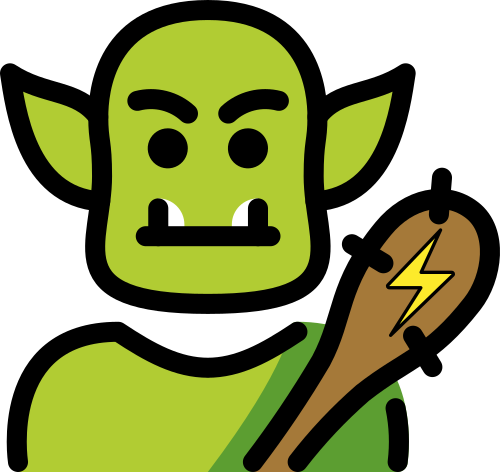
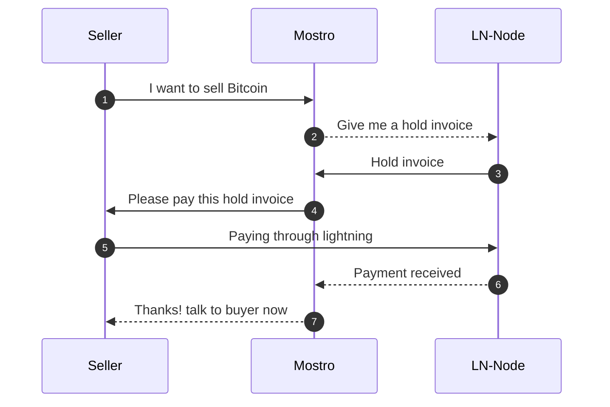

# Mostro 🧌



## Overview

Due to the growing need to be able to operate with Bitcoin without giving up personal data, in 2021 I started a project to allows people to buy and sell Bitcoin through Lightning Network without funds custody and without KYC, this project is a telegram bot called @lnp2pbot.

[@lnp2pBot](https://github.com/lnp2pBot/bot) is growing steadily and organically, it's being use in the whole world and is having a bigger impact in Latin-America, a place where there is no need to explain to people that money is broken, it's being used more and more in dictatorial regimes like Cuba and Venezuela, where people keep resisting tyranny and protesting using less the local currency and more Bitcoin.

Although the bot works excellent, it's running on top of Telegram, a great platform but we do not know if one day it will be reached by the tentacles of a powerful government asking for political dissidents or simply awkward public person.

At this point Nostr appears as a platform where a system like this can live without the possibility of being censored by a powerful entity. This document explains how we can create a censorship-resistant and non custodial lightning network peer-to-peer exchange without a single point of failure like a telegram bot.

## How it works?

Mostro works with a p2p communication on top of Nostr, Mostro will be the escrow that will allow buyer and seller operate reducing the risk for both parties.

Mostro will handle Bitcoin using a Lightning Network node, the node will create the hold invoices for sellers to pay and pays to the buyers lightning regular invoices.

Mostro will need a private key to be able to create, sign and send events through Nostr network.

In the next graphic we can see a very summarized version of how Mostro, the seller and the lightning node interact, a more detailed explanation can be found [here](https://mostro.network/protocol/):



In this repository we are building a Mostro daemon on Rust.

## Client

Buyers and sellers will need Mostro's clients in order to buy/sell Bitcoin and a Lightning Wallet, for this we need to build at least a web client to start, we plan to build mobile and desktop clients in the future.

## Removing the single point of failure

For this idea to work we need to make it as easy as possible for anyone to be a Mostro, we don't need dozens of Mostros but we do need the ones that are running to be reliable, that's why with this implementation we encourage to create your own Mostro and give more options to users.

To handle a Mostro is not going to be that easy, a Mostro admin needs to have a lightning node up and running, it will need to have enough liquidity for users to operate lightning fast, the node MUST have uptime closer to 99.9%, all this requires resources that can be obtained by the fee that sellers pay on each successful order, this is a percentage that can vary between Mostros.

## Mostro's reputation

Users will be able to rate Mostros and Mostros will compete to obtain more users in order to survive. Bad Mostros should be rejected by users and will lose incentives to keep existing.

## Development Fee

Mostro includes a sustainable development fee mechanism that automatically sends a configurable percentage of the Mostro fee to the official development fund on each successful order.

**Key Features:**
- **Configurable**: Set `dev_fee_percentage` in `~/.mostro/settings.toml` (default: 30%, minimum: 10%)
- **Transparent**: Hardcoded destination address `development@mostro.network`
- **Non-blocking**: Failed dev payments are logged but don't prevent order completion
- **Seller-pays**: Development fee is included in the seller's hold invoice
- **Full audit trail**: Database tracking with payment hashes for reconciliation

**Example:**
- Order: 100,000 sats with 1% Mostro fee (1,000 sats)
- Development fee at 30%: 300 sats
- Seller pays: 101,300 sats total (amount + Mostro fee + dev fee)

For technical details and configuration options, see [docs/DEV_FEE_TECHNICAL_SPEC.md](docs/DEV_FEE_TECHNICAL_SPEC.md).

## Requirements

0. You need Rust version 1.86 or higher to compile.
1. You will need a lightning network node.

## Install dependencies

To compile on Ubuntu/Pop!\_OS, please install [cargo](https://www.rust-lang.org/tools/install), then run the following commands:

```bash
sudo apt update
sudo apt install -y cmake build-essential libsqlite3-dev pkg-config protobuf-compiler
```

To compile on Mac, then use brew:

```bash
brew update
brew install cmake pkg-config sqlite3 protobuf
```

## Install

If you want to run Mostro on your local machine, you can follow the instructions below, if you want to run it on a server, you can follow the instructions in the [INSTALL.md](INSTALL.md) file.

Clone the repository and then edit the `settings.tpl.toml` file with your Mostro Nostr private key and other settings.

```bash
git clone https://github.com/MostroP2P/mostro.git
cd mostro
```

To connect to an LND node, you must define 3 variables within the [lightning] section of the settings.toml file.

_lnd_cert_file:_ LND node TLS certificate file path.

_lnd_macaroon_file:_ Macaroon file path, the macaroon file contains permission for doing actions on the lnd node.

_lnd_grpc_host:_ IP address or domain name from the LND node and port, example: `https://127.0.0.1:10009`.

### Database

The data is saved in a sqlite db file named by default `mostro.db`, this file is saved on the root directory of the project and can be change just editing the `url` var on the `[database]` section in `settings.toml` file.

This file is automatically created and initialized when you run the Mostro daemon for the first time.

### Running it

Before running it you need to set `nsec_privkey` in the `[nostr]` section of the `settings.toml` file with the private key of your Mostro, if you don't have a nostr private key you can use [rana 🐸](https://github.com/grunch/rana) to generate a new one.

When you run mostro for first time it will create a .mostro directory in /home/user/ and copy the settings.toml and mostro.db files inside.

Every time you make a change in the settings.toml file of the project, you need to update those changes in /home/user/.mostro/settings.toml file

Finnaly run it:

```bash
cargo run
```

## Connecting to relay

### Option 1: Run Mostro with a private dockerized relay

```bash
make docker-up
```

This will spin a new docker container with an instance of [nostr-rs-relay](https://github.com/scsibug/nostr-rs-relay), that will listen at port `7000`.

So the relay URL you want to connect to is: `ws://localhost:7000`.

You need to set `relays` in the `[nostr]` section of the `settings.toml` file:
relays = ['ws://localhost:7000']

## Dockerized Mostro

If you want to run a dockerized version of Mostro, you can follow the step-by-step instructions in the [Docker Guide for MostroP2P](./docker/README.md).

Or you can use [mostro-regtest](https://github.com/MostroP2P/mostro-regtest) to run a local nostr relay, lightning node and a Mostro instance.

## Contribute

You may be interested in contributing to Mostro. If you're looking for somewhere to start contributing, check out the [good first issue](https://github.com/MostroP2P/mostro/labels/good%20first%20issue) list.

More info in our [contributing guide](CONTRIBUTING.md).

### Rewards board

To incentivize collaborators we have a **Rewards board**, we must clarify that Mostro is not a company but an open source project, the amounts offered are a way to thank for collaboration and we can offer it thanks to the generous donation of contributors, mostly anonymous, but also to two important institutions that have given us grants, you can check it [here](https://github.com/orgs/MostroP2P/projects/2/views/1).

## Documentation

- Protocol documentation: [https://mostro.network/protocol](https://mostro.network/protocol/)
- Frequently Asked Questions: in [English](https://mostro.network/docs-english/), in [Spanish](https://mostro.network/docs-spanish/).

## License

Mostro is licensed under the [MIT license](LICENSE).
