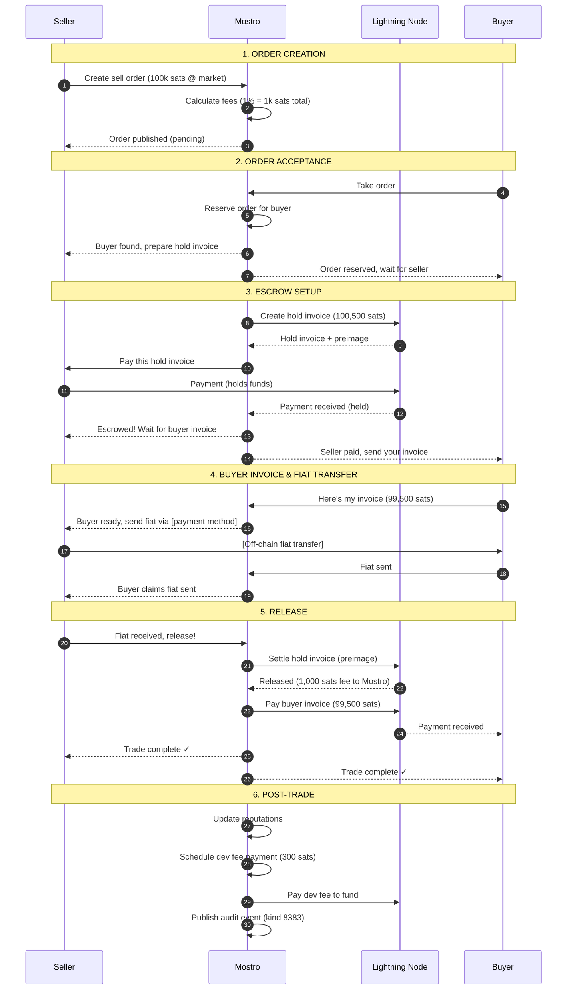
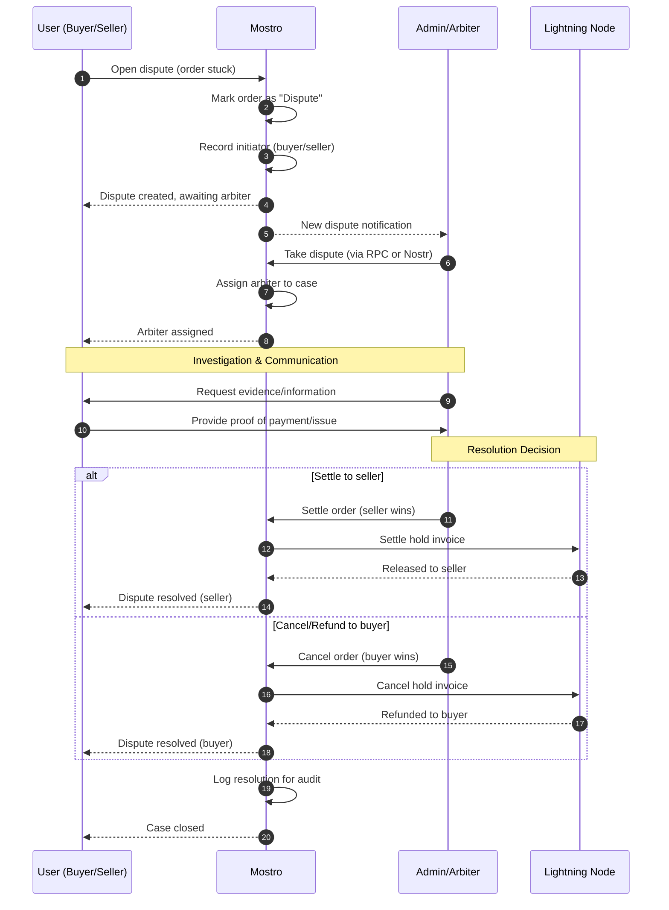
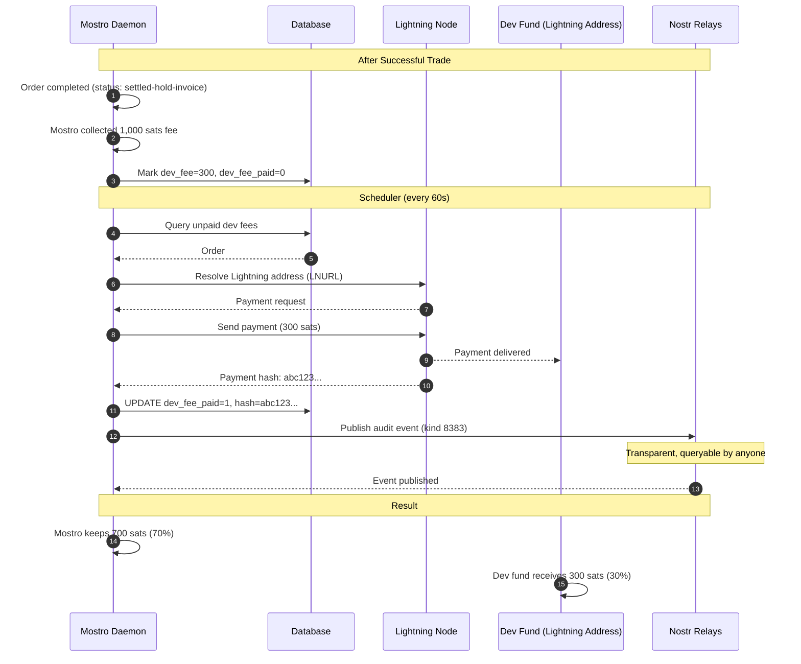
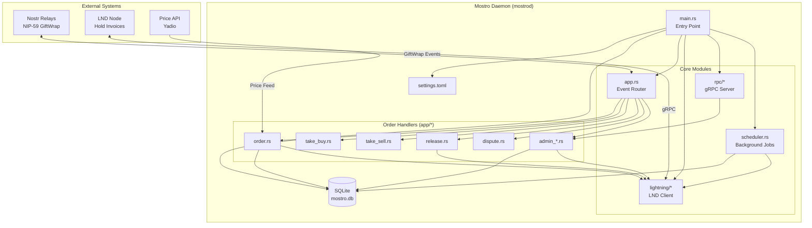

# Mostro 🧌

[](LICENSE)
[](https://www.rust-lang.org)
[](https://github.com/MostroP2P/mostro/releases)

[](https://deepwiki.com/MostroP2P/mostro)

> **A production-ready, censorship-resistant, non-custodial Lightning Network peer-to-peer exchange built on Nostr**


## Quick Links

- [Documentation](https://mostro.network/protocol/) - Protocol specification & guides
- [FAQ](https://mostro.network/docs-english/) - Frequently asked questions ([Spanish](https://mostro.network/docs-spanish/))
- [Installation Guide](INSTALL.md) - Detailed production setup
- [Contributing](CONTRIBUTING.md) - How to contribute
- [Rewards Board](https://github.com/orgs/MostroP2P/projects/2/views/1) - Bounties for contributors

---

## Overview

Mostro is a production-ready Lightning Network peer-to-peer exchange that enables Bitcoin trading without custodial risk or KYC requirements. Built on the censorship-resistant Nostr protocol, Mostro provides a decentralized alternative to centralized exchanges and custodial platforms.

### Why Mostro Exists

The need for KYC-free Bitcoin trading has never been greater. [@lnp2pBot](https://github.com/lnp2pBot/bot), a Telegram-based P2P exchange, has demonstrated strong global demand—particularly in regions facing monetary instability like Latin America, Cuba, and Venezuela, where citizens resist tyranny by adopting Bitcoin over broken fiat currencies.

While @lnp2pBot works excellently, it relies on Telegram—a platform potentially vulnerable to government pressure. Nostr solves this: as a decentralized protocol with no single point of failure, it provides the censorship-resistant foundation needed for a truly unstoppable peer-to-peer exchange.

**Mostro brings this vision to life**. It's not just a proof of concept—it's a fully operational daemon powering real trades today, with robust features including dispute resolution, reputation systems, development fee transparency, and admin tooling.

---

## Key Features

### Core Trading
- **Non-Custodial Orders** - Escrow via Lightning hold invoices; Mostro never controls user funds
- **KYC-Free** - No identity verification, registration, or personal data required
- **Multiple Order Types** - Fixed-price and market-price orders with fiat premium support
- **Maker/Taker Model** - Create or take orders with transparent fee structure (configurable, default 0.6%)

### Reliability & Safety
- **Dispute Resolution** - Built-in arbiter system with dispute tracking and admin settlement tools
- **User Reputation** - Peer rating system to build trust between traders
- **Automatic Timeouts** - Configurable expiration for orders and payment windows
- **Payment Retry Logic** - Automatic retry for failed Lightning payments with configurable attempts

### Advanced Features
- **Development Fee System** - Transparent fee collection with Nostr audit events (kind 8383)
- **RPC Admin Interface** - gRPC interface for direct daemon management and dispute handling
- **Background Scheduler** - Automated order expiration, payment retries, and dev fee processing
- **Multi-Currency Support** - Configurable fiat currency list with real-time price feeds
- **Proof-of-Work Protection** - Optional PoW requirements to prevent spam

### Deployment Options
- **Native Binary** - Direct installation on Linux/Mac with systemd integration
- **Docker Compose** - Containerized deployment with included Nostr relay
- **StartOS Package** - One-click installation on Start9 sovereign computing platform

### Developer Tools
- **Comprehensive Docs** - Architecture guides, event routing, Lightning operations, RPC reference
- **SQLite Backend** - Lightweight, embedded database with full migration support
- **Nostr Protocol** - NIP-59 (GiftWrap), NIP-33 (replaceable events) compliance
- **Observability** - Structured logging with `tracing`, configurable log levels

---

## How It Works

Mostro acts as a non-custodial escrow coordinator between buyers and sellers using the Lightning Network. The daemon handles three primary flows: order lifecycle, dispute resolution, and fee distribution.

### Order Flow (Complete Lifecycle)



**Key Points**:
- **Non-Custodial**: Lightning hold invoices ensure Mostro never controls funds
- **Trustless**: Preimage released only when seller confirms fiat receipt
- **Fee Structure**: Seller pays 500 sats, buyer pays 500 sats (split from 1% of 100k)
- **Dev Sustainability**: Mostro pays 30% of its fee (300 sats) to development fund

For more detailed protocol specifications, see the [official protocol documentation](https://mostro.network/protocol/).

---

### Dispute Flow

When disputes occur, Mostro's arbiter system ensures fair resolution:



**Dispute Tracking** (v0.15.6): Each dispute includes initiator identification (buyer or seller), arbiter assignment, resolution status, and audit trail in the database.

---

### Development Fee Distribution

Mostro implements a transparent development sustainability model:



**Transparency Features**:
- **Configurable**: Node operators set `dev_fee_percentage` (min 10%, max 100%, default 30%)
- **Non-Blocking**: Failed payments don't prevent order completion; retries automatic
- **Auditable**: All dev fee payments published to Nostr (kind 8383 events)
- **Operator Contribution**: Mostro daemon pays from its earnings, not charged to users

Query all dev fee payments on Nostr:
```bash
# Requires nostreq and nostcat tools
nostreq --kinds 8383 --tag y=mostro --tag z=dev-fee-payment | nostcat --stream wss://relay.damus.io
```

---

## Architecture

Mostro is a Rust-based daemon with a modular architecture:



**Key Components**:
- **Event Router** (`app.rs`): Unwraps NIP-59 GiftWraps, validates PoW/signatures, routes to action handlers
- **Action Handlers** (`app/*`): 17 modules handling order lifecycle, disputes, admin operations
- **Lightning Client** (`lightning/*`): Creates hold invoices, settles/cancels, manages payments
- **RPC Server** (`rpc/*`): gRPC interface for direct admin communication (optional)
- **Scheduler** (`scheduler.rs`): Background jobs for expiration, retries, dev fee payments
- **Database** (`db.rs` + SQLx): Order state, user reputation, trade indices, audit trails

**Technology Stack**:
- **Runtime**: Tokio async executor
- **Nostr**: `nostr-sdk` v0.43 (NIP-59 GiftWrap, NIP-33 replaceable events)
- **Lightning**: `fedimint-tonic-lnd` v0.3 (LND gRPC client)
- **Database**: SQLite via `sqlx` v0.6 with offline compile-time query verification
- **RPC**: `tonic` + `prost` (Protocol Buffers)

For detailed architecture documentation, see the [docs/](docs/) directory:
- [ARCHITECTURE.md](docs/ARCHITECTURE.md) - Module map, startup sequence, event routing
- [EVENT_ROUTING.md](docs/EVENT_ROUTING.md) - Message handling flow
- [LIGHTNING_OPS.md](docs/LIGHTNING_OPS.md) - Hold invoice lifecycle
- [ORDERS_AND_ACTIONS.md](docs/ORDERS_AND_ACTIONS.md) - Action handler details

---

## Installation

Mostro supports three deployment methods. For production deployments, see [INSTALL.md](INSTALL.md) for complete step-by-step instructions.

### Prerequisites

**All Methods**:
- Rust 1.86+ (for native builds)
- Lightning Network node (LND required)
  - Recommended: [Polar](https://lightningpolar.com/) for local testing
  - Production: Full LND node with adequate liquidity
- Nostr relays (public or private)

**Native Build Dependencies**:

Ubuntu/Debian:
```bash
sudo apt update
sudo apt install -y cmake build-essential libsqlite3-dev pkg-config protobuf-compiler
```

macOS:
```bash
brew update
brew install cmake pkg-config sqlite3 protobuf
```

---

### Option 1: Native Installation (Production)

Best for: Production servers, VPS deployments, full control over the daemon

**Quick Start**:
```bash
# Clone repository
git clone https://github.com/MostroP2P/mostro.git
cd mostro

# Build release binary
cargo build --release

# Install to system
sudo install target/release/mostrod /usr/local/bin

# Setup configuration
mkdir -p ~/.mostro
cp settings.tpl.toml ~/.mostro/settings.toml
# Edit ~/.mostro/settings.toml (see Configuration section)

# Initialize database
cargo install sqlx-cli --version 0.6.2
./init_db.sh

# Run daemon
mostrod
```

**Production Setup** (systemd):

See [INSTALL.md](INSTALL.md) for complete Digital Ocean/VPS setup including:
- Service configuration (`/etc/systemd/system/mostro.service`)
- Permissions and security hardening
- Log management with journalctl
- Database backup procedures
- Monitoring and operational queries

---

### Option 2: Docker Compose (Local Development)

Best for: Local testing, development environments, quick experiments

**Quick Start**:
```bash
# Clone repository
git clone https://github.com/MostroP2P/mostro.git
cd mostro

# Setup configuration
mkdir -p docker/config
cp settings.tpl.toml docker/config/settings.toml
# Edit docker/config/settings.toml

# Configure LND paths in docker/.env
echo "LND_CERT_FILE=~/.polar/networks/1/volumes/lnd/alice/tls.cert" >> docker/.env
echo "LND_MACAROON_FILE=~/.polar/networks/1/volumes/lnd/alice/data/chain/bitcoin/regtest/admin.macaroon" >> docker/.env

# Build and run
make docker-build
make docker-up
```

This starts:
- Mostro daemon (exposed via configured relays)
- Local Nostr relay (port 7000 by default)

**Stop**: `make docker-down`

For detailed Docker setup, see [docker/README.md](docker/README.md).

---

### Option 3: StartOS (One-Click Install)

Best for: Start9 users, sovereign computing, non-technical users

Mostro is available as a StartOS package with enhanced features. Install directly from the Start9 marketplace or sideload:

```bash
# Build StartOS package
make docker-startos
```

Features in StartOS build:
- Integrated with Start9 LND node
- Web UI for configuration
- Automatic backups
- Health monitoring
- One-click updates

For StartOS-specific documentation, see [docker/README.md](docker/README.md#building-and-running-with-startos-features).

---

### Alternative: Regtest Environment (Development)

For complete local testing with mocked Lightning Network:

```bash
# Clone mostro-regtest (includes relay + LND + Mostro)
git clone https://github.com/MostroP2P/mostro-regtest.git
cd mostro-regtest
# Follow mostro-regtest README for setup
```

This provides a full Bitcoin regtest environment with pre-configured LND nodes and Nostr relay.

---

## Configuration

Mostro uses a TOML configuration file (`settings.toml`). Copy the template and customize:

```bash
cp settings.tpl.toml ~/.mostro/settings.toml
```

### Key Configuration Sections

#### Lightning Network
```toml
[lightning]
lnd_cert_file = '/path/to/lnd/tls.cert'
lnd_macaroon_file = '/path/to/lnd/admin.macaroon'
lnd_grpc_host = 'https://127.0.0.1:10009'

# Hold invoice expiration (5 minutes = 300 seconds)
hold_invoice_expiration_window = 300

# Payment retry configuration
payment_attempts = 3
payment_retries_interval = 60  # seconds between retries
```

**Required**: LND connection details. Mostro needs admin macaroon for hold invoice management.

---

#### Nostr Configuration
```toml
[nostr]
# Your Mostro daemon's private key (nsec format)
nsec_privkey = 'nsec1...'

# Relays to connect to
relays = [
  'wss://relay.damus.io',
  'wss://relay.mostro.network',
  'wss://nostr.wine'
]
```

**Required**: Generate a dedicated Nostr key for your Mostro instance:
```bash
# Using rana (https://github.com/grunch/rana)
rana --vanity mostro
```

**Important**: Never reuse keys between Mostro instances. Each daemon needs a unique identity.

---

#### Mostro Business Logic
```toml
[mostro]
# Trading fee (0.006 = 0.6%, charged to both parties)
fee = 0.006

# Maximum Lightning routing fee tolerance (0.001 = 0.1%)
max_routing_fee = 0.001

# Order limits (satoshis)
max_order_amount = 1000000     # 1M sats max per order
min_payment_amount = 100       # 100 sats minimum

# Order expiration
expiration_hours = 24          # Orders expire after 24 hours if not taken
expiration_seconds = 900       # 15 minutes for taker to complete payment

# Proof-of-Work requirement (0 = disabled)
pow = 0  # Set to 10-20 to prevent spam

# Development sustainability fee (0.30 = 30% of Mostro fee goes to dev fund)
dev_fee_percentage = 0.30      # Minimum: 0.10 (10%), Maximum: 1.0 (100%)

# Fiat currency whitelist (empty = accept all)
fiat_currencies_accepted = ['USD', 'EUR', 'ARS', 'BRL']

# Price feed API
bitcoin_price_api_url = "https://api.yadio.io"
```

**Key Settings**:
- `fee`: Your Mostro's fee percentage (default 0.6% split between buyer/seller)
- `dev_fee_percentage`: Portion of your fee donated to Mostro development (default 30%)
- `pow`: Increase to 10-20 if experiencing spam (higher = slower client messages)
- `fiat_currencies_accepted`: Restrict supported currencies (empty array = accept all)

---

#### RPC Interface (Optional)
```toml
[rpc]
enabled = false              # Set to true to enable gRPC admin interface
listen_address = "127.0.0.1"
port = 50051
```

When enabled, exposes gRPC interface on `127.0.0.1:50051` for:
- Admin order cancellation
- Dispute settlement
- Solver management

---

#### Database
```toml
[database]
url = "sqlite://mostro.db"  # Relative path or absolute: "sqlite:///home/mostro/.mostro/mostro.db"
```

**Database Management**:
```bash
# Initialize new database
cargo sqlx database create
cargo sqlx migrate run

# Backup database
cp ~/.mostro/mostro.db ~/.mostro/mostro.db.backup

# Inspect database
sqlite3 ~/.mostro/mostro.db
```

---

### Configuration Tips

1. **Never commit `settings.toml`** - Contains private keys and credentials
2. **Validate config on startup** - Mostro will refuse to start with invalid settings
3. **Update after schema changes** - Run `cargo sqlx migrate run` after pulling updates
4. **Monitor dev fee payments** - Check logs: `journalctl -u mostro | grep "dev_fee"`
5. **Adjust PoW for load** - Start at 0, increase to 15-20 if spam becomes an issue

For complete settings reference, see [settings.tpl.toml](settings.tpl.toml).

---

## Usage

### Running Mostro

**Native Binary**:
```bash
# Foreground (see logs)
mostrod

# Background (systemd)
sudo systemctl start mostro
sudo systemctl status mostro
sudo journalctl -u mostro -f  # Follow logs
```

**Docker**:
```bash
make docker-up      # Start services
make docker-down    # Stop services
docker compose logs -f mostro  # View logs
```

---

### Monitoring Operations

**Check active orders**:
```bash
sqlite3 ~/.mostro/mostro.db "SELECT id, status, amount, fiat_amount FROM orders WHERE status = 'pending' ORDER BY created_at DESC LIMIT 10;"
```

**Monitor dev fee payments**:
```bash
sqlite3 ~/.mostro/mostro.db "SELECT id, dev_fee, dev_fee_paid, dev_fee_payment_hash FROM orders WHERE status = 'success' ORDER BY created_at DESC LIMIT 10;"
```

**Query Nostr for Mostro info event**:
```bash
# Install nostr tools: cargo install nostreq nostcat
# Fetch Mostro settings (kind 38383)
nostreq --kinds 38383 --limit 1 --authors YOUR_MOSTRO_PUBKEY | nostcat --stream wss://relay.damus.io | jq
```

---

### Using Clients

Mostro requires a client to interact with the daemon. Available clients:

- **[mostro-cli](https://github.com/MostroP2P/mostro-cli)** - Command-line interface (recommended for testing)
- **[Mostro Mobile](https://github.com/MostroP2P/mobile)** - Mobile app (beta)
- **[MostriX](https://github.com/MostroP2P/mostrix)** - Terminal UI client (work in progress)

**Example: Creating an order with mostro-cli**:
```bash
# Install mostro-cli
git clone https://github.com/MostroP2P/mostro-cli.git
cd mostro-cli
cargo install --path .

# Create sell order (sell 100k sats for $50 USD via bank transfer)
mostro-cli order create --kind sell --amount 100000 --fiat-amount 50 --fiat-code USD --payment-method bank-transfer

# List available orders
mostro-cli order list

# Take an order
mostro-cli order take <order-id>
```

For client documentation, see the respective client repositories.

---

### Admin Operations (RPC Interface)

If RPC is enabled, use admin tools for dispute resolution:

```bash
# Cancel an order (admin override)
grpcurl -plaintext -d '{"order_id": "abc123"}' localhost:50051 mostro.admin.v1.AdminService/CancelOrder

# Settle disputed order
grpcurl -plaintext -d '{"order_id": "abc123"}' localhost:50051 mostro.admin.v1.AdminService/SettleOrder

# Add dispute solver
grpcurl -plaintext -d '{"solver_pubkey": "npub1..."}' localhost:50051 mostro.admin.v1.AdminService/AddSolver
```

---

### Querying Audit Events

Development fee payments are auditable via Nostr (kind 8383):

```bash
# Get all dev fee payments from your Mostro
nostreq --kinds 8383 --tag y=mostro --tag z=dev-fee-payment --authors YOUR_MOSTRO_PUBKEY | nostcat --stream wss://relay.damus.io | jq

# Calculate total dev fund contributions
nostreq --kinds 8383 --tag y=mostro --tag z=dev-fee-payment | jq '[.[] | .tags[] | select(.[0]=="amount") | .[1] | tonumber] | add'
```

This transparency allows third-party verification of development fund contributions.

---

## Clients

Mostro is a backend daemon. Users interact with it through client applications that communicate via Nostr.

### Official Clients

#### mostro-cli (Command-Line Interface)
**Repository**: https://github.com/MostroP2P/mostro-cli
**Status**: Production-ready
**Best For**: Testing, automation, power users

Features:
- Create and manage orders
- Take orders and complete trades
- Query order history and status
- Dispute management

**Installation**:
```bash
git clone https://github.com/MostroP2P/mostro-cli.git
cd mostro-cli
cargo install --path .
```

---

#### Mostro Mobile (Mobile App)
**Repository**: https://github.com/MostroP2P/mobile
**Status**: Beta
**Best For**: General users, accessibility

Features:
- Complete trading (create, take, and cancel orders)
- Encrypted P2P chat (ECDH shared key + NIP-59 gift wrapping, Blossom servers for multimedia)
- Key management (NIP-06 and NIP-59, unique keys per trade)
- Real-time order book updates
- Multi-language support (English, Spanish, Italian)
- Push notifications
- User rating system
- Dispute resolution

**Stack**: Flutter (Android)

---

#### MostriX (Terminal UI Client)
**Repository**: https://github.com/MostroP2P/mostrix
**Status**: Work in progress
**Best For**: Admins

Features:
- Admin mode with separate key
- Dispute management
- Order book visualization
- Take buy/sell orders
- Create buy/sell orders (with LN address support)
- Key management (Mostro protocol compliant)

**Stack**: Rust (TUI)

---

### Building Your Own Client

Mostro clients communicate via Nostr using the [mostro-core](https://github.com/MostroP2P/mostro-core) protocol library.

**Quick Start**:
```rust
// Add to Cargo.toml
[dependencies]
mostro-core = "0.6.57"
nostr-sdk = "0.43"

// Basic client structure
use mostro_core::{Message, Action, Order};
use nostr_sdk::Client;

// Connect to relays
let client = Client::new(&keys);
client.add_relay("wss://relay.mostro.network").await?;

// Create order message
let order = Order { /* ... */ };
let message = Message::new(Action::NewOrder, order);

// Send via NIP-59 GiftWrap to Mostro pubkey
// ...
```

**Resources**:
- Protocol specification: https://mostro.network/protocol/
- mostro-core docs: https://docs.rs/mostro-core/
- Example implementations: See mostro-cli source code

For detailed client development guide, see the [protocol documentation](https://mostro.network/protocol/).

---

## Development

Mostro is actively developed and welcomes contributions. Whether you're fixing bugs, adding features, or improving documentation, your help makes Mostro better for everyone.

### Getting Started

1. **Fork and clone**:
```bash
git clone https://github.com/YOUR_USERNAME/mostro.git
cd mostro
```

2. **Install development tools**:
```bash
# Rust toolchain (1.86+)
rustup update stable

# SQLx CLI (for database migrations)
cargo install sqlx-cli --version 0.6.2

# Development dependencies
sudo apt install protobuf-compiler cmake build-essential  # Ubuntu
brew install protobuf cmake  # macOS
```

3. **Setup local environment**:
```bash
# Copy template configuration
cp settings.tpl.toml settings.toml
# Edit settings.toml with your LND/Nostr config

# Initialize database
./init_db.sh
```

4. **Run in development mode**:
```bash
# With debug logging
RUST_LOG=debug cargo run

# Run tests
cargo test

# Check code formatting
cargo fmt --all -- --check

# Run linter
cargo clippy --all-targets --all-features -- -D warnings
```

---

### Project Structure

```
mostro/
├── src/
│   ├── main.rs              # Entry point, initialization
│   ├── app.rs               # Event router, message dispatcher
│   ├── app/                 # Order lifecycle handlers (17 modules)
│   │   ├── order.rs         # Create orders
│   │   ├── take_buy.rs      # Buyer takes sell order
│   │   ├── take_sell.rs     # Seller takes buy order
│   │   ├── release.rs       # Release escrow, payments
│   │   ├── dispute.rs       # Dispute handling
│   │   └── admin_*.rs       # Admin operations (4 modules)
│   ├── lightning/           # LND integration
│   │   ├── mod.rs           # Client, hold invoice management
│   │   └── invoice.rs       # Invoice parsing, validation
│   ├── rpc/                 # gRPC server
│   │   └── server.rs        # Admin service implementation
│   ├── config/              # Configuration management
│   ├── db.rs                # Database queries (SQLx)
│   ├── scheduler.rs         # Background jobs
│   └── util.rs              # Shared utilities
├── proto/                   # Protocol Buffer definitions
│   └── admin.proto          # RPC API specification
├── migrations/              # SQLx database migrations
├── docs/                    # Architecture documentation
│   ├── ARCHITECTURE.md      # System overview
│   ├── ORDERS_AND_ACTIONS.md
│   ├── DEV_FEE.md          # Development fee technical spec
│   └── RPC.md              # RPC API reference
├── docker/                  # Docker configuration
└── settings.tpl.toml        # Configuration template
```

---

### Development Workflow

**Before committing**:
```bash
# Format code
cargo fmt

# Run linter
cargo clippy --all-targets --all-features -- -D warnings

# Run tests
cargo test

# Update SQLx offline data (after query/schema changes)
cargo sqlx prepare -- --bin mostrod
```

**After schema changes**:
```bash
# Create migration
sqlx migrate add my_feature_name

# Edit migrations/YYYYMMDDHHMMSS_my_feature_name.sql
# Apply migration
sqlx migrate run

# Update offline data
cargo sqlx prepare -- --bin mostrod
```

---

### Finding Issues to Work On

- **Good first issues**: https://github.com/MostroP2P/mostro/labels/good%20first%20issue
- **Rewards board**: https://github.com/orgs/MostroP2P/projects/2/views/1 (bounties available)
- **Help wanted**: https://github.com/MostroP2P/mostro/labels/help%20wanted

---

### Communication Channels

- **Development**: [Telegram @mostro_dev](https://t.me/mostro_dev) - Technical discussions
- **General**: [Telegram @MostroP2P](https://t.me/MostroP2P) - Community chat
- **Issues**: [GitHub Issues](https://github.com/MostroP2P/mostro/issues) - Bug reports, feature requests

---

### Testing

**Unit Tests**: Co-located in modules under `mod tests`
```bash
# Run all tests
cargo test

# Run specific test
cargo test test_get_dev_fee

# Run with output
cargo test -- --nocapture
```

**Integration Testing**: Use `mostro-regtest` for full stack testing
```bash
git clone https://github.com/MostroP2P/mostro-regtest.git
cd mostro-regtest
# Follow README for complete regtest environment
```

---

### Documentation

When adding features:
- Update relevant docs in `docs/` directory
- Add inline documentation (`///`) for public APIs
- Include examples in doc comments
- Update CHANGELOG.md for user-facing changes

For extensive features, add a dedicated doc file (e.g., `docs/MY_FEATURE.md`).

For detailed contributing guidelines, see [CONTRIBUTING.md](CONTRIBUTING.md).

---

## Running Your Own Mostro

Mostro's open-source design enables anyone to operate their own instance, ensuring no single entity controls the network. Multiple independent Mostro operators create a resilient, censorship-resistant ecosystem.

### Why Run Your Own Mostro?

**For the Network**:
- **Decentralization**: More operators = harder to shut down
- **Geographic Diversity**: Serve your local community/currency
- **Resilience**: Network continues even if some operators go offline

**For You**:
- **Revenue**: Earn fees on successful trades (default 0.6% per order, configurable)
- **Control**: Set your own fee structure, supported currencies, order limits
- **Community**: Build reputation and trust within your local Bitcoin economy

### Requirements for Operators

**Technical Prerequisites**:
- Lightning Network node with adequate liquidity (LND required)
- Server with 99%+ uptime (VPS recommended: 2vCPU, 2GB RAM, 60GB storage)
- Basic Linux/Docker administration skills
- Nostr relay access (can run your own or use public relays)

**Operational Commitment**:
- **Liquidity Management**: Maintain sufficient Lightning channel capacity for order volume
- **Dispute Resolution**: Assign trusted arbiters to handle disputes fairly
- **Monitoring**: Track order flow, payment failures, system health
- **Updates**: Keep Mostro daemon updated with latest releases

**Financial Considerations**:
- **Upfront Liquidity**: Lightning channels require capital (amount depends on expected order sizes)
- **Operating Costs**: VPS hosting ($10-50/month), Lightning channel fees
- **Revenue Model**: Fee income from successful orders (both parties pay, operator keeps fee minus dev contribution)

### Operator Reputation

Mostro implements a reputation system where users rate their experience with each Mostro operator. Poor reputation = fewer users = lower revenue. This creates economic incentives for operators to:
- Maintain high uptime
- Resolve disputes fairly
- Provide responsive support
- Keep competitive fees

### Getting Started as an Operator

1. **Setup Infrastructure**: Follow [INSTALL.md](INSTALL.md) for production deployment
2. **Configure Settings**: Set fee structure, currencies, limits in `settings.toml`
3. **Announce Your Mostro**: Publish info event (kind 38383) - done automatically on startup
4. **Add to Directories**: Submit your Mostro to community listings and websites
5. **Assign Arbiters**: Add trusted npubs as dispute solvers via RPC or admin actions

### Finding Other Mostros

Users can discover Mostro operators by:
- Querying Nostr for kind 38383 events (Mostro info)
- Checking community-maintained directories (e.g., mostro.network)
- Word-of-mouth and local Bitcoin communities

**Example Query**:
```bash
# Find all Mostro instances on Nostr
nostreq --kinds 38383 | nostcat --stream wss://relay.damus.io | jq
```

### Operator Support

Join the operator community:
- **Telegram**: [@mostro_dev](https://t.me/mostro_dev) - Technical support
- **GitHub Discussions**: Share operational insights, ask questions
- **Documentation**: [docs/](docs/) - Technical references for operators

---

## Documentation

### Official Documentation
- **Protocol Specification**: https://mostro.network/protocol/ - Complete Nostr protocol specification
- **FAQ (English)**: https://mostro.network/docs-english/ - Frequently asked questions
- **FAQ (Español)**: https://mostro.network/docs-spanish/ - Preguntas frecuentes

### Technical Documentation (This Repository)
- **[Architecture Overview](docs/ARCHITECTURE.md)** - System design, module map, startup sequence
- **[Event Routing](docs/EVENT_ROUTING.md)** - Message handling, NIP-59 GiftWrap processing
- **[Lightning Operations](docs/LIGHTNING_OPS.md)** - Hold invoice lifecycle, payment flows
- **[Orders & Actions](docs/ORDERS_AND_ACTIONS.md)** - Order state machine, action handlers
- **[Admin RPC & Disputes](docs/ADMIN_RPC_AND_DISPUTES.md)** - Dispute resolution, admin interface
- **[Development Fee System](docs/DEV_FEE.md)** - Complete technical specification
- **[Startup & Configuration](docs/STARTUP_AND_CONFIG.md)** - Initialization, settings guide

### Guides
- **[Installation Guide](INSTALL.md)** - Production deployment on VPS/Digital Ocean
- **[Docker Guide](docker/README.md)** - Containerized deployment, StartOS builds
- **[Contributing Guide](CONTRIBUTING.md)** - Development workflow, PR guidelines

### API Documentation
- **Rust Docs**: Run `cargo doc --open` to generate and browse API documentation
- **mostro-core**: https://docs.rs/mostro-core/ - Protocol library for building clients
- **Protocol Buffers**: [proto/admin.proto](proto/admin.proto) - RPC service definitions

### External Resources
- **Mostro Network**: https://mostro.network/ - Official website
- **GitHub Organization**: https://github.com/MostroP2P - All Mostro projects
- **Rewards Board**: https://github.com/orgs/MostroP2P/projects/2/views/1 - Bounties and incentives

---

## License

Mostro is licensed under the [MIT License](LICENSE).

## Credits & Acknowledgments

Mostro is built by the community, for the community. Special thanks to:

- **Contributors**: Everyone who has submitted code, documentation, bug reports, and feedback
- **Grant Support**: Organizations that have provided funding to sustain development: [HRF](https://hrf.org) and [Opensats](https://opensats.org)
- **@lnp2pBot**: The Telegram bot that proved the need and validated the model
- **Nostr Protocol**: The censorship-resistant foundation that makes Mostro possible
- **Bitcoin & Lightning Network**: The decentralized financial infrastructure

### Rewards Program

Mostro offers bounties for contributions through our [Rewards Board](https://github.com/orgs/MostroP2P/projects/2/views/1). We're grateful for the generous donations from contributors (many anonymous) and institutional grants that make this program possible.

While Mostro is not a company, the rewards program enables us to thank collaborators and accelerate development.

### Development Sustainability

As of v0.15.6, Mostro includes a transparent development fee system where Mostro operators contribute a configurable percentage (default 30%, minimum 10%) of their fee income to the development fund. This ensures long-term sustainability while maintaining the project's open-source ethos.

All development fee payments are published to Nostr (kind 8383 events) for public verification. See [docs/DEV_FEE.md](docs/DEV_FEE.md) for complete details.

## Maintainers

For a complete list of contributors, see the [contributors page](https://github.com/MostroP2P/mostro/graphs/contributors).
