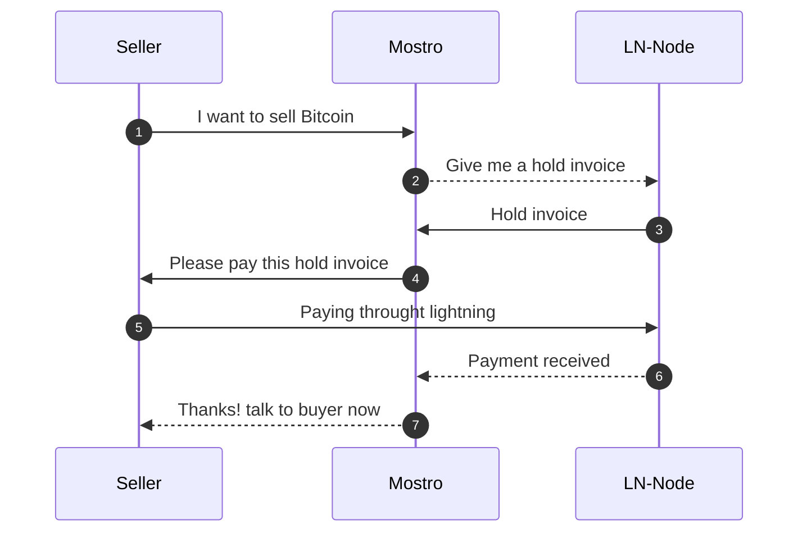

# Mostro server

This document explains how Mostro works.

## Overview

Due to the growing need to be able to operate with Bitcoin without giving up personal data, in 2021 I started a project to allows people to buy and sell Bitcoin through Lightning Network without funds custody and without KYC, this project is a telegram bot called @lnp2pbot.

[@lnp2pBot](https://github.com/lnp2pBot/bot) is growing steadily and organically, it's being use in the whole world and is having a bigger impact in Latin-America, a place where there is no need to explain to people that money is broken, it's being used more and more in dictatorial regimes like Cuba and Venezuela, where people keep resisting tyranny and protesting using less the local currency and more Bitcoin.

Although the bot works excellent, it's running on top of Telegram, a great platform but we do not know if one day it will be reached by the tentacles of a powerful government asking for political dissidents or simply awkward public person.

At this point Nostr appears as a platform where a system like this can live without the possibility of being censored by a powerful entity. This document explains how we can create a censorship-resistant and non custodial lightning network peer-to-peer exchange without a single point of failure like a telegram bot.

## Server

Mostro works with a simple server/client architecture on top of Nostr, the server will be the escrow that will allow buyer and seller operate reducing the risk for both parties.

Mostro server will handle Bitcoin using a Lightning Network node, the node will create the hold invoices for sellers and pay the buyers lightning regular invoices.

Mostro server will need a private key to be able to create, sign and send events to Nostr network.

In the next graphic we can see a very summarized version of how Mostro, the seller and the lightning node interact, a more detailed explanation can be found [here](./FLOW.md):

In this repository we are building a Mostro server on Rust.

## Client

Buyers and sellers will need Mostro's clients in order to buy/sell Bitcoin and a Lightning Wallet, for this we need to build at least a web client to start, we plan to build mobile and desktop clients in the future.

## Removing the single point of failure

For this idea to work we need to make it as easy as possible for anyone to be a server, we don't need dozens of servers but we do need the ones that are running to be reliable, that's why with this implementation we encourage to create your own Mostro server and give more options to users.

To handle a Mostro server is not going to be that easy, a Mostro server admin needs to have a lightning node up and running, it will need to have enough liquidity for users to operate lightning fast, the node MUST have uptime closer to 99.9%, all this requires resources that can be obtained by the fee that sellers pay on each successful order, this is a percentage that can vary between servers.

## Server reputation

Users will be able to rate servers and servers will compete to obtain more users in order to survive. Bad servers should be rejected by users and will lose incentives to keep existing.
