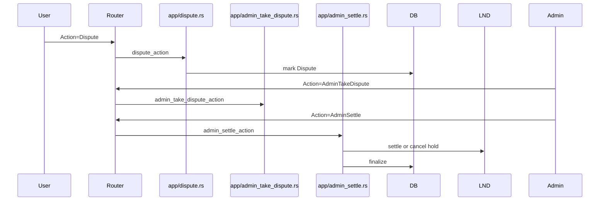

# Admin RPC and Disputes

Admin capabilities and dispute resolution paths.

## RPC Server
- Source: `src/rpc/server.rs`
- Enable: `settings.toml` → `[rpc] enabled = true`
- Binds `listen_address:port`; injects Keys, `Arc<Pool<Sqlite>>`, `Arc<Mutex<LndConnector>>`.
- Uses `tonic`; see `docs/RPC.md` and `proto/admin.proto`.

## Dispute Lifecycle
- Open: `src/app/dispute.rs` (Action=Dispute) → mark order as `Dispute` and notify.
- Admin Take: `src/app/admin_take_dispute.rs` assigns solver.
- Admin Settle: `src/app/admin_settle.rs` settles/cancels hold or pays out as needed.

## Admin Cancel
- File: `src/app/admin_cancel.rs`.
- Cancels order, optionally cancels hold invoice via LND.

## Diagram: Dispute

## Audit and Safety
- Require admin authentication/authorization at message level.
- Record solver, timestamps, and decisions in DB for traceability.
- Avoid leaking sensitive data in logs; scrub invoices and keys.
