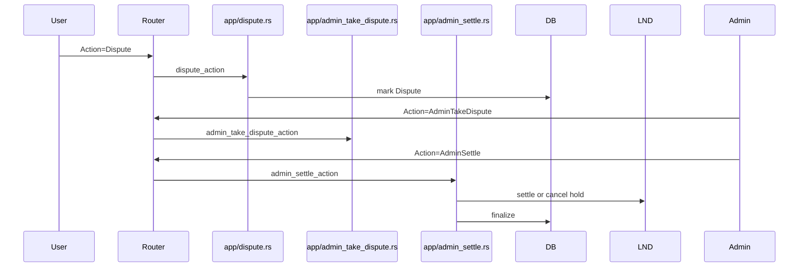

# Admin RPC and Disputes

Admin capabilities and dispute resolution paths.

## RPC Server
- Source: `src/rpc/server.rs`
- Enable: `settings.toml` → `[rpc] enabled = true`, plus a `MOSTRO_RPC_TOKEN` bearer token in the environment (startup is fatal without it).
- Binds `listen_address:port`; injects Keys, `Arc<Pool<Sqlite>>`, `Arc<Mutex<LndConnector>>`.
- Auth: `src/rpc/auth.rs` intercepts every method and rejects any request without the token. This is the *only* caller authorization on the RPC path — the handlers run as the daemon identity, which every downstream check treats as fully privileged.
- Uses `tonic`; see `docs/RPC.md` and `proto/admin.proto`.

## Dispute Lifecycle
- Open: `src/app/dispute.rs` (Action=Dispute) → mark order as `Dispute` and notify.
- Admin Take: `src/app/admin_take_dispute.rs` assigns solver. Both `read` and `read-write` solvers may take disputes.
- Admin Settle: `src/app/admin_settle.rs` settles/cancels hold or pays out as needed. Requires a `read-write` solver.

## Admin Cancel
- File: `src/app/admin_cancel.rs`.
- Cancels order, optionally cancels hold invoice via LND.

## Diagram: Dispute

```mermaid
sequenceDiagram
  participant User as User
  participant Mostro as Router
  participant Dispute as app/dispute.rs
  participant AdminTake as app/admin_take_dispute.rs
  participant AdminSettle as app/admin_settle.rs
  participant DB as DB
  participant LND as LND
  participant Admin as Admin

  User->>Mostro: Action=Dispute
  Mostro->>Dispute: dispute_action
  Dispute->>DB: mark Dispute
  Admin->>Mostro: Action=AdminTakeDispute
  Mostro->>AdminTake: admin_take_dispute_action
  Admin->>Mostro: Action=AdminSettle
  Mostro->>AdminSettle: admin_settle_action
  AdminSettle->>LND: settle or cancel hold
  AdminSettle->>DB: finalize
```

## Audit and Safety
- Nostr admin messages are authorized at message level; the gRPC path is authorized at the transport instead (bearer token), because its synthesized events always carry the daemon identity.
- Enforce solver permission levels in the daemon: `read` solvers can assist but cannot execute `admin-settle` or `admin-cancel`.
- Record solver, timestamps, and decisions in DB for traceability.
- Avoid leaking sensitive data in logs; scrub invoices and keys.
