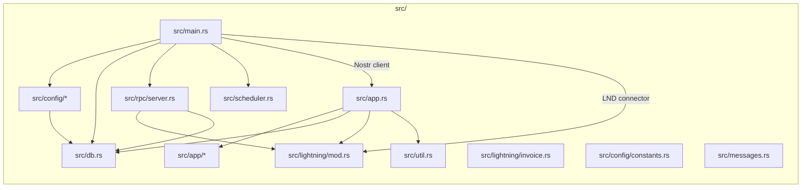
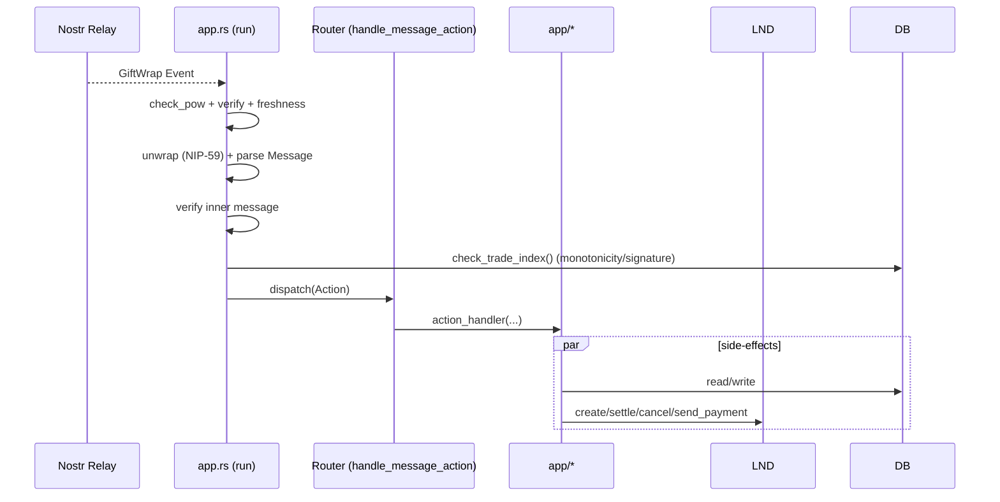
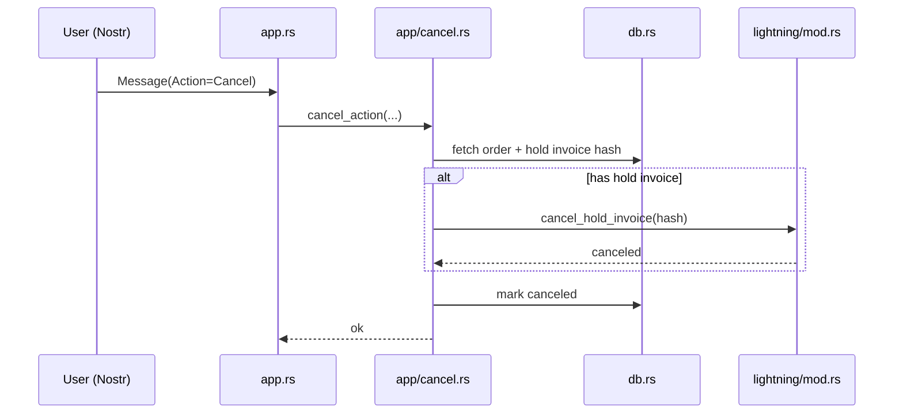
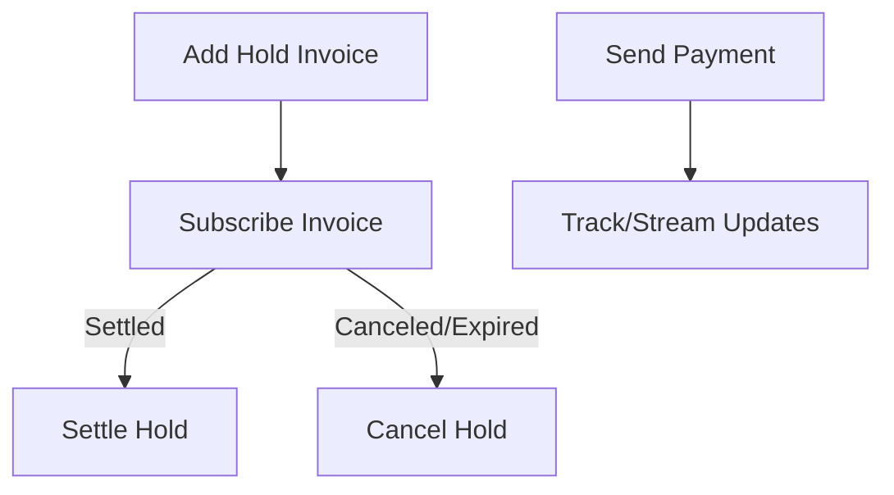

# Mostro Architecture

This document maps the Mostro daemon: startup flow, event intake and routing, action modules, Lightning integration, and admin RPC. It links source modules and shows key sequences.

## Module Map



- Entry: `src/main.rs` initializes settings, DB, Nostr, LND, RPC, scheduler, then calls `app::run`.
- Routing: `src/app.rs` unwraps Nostr GiftWrap events, verifies POW/signature/timestamp, parses `mostro_core::Message`, and dispatches to `src/app/*`.
- Lightning: `src/lightning/mod.rs` provides hold invoices, settle/cancel, and outgoing payments.
- RPC: `src/rpc/server.rs` serves admin operations when enabled.

## Action Modules (src/app/*)

- Orders: `order.rs`, `take_buy.rs`, `take_sell.rs`, `cancel.rs`, `release.rs`, `add_invoice.rs`, `fiat_sent.rs`, `orders.rs`, `restore_session.rs`, `trade_pubkey.rs`, `rate_user.rs`, `dispute.rs`.
- Admin: `admin_cancel.rs`, `admin_settle.rs`, `admin_add_solver.rs`, `admin_take_dispute.rs`.
- Router: `app.rs:handle_message_action` matches `mostro_core::message::Action` and calls module functions.

### Per‑Action Summaries

- `app/order.rs` – validates and creates new orders; persists to DB; emits acknowledgements.
- `app/take_buy.rs` – buyer accepts a sell offer; checks order state, reserves amount.
- `app/take_sell.rs` – seller accepts a buy offer; mirrors `take_buy` logic for sell side.
- `app/add_invoice.rs` – records buyer invoice or creates hold invoice for escrow; may call LND.
- `app/release.rs` – releases held funds on successful trade; settles hold invoice via LND.
- `app/fiat_sent.rs` – buyer signals fiat transfer; updates order state, notifies counterparty.
- `app/cancel.rs` – cancels pending orders; may cancel hold invoice if present.
- `app/dispute.rs` – opens a dispute; flags order and awaits admin solver.
- `app/rate_user.rs` – updates user reputation after completion.
- `app/orders.rs` – queries and returns order listings/history.
- `app/restore_session.rs` – rehydrates context for a client after reconnect.
- `app/trade_pubkey.rs` – exchanges/updates trade pubkeys for secure comms.
- Admin modules – force cancel/settle, take disputes, add solvers; guarded and auditable.

## Configuration Constants (src/config/constants.rs)

New file containing development fee constants:
- `MIN_DEV_FEE_PERCENTAGE`: Minimum fee percentage
- `MAX_DEV_FEE_PERCENTAGE`: Maximum fee percentage
- `DEV_FEE_LIGHTNING_ADDRESS`: Destination Lightning address for dev fees

Referenced by fee calculation logic in order processing.

## Startup Sequence

```mermaid
sequenceDiagram
  participant OS as Process
  participant M as main.rs
  participant CFG as config/*
  participant DB as db.rs
  participant N as Nostr
  participant L as LND
  participant RPC as rpc/server.rs
  participant APP as app.rs

  OS->>M: start()
  M->>CFG: settings_init()
  M->>DB: connect() -> Pool
  M->>N: connect_nostr() -> Client
  M->>L: LndConnector::new(); get_node_info()
  M->>DB: find_held_invoices()
  alt RPC enabled
    M->>RPC: start(keys, pool, ln)
  end
  M->>APP: run(keys, client, ln)
```

## Event Intake & Routing



## Example Flows

### Flow: Take Buy → Add Invoice → Release

```mermaid
sequenceDiagram
  participant Buyer as Buyer (Nostr)
  participant Mostro as app.rs
  participant TakeBuy as app/take_buy.rs
  participant AddInv as app/add_invoice.rs
  participant Release as app/release.rs
  participant DB as db.rs
  participant LND as lightning/mod.rs

  Buyer->>Mostro: Message(Action=TakeBuy)
  Mostro->>DB: check_trade_index + load order
  Mostro->>TakeBuy: take_buy_action(...)
  TakeBuy->>DB: assert available, reserve amounts
  TakeBuy-->>Mostro: ok
  Buyer->>Mostro: Message(Action=AddInvoice)
  Mostro->>AddInv: add_invoice_action(...)
  AddInv->>LND: create_hold_invoice(amount)
  LND-->>AddInv: invoice, preimage, hash
  AddInv->>DB: persist hold invoice refs
  AddInv-->>Mostro: ok
  Buyer->>Mostro: Message(Action=FiatSent)
  Mostro->>DB: mark fiat_sent
  Counterparty->>Mostro: Message(Action=Release)
  Mostro->>Release: release_action(...)
  Release->>LND: settle_hold_invoice(preimage)
  LND-->>Release: settled
  Release->>DB: finalize order; update reputation cues
```

### Flow: Cancel with Held Invoice



### Flow: Dispute Lifecycle (Open → Admin Take → Settle)

```mermaid
sequenceDiagram
  participant User as User (Nostr)
  participant Mostro as app.rs
  participant Dispute as app/dispute.rs
  participant AdminTake as app/admin_take_dispute.rs
  participant AdminSettle as app/admin_settle.rs
  participant DB as db.rs
  participant LND as lightning/mod.rs

  User->>Mostro: Message(Action=Dispute)
  Mostro->>Dispute: dispute_action(...)
  Dispute->>DB: mark order Dispute; log reason
  Dispute-->>Mostro: ok (notify parties)
  Admin->>Mostro: Message(Action=AdminTakeDispute)
  Mostro->>AdminTake: admin_take_dispute_action(...)
  AdminTake->>DB: assign solver; update status
  Admin->>Mostro: Message(Action=AdminSettle)
  Mostro->>AdminSettle: admin_settle_action(...)
  alt settle to seller
    AdminSettle->>LND: settle_hold_invoice(preimage)
  else refund to buyer
    AdminSettle->>LND: cancel_hold_invoice(hash) or pay buyer
  end
  AdminSettle->>DB: finalize order
```

### Flow: Admin Cancel

```mermaid
sequenceDiagram
  participant Admin as Admin (Nostr)
  participant Mostro as app.rs
  participant AdminCancel as app/admin_cancel.rs
  participant DB as db.rs
  participant LND as lightning/mod.rs

  Admin->>Mostro: Message(Action=AdminCancel)
  Mostro->>AdminCancel: admin_cancel_action(...)
  AdminCancel->>DB: fetch order + hold invoice
  alt has hold invoice
    AdminCancel->>LND: cancel_hold_invoice(hash)
  end
  AdminCancel->>DB: mark canceled; audit trail
```

## Lightning Operations

- `create_hold_invoice(description, amount)` → returns invoice, preimage, hash.
- `subscribe_invoice(r_hash, sender)` → streams `InvoiceState` updates.
- `settle_hold_invoice(preimage)` / `cancel_hold_invoice(hash)`.
- `send_payment(invoice, amount, sender)` → enforces amount, caps fees by `Settings::get_mostro().max_routing_fee`, streams payment updates.



## Admin RPC

- Server: `src/rpc/server.rs`. Enabled via `settings.toml` RPC section.
- Injects: Keys, `Arc<Pool<Sqlite>>`, `Arc<Mutex<LndConnector>>`.
- Built with `tonic`; see `docs/RPC.md` and `proto/admin.proto` for methods.

## Developer Pointers

- POW threshold: `Settings::get_mostro().pow` (gate early).
- Trade index: `check_trade_index` rejects replays/out-of-order and bootstraps new users.
- SQLx: update offline data after query/schema changes: `cargo sqlx prepare -- --bin mostrod`.
- Sensitive config: keep templates in `settings.tpl.toml`; never commit populated `settings.toml`.
