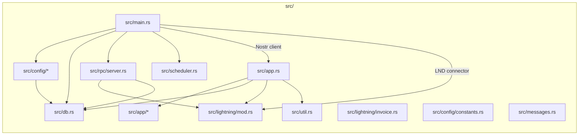
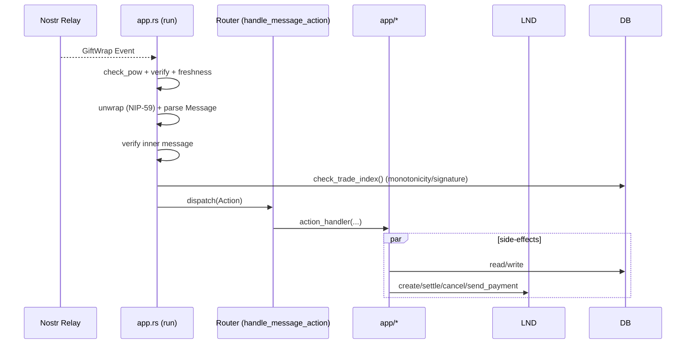
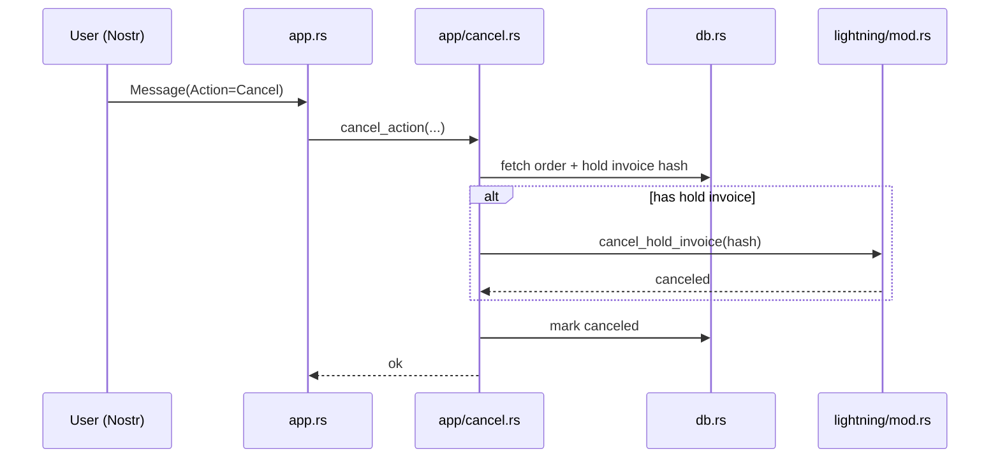
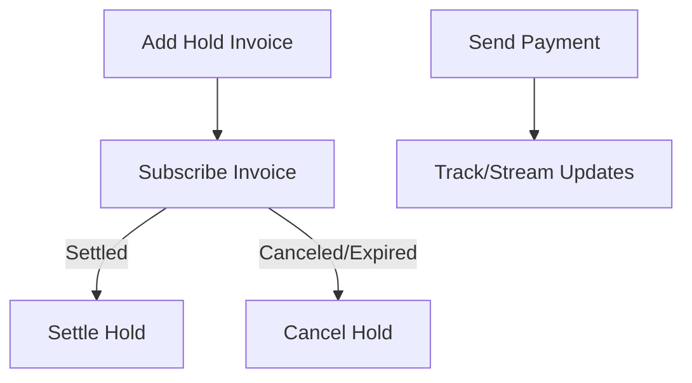

# Mostro Architecture

This document maps the Mostro daemon: startup flow, event intake and routing, action modules, Lightning integration, and admin RPC. It links source modules and shows key sequences.

## Module Map


```mermaid
flowchart LR
  subgraph Runtime[src/]
    MAIN[src/main.rs]
    APP[src/app.rs]
    A_APP[src/app/*]
    LND[src/lightning/mod.rs]
    LND_INV[src/lightning/invoice.rs]
    RPC[src/rpc/server.rs]
    CFG[src/config/*]
    CONST[src/config/constants.rs]
    DB[src/db.rs]
    UTIL[src/util.rs]
    MSG[src/messages.rs]
    SCHED[src/scheduler.rs]
  end

  MAIN --> CFG
  MAIN --> DB
  MAIN --> RPC
  MAIN --> SCHED
  MAIN -->|Nostr client| APP
  MAIN -->|LND connector| LND
  APP --> A_APP
  APP --> DB
  APP --> LND
  APP --> UTIL
  RPC --> LND
  RPC --> DB
  CFG --> DB
```

- Entry: `src/main.rs` initializes settings, DB, Nostr, LND, RPC, builds `AppContext`, starts scheduler, then calls `app::run`.
- Routing: `src/app.rs` unwraps Nostr GiftWrap events, verifies POW/signature/timestamp, parses `mostro_core::Message`, and dispatches to `src/app/*`.
- Lightning: `src/lightning/mod.rs` provides hold invoices, settle/cancel, and outgoing payments.
- RPC: `src/rpc/server.rs` serves admin operations when enabled.
- DI Context: `src/app/context.rs` provides `AppContext` for dependency injection across handlers and scheduler.

## Action Modules (src/app/*)

- Orders: `order.rs`, `take_buy.rs`, `take_sell.rs`, `cancel.rs`, `release.rs`, `add_invoice.rs`, `fiat_sent.rs`, `orders.rs`, `restore_session.rs`, `trade_pubkey.rs`, `rate_user.rs`, `dispute.rs`.
- Admin: `admin_cancel.rs`, `admin_settle.rs`, `admin_add_solver.rs`, `admin_take_dispute.rs`.
- Anti-abuse bond (`app/bond/*`): `flow.rs` (lock/release lifecycle), `slash.rs` (dispute + timeout slash), `payout.rs` (counterparty payout), `db.rs`/`model.rs` (the `bonds` table), `math.rs` (amount/split math), `types.rs` (`BondRole`, `BondState`, `BondSlashReason`). Opt-in and off by default; see `docs/ANTI_ABUSE_BOND.md`.
- Router: `app.rs:handle_message_action` matches `mostro_core::message::Action` and calls module functions.

### Per‑Action Summaries

- `app/order.rs` – validates and creates new orders; persists to DB; emits acknowledgements.
- `app/take_buy.rs` – buyer accepts a sell offer; checks order state, reserves amount.
- `app/take_sell.rs` – seller accepts a buy offer; mirrors `take_buy` logic for sell side.
- `app/add_invoice.rs` – records buyer invoice or creates hold invoice for escrow; may call LND.
- `app/release.rs` – releases held funds on successful trade; settles hold invoice via LND.
- `app/fiat_sent.rs` – buyer signals fiat transfer; updates order state, notifies counterparty.
- `app/cancel.rs` – cancels pending orders; may cancel hold invoice if present.
- `app/dispute.rs` – opens a dispute; flags order and awaits admin solver.
- `app/rate_user.rs` – updates user reputation after completion.
- `app/orders.rs` – queries and returns order listings/history.
- `app/restore_session.rs` – rehydrates context for a client after reconnect.
- `app/trade_pubkey.rs` – exchanges/updates trade pubkeys for secure comms.
- Admin modules – force cancel/settle, take disputes, add solvers; guarded, auditable, and permission-gated for solver capabilities. `admin_settle`/`admin_cancel` also carry the optional `BondResolution` payload that lets a solver slash a bond independently of the trade outcome.
- `app/bond/*` – optional anti-abuse bond: a *second* Lightning hold invoice the maker and/or taker locks when entering a trade. Released on normal completion and on cancels before a waiting-state timeout; slashed only on an explicit solver `BondResolution` directive or a waiting-state timeout (gated by `slash_on_waiting_timeout`). Wired into `take_buy`/`take_sell` (lock), every cancel/release/admin path (release), and the scheduler (timeout slash + payout). Disabled by default.

### Two axes the bond keeps separate

The bond feature deliberately distinguishes two axes (see `docs/ANTI_ABUSE_BOND.md` §3.1):

- **Maker / taker — *who posted the bond, and when.*** The bond is requested at order-creation time (maker) or take time (taker). The `apply_to` setting (`take` | `make` | `both`) is a maker/taker switch; `BondRole` is a maker/taker enum.
- **Buyer / seller — *whose action triggers a slash.*** All trade-flow duties (paying the hold invoice, providing the buyer invoice, sending fiat, releasing) are buyer/seller duties, so the solver's `BondResolution` carries `slash_seller` / `slash_buyer`, never `slash_maker` / `slash_taker`.

The order kind fixes the mapping: on a `sell` order the maker is the seller and the taker is the buyer; on a `buy` order the maker is the buyer and the taker is the seller. The daemon resolves a `slash_seller`/`slash_buyer` directive to the right bond row internally.

## Configuration Constants (src/config/constants.rs)

New file containing development fee constants:
- `MIN_DEV_FEE_PERCENTAGE`: Minimum fee percentage
- `MAX_DEV_FEE_PERCENTAGE`: Maximum fee percentage
- `DEV_FEE_LIGHTNING_ADDRESS`: Destination Lightning address for dev fees

Referenced by fee calculation logic in order processing.

## Dependency Injection (AppContext)

**File**: `src/app/context.rs`

`AppContext` is the central dependency container passed to all handlers and scheduler jobs. It replaces direct access to global state, enabling better testability and explicit dependencies.

### Fields

| Field | Type | Description |
|-------|------|-------------|
| `pool` | `Arc<Pool<Sqlite>>` | Database connection pool |
| `nostr_client` | `Client` | Nostr client for publishing events |
| `settings` | `Arc<Settings>` | Application configuration |
| `order_msg_queue` | `OrderMsgQueue` | Shared queue for outbound messages |
| `keys` | `Keys` | Mostro's Nostr signing keys |

### Accessors

- `ctx.pool()` → `&Pool<Sqlite>`
- `ctx.nostr_client()` → `&Client`
- `ctx.settings()` → `&Settings`
- `ctx.keys()` → `&Keys`
- `ctx.order_msg_queue()` → `&OrderMsgQueue`

### Construction

`AppContext` is constructed once in `main.rs` and passed to:
1. `scheduler::start_scheduler(ctx)` — for background jobs
2. `app::run(ctx, ln_client)` — for the main event loop

### Testing

Use `TestContextBuilder` for unit tests:

```rust
let ctx = TestContextBuilder::new()
    .with_pool(test_pool)
    .with_settings(test_settings())
    .build();
```

## Startup Sequence

```mermaid
sequenceDiagram
  participant OS as Process
  participant M as main.rs
  participant CFG as config/*
  participant DB as db.rs
  participant N as Nostr
  participant L as LND
  participant RPC as rpc/server.rs
  participant APP as app.rs

  OS->>M: start()
  M->>CFG: settings_init()
  M->>DB: connect() -> Pool
  M->>N: connect_nostr() -> Client
  M->>L: LndConnector::new(); get_node_info()
  M->>DB: find_held_invoices()
  alt RPC enabled
    M->>RPC: start(keys, pool, ln)
  end
  M->>M: Build AppContext(pool, client, settings, queue, keys)
  M->>SCHED: start_scheduler(ctx)
  M->>APP: run(ctx, ln)
```

## Event Intake & Routing


```mermaid
sequenceDiagram
  participant Relay as Nostr Relay
  participant APP as app.rs (run)
  participant R as Router (handle_message_action)
  participant MOD as app/*
  participant L as LND
  participant DB as DB

  Relay-->>APP: GiftWrap Event
  APP->>APP: check_pow + verify + freshness
  APP->>APP: unwrap (NIP-59) + parse Message
  APP->>APP: verify inner message
  APP->>DB: check_trade_index() (monotonicity/signature)
  APP->>R: dispatch(Action)
  R->>MOD: action_handler(...)
  par side-effects
    MOD->>DB: read/write
    MOD->>L: create/settle/cancel/send_payment
  end
```

## Example Flows

### Flow: Take Buy → Add Invoice → Release

```mermaid
sequenceDiagram
  participant Buyer as Buyer (Nostr)
  participant Mostro as app.rs
  participant TakeBuy as app/take_buy.rs
  participant AddInv as app/add_invoice.rs
  participant Release as app/release.rs
  participant DB as db.rs
  participant LND as lightning/mod.rs

  Buyer->>Mostro: Message(Action=TakeBuy)
  Mostro->>DB: check_trade_index + load order
  Mostro->>TakeBuy: take_buy_action(...)
  TakeBuy->>DB: assert available, reserve amounts
  TakeBuy-->>Mostro: ok
  Buyer->>Mostro: Message(Action=AddInvoice)
  Mostro->>AddInv: add_invoice_action(...)
  AddInv->>LND: create_hold_invoice(amount)
  LND-->>AddInv: invoice, preimage, hash
  AddInv->>DB: persist hold invoice refs
  AddInv-->>Mostro: ok
  Buyer->>Mostro: Message(Action=FiatSent)
  Mostro->>DB: mark fiat_sent
  Counterparty->>Mostro: Message(Action=Release)
  Mostro->>Release: release_action(...)
  Release->>LND: settle_hold_invoice(preimage)
  LND-->>Release: settled
  Release->>DB: finalize order; update reputation cues
```

### Flow: Cancel with Held Invoice


```mermaid
sequenceDiagram
  participant User as User (Nostr)
  participant Mostro as app.rs
  participant Cancel as app/cancel.rs
  participant DB as db.rs
  participant LND as lightning/mod.rs

  User->>Mostro: Message(Action=Cancel)
  Mostro->>Cancel: cancel_action(...)
  Cancel->>DB: fetch order + hold invoice hash
  alt has hold invoice
    Cancel->>LND: cancel_hold_invoice(hash)
    LND-->>Cancel: canceled
  end
  Cancel->>DB: mark canceled
  Cancel-->>Mostro: ok
```

### Flow: Dispute Lifecycle (Open → Admin Take → Settle)

```mermaid
sequenceDiagram
  participant User as User (Nostr)
  participant Mostro as app.rs
  participant Dispute as app/dispute.rs
  participant AdminTake as app/admin_take_dispute.rs
  participant AdminSettle as app/admin_settle.rs
  participant DB as db.rs
  participant LND as lightning/mod.rs

  User->>Mostro: Message(Action=Dispute)
  Mostro->>Dispute: dispute_action(...)
  Dispute->>DB: mark order Dispute; log reason
  Dispute-->>Mostro: ok (notify parties)
  Admin->>Mostro: Message(Action=AdminTakeDispute)
  Mostro->>AdminTake: admin_take_dispute_action(...)
  AdminTake->>DB: assign solver; update status
  Admin->>Mostro: Message(Action=AdminSettle)
  Mostro->>AdminSettle: admin_settle_action(...)
  alt settle to seller
    AdminSettle->>LND: settle_hold_invoice(preimage)
  else refund to buyer
    AdminSettle->>LND: cancel_hold_invoice(hash) or pay buyer
  end
  AdminSettle->>DB: finalize order
```

### Flow: Admin Cancel

```mermaid
sequenceDiagram
  participant Admin as Admin (Nostr)
  participant Mostro as app.rs
  participant AdminCancel as app/admin_cancel.rs
  participant DB as db.rs
  participant LND as lightning/mod.rs

  Admin->>Mostro: Message(Action=AdminCancel)
  Mostro->>AdminCancel: admin_cancel_action(...)
  AdminCancel->>DB: fetch order + hold invoice
  alt has hold invoice
    AdminCancel->>LND: cancel_hold_invoice(hash)
  end
  AdminCancel->>DB: mark canceled; audit trail
```

### Flow: Anti-Abuse Bond (Lock → Resolve)

Opt-in (`[anti_abuse_bond].enabled = true`). The bond is a second hold
invoice, separate from the trade escrow. Shown for a taker on a buy order;
the maker side (Phase 5+) is symmetric.

```mermaid
sequenceDiagram
  participant Taker as Taker (Nostr)
  participant Mostro as app.rs
  participant Bond as app/bond/*
  participant Sched as scheduler.rs
  participant DB as db.rs
  participant LND as lightning/mod.rs

  Taker->>Mostro: Message(Action=TakeBuy)
  Mostro->>Bond: request_taker_bond(...)
  Bond->>LND: create_hold_invoice(bond amount)
  Bond->>DB: insert bonds row (state=Requested)
  Bond-->>Taker: Action=PayBondInvoice (bolt11)
  Taker->>LND: pay bond hold invoice (HTLC held)
  LND-->>Bond: InvoiceState=Accepted
  Bond->>DB: state=Locked; copy taker_* onto order; resume take
  alt normal completion or pre-timeout cancel
    Mostro->>Bond: release_bond(...)
    Bond->>LND: cancel_hold_invoice(bond hash)
    Bond->>DB: state=Released
  else solver directive (BondResolution) or waiting-state timeout
    Mostro->>Bond: slash (admin_settle/cancel) or
    Sched->>Bond: slash_or_release_on_timeout(...)
    Bond->>LND: settle_hold_invoice(preimage)  %% claims bond into Mostro wallet
    Bond->>DB: state=PendingPayout; freeze node_share_sats
    Bond-->>Taker: Action=BondSlashed (timeout path)
    Sched->>Bond: job_process_bond_payouts
    Bond-->>Counterparty: Action=AddBondInvoice (asks for payout bolt11)
    Counterparty-->>Bond: Action=AddInvoice (payout bolt11)
    Bond->>LND: send_payment(counterparty share)
    Bond->>DB: state=Slashed (or Forfeited if claim window lapses)
  end
```

## Lightning Operations

- `create_hold_invoice(description, amount)` → returns invoice, preimage, hash.
- `subscribe_invoice(r_hash, sender)` → streams `InvoiceState` updates.
- `settle_hold_invoice(preimage)` / `cancel_hold_invoice(hash)`.
- `send_payment(invoice, amount, sender)` → enforces amount, caps fees by `Settings::get_mostro().max_routing_fee`, streams payment updates.


```mermaid
flowchart TD
  A[Add Hold Invoice] --> B[Subscribe Invoice]
  B -->|Settled| C[Settle Hold]
  B -->|Canceled/Expired| D[Cancel Hold]
  E[Send Payment] --> F[Track/Stream Updates]
```

## Admin RPC

- Server: `src/rpc/server.rs`. Enabled via `settings.toml` RPC section.
- Injects: Keys, `Arc<Pool<Sqlite>>`, `Arc<Mutex<LndConnector>>`.
- Built with `tonic`; see `docs/RPC.md` and `proto/admin.proto` for methods.

## Developer Pointers

- POW threshold: `Settings::get_mostro().pow` (gate early).
- Trade index: `check_trade_index` rejects replays/out-of-order and bootstraps new users.
- SQLx: update offline data after query/schema changes: `cargo sqlx prepare -- --bin mostrod`.
- Sensitive config: keep templates in `settings.tpl.toml`; never commit populated `settings.toml`.
