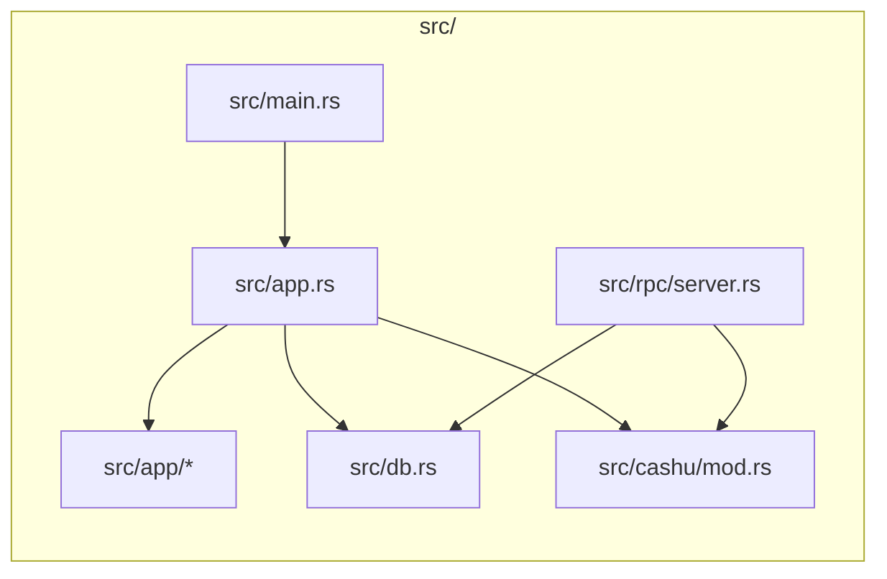
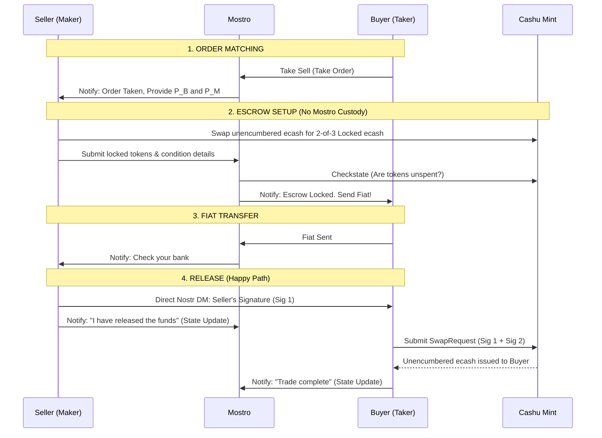
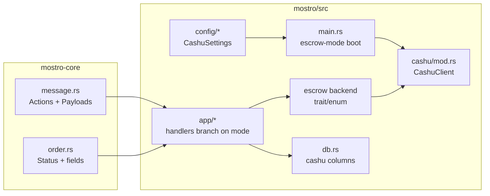
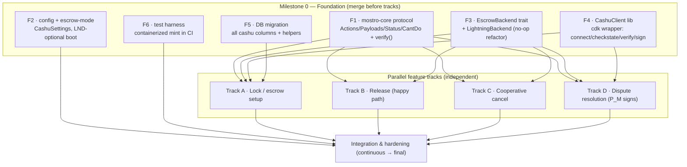

# Cashu 2-of-3 Multisig Escrow Architecture

This document describes the alternative escrow mechanism utilizing Cashu (NUT-11 P2PK) rather than Lightning Network hold invoices. In this model, Mostro acts strictly as a coordinator and arbitrator, and never takes custody of funds. 

## Context & Motivation

The Lightning hold-invoice escrow works well for users who run their own node and have reliable connectivity, but it does not serve everyone in the Mostro ecosystem. This Cashu-based model is **not a replacement** for the Lightning flow — it is an additional option aimed at communities and conditions where hold invoices are impractical. It deliberately trades self-custody and trustlessness for offline resilience and simplicity, which is an acceptable bargain in **trust-based communities**.

### Use Cases

1. **Offline resilience for users with unreliable infrastructure.** In places like Cuba, recurring electricity outages and intermittent connectivity make it impractical to keep a node — or even a phone — online for the full duration of a trade. The Lightning hold-invoice flow requires the payer, the payee, and Mostro's routing node to be online and able to route an HTLC at the same moment. The Cashu flow does not: funds are locked in an ecash token, and the release signature can be exchanged out-of-band over Nostr whenever each party happens to come online. A trade can progress across separate, non-overlapping connectivity windows.

2. **Non-technical users who don't want to run a node.** Operating a Lightning node means managing channels, inbound/outbound liquidity, rebalancing, and the custody risk of the funds those channels hold. Many users — especially newcomers — neither want nor are equipped to do this. The Cashu model lets them rely on an **external mint** instead. This means delegating custody and trust to the mint operator, which is a reasonable tradeoff for trust-based communities that already share a mint they trust.

3. **Reduced legal/custody surface for the operator.** This is the key structural improvement over Lightning. With a hold invoice, Mostro takes actual custody of the funds for the few seconds between accepting the inbound HTLC and settling the outbound payment — brief, but real custody. In the Cashu 2-of-3 model the operator **never takes possession of user funds at any point**: Mostro only ever holds 1 of the 3 keys and can never unilaterally move the ecash. This removes Mostro from the custody path entirely, which materially shrinks the legal and regulatory burden of operating a coordinator.

4. **Long-lived escrow for marketplace-style trades.** A Lightning hold invoice cannot stay pending indefinitely — it is bounded by its CLTV delta (measured in blocks), so the funds must be released or refunded within hours. This makes Lightning escrow unsuitable for any trade that does not settle almost immediately. Cashu ecash, by contrast, **does not expire**: a 2-of-3 locked token can sit in escrow for days or weeks without any on-chain timeout forcing resolution. This unlocks Mostro as a **marketplace** for physical goods and other slow-to-deliver items — a buyer can lock funds, wait for the seller to ship and the package to arrive, and only then release, with the same non-custodial safety throughout the entire delivery window.

## Module Map (Proposed)



- Entry: `src/main.rs` initializes standard subsystems but bypasses `fedimint-tonic-lnd` initialization if operating in pure-Cashu mode.
- Cashu: `src/cashu/mod.rs` interfaces with the `cdk` crate to verify token conditions (NUT-10/NUT-11) and communicate with the Mint's `/v1/checkstate` endpoint.

## Core Flow: 2-of-3 Multisig

Instead of routing HTLCs through Mostro's node, the seller locks the funds in a Cashu token governed by a `2-of-3` signature requirement:
1. $P_B$ (Buyer Pubkey)
2. $P_S$ (Seller Pubkey)
3. $P_M$ (Mostro/Arbitrator Pubkey)

> **The buyer and seller pubkeys MUST be the per-order trade keys, never the parties' identity (master) keys.** Mostro already derives a fresh, ephemeral *trade key* for each side of every order (see the existing trade-key flow used by `add-invoice`/`take-*`). The Cashu escrow reuses exactly those keys: $P_B$ is the buyer's trade pubkey for this order and $P_S$ is the seller's trade pubkey for this order. This is not an arbitrary choice — it is required for both privacy and protocol consistency:
> - **Privacy / unlinkability.** Using identity keys would publish a long-lived pubkey into the mint's spending condition, letting the mint (or anyone who later inspects the token) link every escrow a user ever participates in back to one identity and to each other. Per-order trade keys keep each escrow cryptographically independent.
> - **Consistency with the rest of the protocol.** Every other signature a party produces in an order (order messages, `release`, `cancel`, NIP-59 DMs carrying the release signature) is already made with the trade key. The Cashu signature that satisfies the 2-of-3 condition is produced by the *same* key, so the party can sign the swap with the key they already hold for this order, and the daemon verifies against the trade pubkey it already has on file.
>
> $P_M$ is Mostro's arbitrator key. It MAY be a Mostro key dedicated to Cashu arbitration rather than a per-order key, since Mostro only ever signs during dispute resolution; the daemon's identity is not something the trade is trying to hide.



## Action Changes & Handlers

The introduction of Cashu Escrow modifies the responsibility of core action handlers.

| Action | Proposed Handler Mod | Responsibility |
| --- | --- | --- |
| `add-invoice` | `src/app/add_invoice.rs` | Instead of creating a hold invoice, validates the submitted Cashu token using `cdk`, verifies the 2-of-3 spending condition, and calls the Mint API to ensure funds exist. |
| `release` | `src/app/release.rs` | Instead of acting as the middleman for signatures, Mostro simply receives the state update notification from the Seller. The cryptographic signature is sent directly to the Buyer via a P2P Nostr Direct Message (NIP-59) using the trade's ephemeral keys. |
| `cancel` | `src/app/cancel.rs` | If a trade is canceled cooperatively, the Buyer provides their signature directly to the Seller (via NIP-59 DM) so the Seller can reclaim the locked ecash, bypassing Mostro's servers. |
| `admin-settle` | `src/app/admin_settle.rs` | (Dispute Resolution) Mostro generates its signature ($P_M$) and hands it to the Buyer, allowing the Buyer to construct a valid 2-of-3 SwapRequest. |
| `admin-cancel` | `src/app/admin_cancel.rs` | (Dispute Resolution) Mostro generates its signature ($P_M$) and hands it to the Seller, allowing the Seller to reclaim their funds. |

## CDK Implementation Details

### Generating Spending Conditions
Sellers construct the 2-of-3 spending condition using `cdk::nuts::nut10`. We recommend the `SIG_INPUTS` flag. This allows the seller to sign the authorization once and pass it to the buyer, allowing the buyer to specify their own target outputs independently.

```rust
use cdk::nuts::nut10::{Conditions, SpendingConditions, SigFlag};
use cdk::nuts::PublicKey;

// 1. Gather pubkeys — P_B and P_S MUST be the per-order *trade* keys
//    for this order, NOT the parties' identity/master keys.
let p_s: PublicKey = /* Seller's trade pubkey for this order */;
let p_b: PublicKey = /* Buyer's trade pubkey for this order  */;
let p_m: PublicKey = /* Mostro's arbitrator pubkey           */;

// 2. Define 2-of-3 constraints
let conditions = Conditions::new(
    None,                           
    Some(vec![p_b, p_m]),           // Secondary keys
    None,                           
    Some(2),                        // Requires 2 signatures
    None,                           
    Some(SigFlag::SigInputs),       // SigInputs for flexible output assignment
).unwrap();

// 3. Generate Secret for blinding
let secret = SpendingConditions::new_p2pk(p_s, Some(conditions));
```

### Signature Flags: `SIG_INPUTS` vs `SIG_ALL`
*   **`SIG_INPUTS`:** The easiest UX. The Seller only signs the intent to release. The Buyer receives the signature via Nostr DM, crafts their own unblinded outputs, signs the request, and asks the Mint to swap.
*   **`SIG_ALL`:** The safest UX against malicious Mints. The Buyer must pre-construct their outputs, send the hash to the Seller, and the Seller signs the entire bundle. 
*   **Decision:** Mostro relies on `SIG_INPUTS` as the baseline. Because both parties must mutually agree on the Mint provider prior to the trade, we assume the Mint will not maliciously front-run transaction outputs. 

## Advantages over Lightning Hold Invoices

1. **Non-Custodial:** Mostro drops all legal and technical burdens of custody. A compromised Mostro server only leaks 1 of 3 keys, meaning attacker cannot steal active escrows.
2. **Offline Resilience:** If Mostro's daemon crashes or vanishes permanently, the Buyer and Seller can still cooperate out-of-band to settle the trade (Seller + Buyer = 2 keys).
3. **No Routing Failures:** Bypasses Lightning Network topology, channel liquidity constraints, and unpredictable routing fees.
4. **Zero Capital Lockup:** Mostro does not require inbound/outbound channel liquidity to facilitate trades.

---

# Implementation Plan (Phased Rollout)

This section turns the architecture above into a concrete, incremental engineering plan. It follows the same phased-PR convention as [`ANTI_ABUSE_BOND.md`](./ANTI_ABUSE_BOND.md): each phase is a self-contained, reviewable pull request that leaves `main` shippable. The feature is **opt-in and defaults to off** — until an operator enables it, the daemon behaves exactly as it does today.

## Design Decisions (locked)

These decisions scope the plan and should not be re-litigated per phase:

1. **Global mode switch, not per-order.** A node runs in **one** escrow mode at a time: `lightning` (today's default) **or** `cashu`. The mode is fixed in `settings.toml`. When a node runs in `cashu` mode, the `fedimint-tonic-lnd` connector is **not initialized** at startup — the node needs no LND. There is no mixed mode where a single node offers both escrow types simultaneously.
2. **Node-configured, fixed mint.** The operator sets a single `mint_url` in `settings.toml`. All Cashu trades on that node use that mint. Per-order mint negotiation is explicitly out of scope for this rollout (possible future work).
3. **The daemon is a coordinator, not a wallet.** All wallet-side ecash operations — the seller swapping unencumbered ecash into a 2-of-3 locked token, and the buyer redeeming the locked token with two signatures — happen in the **client**. The daemon's responsibilities are narrow: validate a submitted locked token against the mint (`/v1/checkstate`), verify the 2-of-3 spending condition embeds the right three pubkeys, hold its own key `P_M`, and produce a `P_M` signature **only** during dispute resolution. Client work is documented here as an interface contract but implemented in the client repos, not here.
4. **`mostro-core` changes ship first.** New `Action`/`Payload`/`CantDoReason` variants and any new `Status` live in the shared `mostro-core` crate. They are additive and must be released (and the daemon's dependency bumped) before the daemon can use them. During development the daemon points at the local `mostro-core` via a `path` dependency.
5. **Bonds and Cashu mode are mutually exclusive (for now).** The anti-abuse bond is built on LN hold invoices and cannot function without LND. In `cashu` mode the bond feature is rejected at config-validation time. A Cashu-native bond is future work.

## Module Map (Target)



## Parallelization Strategy

This feature is large enough that several developers (each AI-assisted) should be able to work simultaneously without stepping on each other. Sequential phasing would serialize that team; instead we split the work into a small **Foundation milestone** that everyone depends on, followed by **independent feature tracks** that can be built in parallel.

The whole strategy rests on three ideas:

1. **Freeze the contracts first.** Three interfaces are the seams between workstreams. Once their *signatures* are agreed and merged (even as stubs), every track can code and unit-test against them in isolation, mocking the other side:
   - **Protocol contract** — the new `Action`/`Payload`/`Status`/`CantDoReason` shapes in `mostro-core`.
   - **`EscrowBackend` trait** — the abstraction the action handlers call instead of touching LND or `cdk` directly (`lock`, `release`, `cooperative_cancel`, `dispute_settle`, `dispute_cancel`). A `LightningBackend` wraps today's code unchanged; a `CashuBackend` is filled in by the feature tracks.
   - **`CashuClient` API** — the `cdk` wrapper in `src/cashu/` (connect, `check_state`, `verify_2of3_condition`, `sign_with_pm`). A thin, self-contained library the tracks call.
2. **Stub every integration point in Foundation.** All new enum variants, *all* dispatch `match` arms (pointing at stub handlers that return "not implemented"), all trait-method signatures (Cashu impl = `unimplemented!()`), and the full DB schema land together in Foundation. This is what avoids merge hell: after Foundation, the conflict-prone shared files (`app.rs` dispatch, `message.rs` enums, the migration) are **frozen**, and each feature track only fills in handler/trait bodies in *its own* files.
3. **One DB migration up front.** Parallel devs each writing migrations against the same `orders` table causes ordering/merge conflicts. Foundation adds *all* Cashu columns in a single migration so no feature track touches the schema.



## Milestone 0 — Foundation

Six PRs. **F1 and F3 are the critical contracts** and should land first; F2/F4/F5/F6 can themselves be built in parallel once the contract shapes are agreed (a short written interface spec on day one lets F4 proceed before F3 merges, etc.). Zero behavior change when the feature is off.

- **F1 · `mostro-core` protocol.** `src/message.rs`: add `Action` variants (`AddCashuEscrow`, `CashuEscrowLocked`, …) and `Payload` variants (`CashuToken(String)`, `CashuMintUrl(String)`, `CashuLockProof(CashuLockProofData)` where the struct carries `{ token, mint_url, buyer_pubkey, seller_pubkey, mostro_pubkey, signatures }` — `buyer_pubkey` and `seller_pubkey` are the per-order **trade** pubkeys, never identity keys); extend `MessageKind::verify()`; add round-trip tests. `src/error.rs`: add `CantDoReason` variants (`InvalidCashuToken`, `CashuMintUnavailable`, `InvalidMintUrl`, `CashuEscrowNotLocked`, `CashuSignatureMissing`). `src/order.rs`: add optional `Order` fields (`cashu_mint_url`, `cashu_escrow_token`, `cashu_escrow_locked_at`); keep `SmallOrder` lean. Bump crate version; daemon pins the local `path` during dev.
- **F2 · config + escrow-mode + boot.** `Cargo.toml`: add `cdk`. `config/types.rs` + `settings.rs`: `CashuSettings { enabled, mint_url, .. }` as `#[serde(default)] pub cashu: Option<CashuSettings>` mirroring `anti_abuse_bond`; `get_cashu()` / `is_cashu_enabled()`. Add `enum EscrowMode { Lightning, Cashu }` resolved from config; validation (parseable `mint_url`; Cashu + `anti_abuse_bond.enabled` is a hard error; Lightning default when `[cashu]` absent). `main.rs`: in Cashu mode **skip** `LndConnector::new()` and the LN_STATUS probe. `wizard.rs` + `settings.tpl.toml`: prompts and a commented `[cashu]` block.
- **F3 · `EscrowBackend` trait + Lightning impl.** Define the trait (`lock`, `release`, `cooperative_cancel`, `dispute_settle`, `dispute_cancel`, plus whatever startup/status hooks are needed). Refactor today's LND calls in `take_*`/`add_invoice`/`release`/`cancel`/`admin_*` to go through a `LightningBackend` implementation — **behavior-preserving, fully covered by existing tests**. Add a `CashuBackend` whose methods are `unimplemented!()`. `AppContext` carries the active backend. This is the seam that lets Tracks A–D edit disjoint method bodies.
- **F4 · `CashuClient` library.** `src/cashu/mod.rs`: a self-contained `cdk` wrapper — `connect(mint_url)`, `check_state(...)` (NUT-07 `/v1/checkstate`), `verify_2of3_condition(token, p_b, p_s, p_m)` (NUT-10/11), where `p_b`/`p_s` are the caller-supplied per-order trade pubkeys the condition must embed, `sign_with_pm(proofs)` (NUT-11 P2PK). Startup mint-connectivity check storing a `CASHU_STATUS` `OnceLock`. Unit-tested against the F6 mint; no daemon wiring, so it's fully parallelizable.
- **F5 · DB migration + helpers.** One migration adding all Cashu columns to `orders`; `find_order_by_*` and update helpers. Frozen after this PR so no feature track writes a migration.
- **F6 · test harness.** Containerized test mint (e.g. `nutshell`) wired into CI alongside the existing LN regtest, plus fixtures/helpers the tracks reuse for integration tests.

**Deliverable:** node boots in either mode; in Cashu mode it connects to the mint and starts; all Cashu handlers/backends are stubbed (`unimplemented!()`), gated off by default. The shared files are now frozen.

## Parallel Feature Tracks

After Foundation merges, these four tracks are mutually independent — each fills in stubbed handler/backend bodies in **its own files** and adds its own tests against the F4 client and F6 mint. They can be assigned to four developers and merged in any order.

- **Track A · Lock / escrow setup** (box 2 of the sequence diagram). Implement `CashuBackend::lock`: on `AddCashuEscrow`, parse the seller's token, call `CashuClient::verify_2of3_condition` over `{P_B, P_S, P_M}` — asserting that $P_B$ and $P_S$ match the **trade pubkeys Mostro already holds for this order** (reject the token otherwise) and that $P_M$ is Mostro's own arbitrator key — `check_state` to confirm unspent, persist the F5 columns, advance the order (`WaitingPayment` → `Active`), notify the buyer to send fiat. Touches the lock branch of `take_*`/`add_invoice` only. *Depends on F1, F3, F4, F5.*
- **Track B · Release happy path** (box 4). Implement `CashuBackend::release`: the seller's release **signature** goes seller→buyer P2P over NIP-59 DM (reuse `mostro-core`'s `chat`/`SendDm`); the daemon only validates the `FiatSent → released` transition and advances to a terminal success state — it never touches funds. Document the exact client↔client payload as an interface contract. Touches `release.rs`'s Cashu branch only. *Depends on F1, F3.*
- **Track C · Cooperative cancel.** Implement `CashuBackend::cooperative_cancel`: record the cancel and transition state with **no** hold-invoice cancellation; the buyer hands their signature to the seller P2P so the seller reconstructs a `P_S + P_B` 2-of-3 swap to reclaim. Touches `cancel.rs`'s Cashu branch only. *Depends on F1, F3.*
- **Track D · Dispute resolution** — the only place the daemon signs with `P_M`. Implement `CashuBackend::dispute_settle`/`dispute_cancel` using `CashuClient::sign_with_pm`: `admin_settle` → deliver `P_M` signature to the buyer; `admin_cancel` → deliver `P_M` signature to the seller. Reuse existing solver/permission checks; only the settlement primitive changes. Touches `admin_settle.rs`/`admin_cancel.rs` Cashu branches only. *Depends on F1, F3, F4.*

## Integration & Hardening (continuous → final)

Runs alongside the tracks and closes the milestone:

- End-to-end happy-path and dispute trades on the F6 mint; cross-track wiring once A+B (and then C, D) land.
- Mint-unavailable handling and retries; idempotency on resubmitted tokens; `restore_session` for in-flight Cashu orders; expiry/timeout for un-locked escrows.
- **Daemon-driven timeout cancel through the escrow seam.** `scheduler.rs`'s `job_cancel_orders` currently returns locked trade funds to the seller by calling `LndConnector::cancel_hold_invoice` directly. That bypasses `EscrowBackend` and is Lightning-only, so a Cashu order hitting the same timeout would not be handled correctly. Route this path through `EscrowBackend::cooperative_cancel` so daemon-initiated timeout refunds work for either backend. Deliberately left out of F3 (which is behavior-preserving and scoped to the user-facing `take_*`/`add_invoice`/`release`/`cancel`/`admin_*` call sites) and distinct from Track C, which only owns `cancel.rs`'s user-initiated branch.
- Enforce and test the bonds-vs-Cashu mutual exclusion end to end.
- Operator docs: enabling Cashu mode, choosing a mint, the trust model, and migration/runbook notes.

## Ownership & Merge Order

| Unit | Depends on | Conflict-prone shared files it touches | Parallel with |
| --- | --- | --- | --- |
| F1 protocol | — | `mostro-core` enums (frozen after) | F2, F4, F5, F6 (shapes agreed first) |
| F3 trait | F1 shapes | `app.rs` dispatch, handler signatures (frozen after) | F2, F4, F5, F6 |
| F2 config/boot | F1 shapes | `main.rs`, `config/*` | F3, F4, F5, F6 |
| F4 CashuClient | — (cdk only) | none (new module) | everything |
| F5 migration | — | one migration (frozen after) | everything |
| F6 test harness | — | CI config | everything |
| Track A lock | F1, F3, F4, F5 | own files only | B, C, D |
| Track B release | F1, F3 | own files only | A, C, D |
| Track C coop-cancel | F1, F3 | own files only | A, B, D |
| Track D dispute | F1, F3, F4 | own files only | A, B, C |

## Open Questions / Future Work

- **`SIG_INPUTS` vs `SIG_ALL`** is currently decided as `SIG_INPUTS` (see above). Revisit if malicious-mint resistance becomes a requirement.
- **Per-order mint negotiation** and **multi-mint allow-lists** are deferred.
- **Cashu-native anti-abuse bond** to replace the LN bond in Cashu mode.
- **Fee collection** in Cashu mode (today the Mostro fee is taken from the LN amounts) needs its own design — how/whether the operator collects a fee on a non-custodial ecash trade.