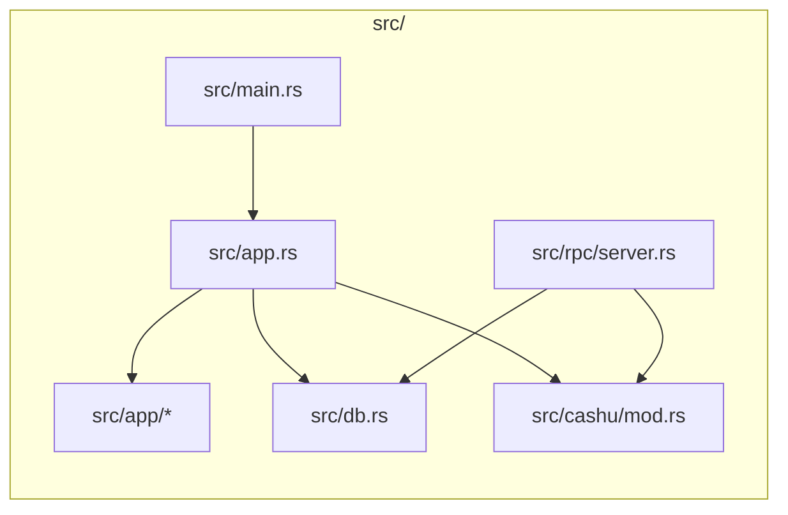
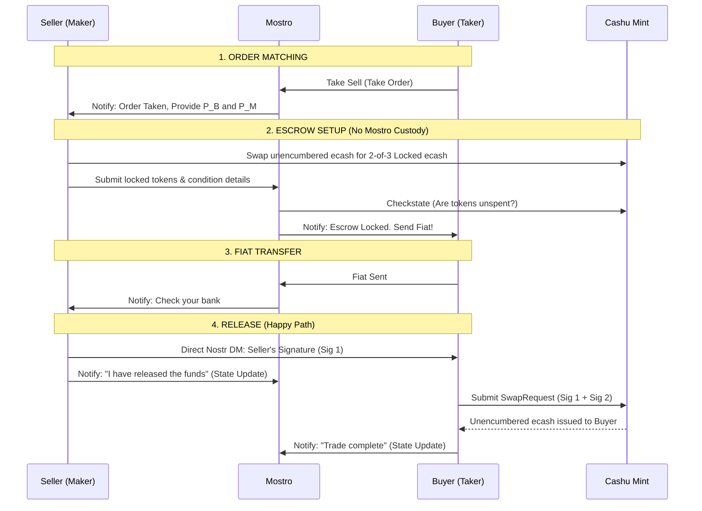
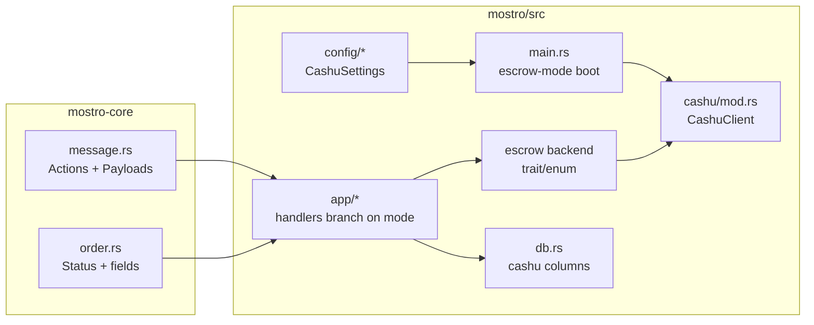

# Cashu 2-of-3 Multisig Escrow Architecture

This document describes the alternative escrow mechanism utilizing Cashu (NUT-11 P2PK) rather than Lightning Network hold invoices. In this model, Mostro acts strictly as a coordinator and arbitrator, and never takes custody of funds. 

## Context & Motivation

The Lightning hold-invoice escrow works well for users who run their own node and have reliable connectivity, but it does not serve everyone in the Mostro ecosystem. This Cashu-based model is **not a replacement** for the Lightning flow — it is an additional option aimed at communities and conditions where hold invoices are impractical. It deliberately trades self-custody and trustlessness for offline resilience and simplicity, which is an acceptable bargain in **trust-based communities**.

### Use Cases

1. **Offline resilience for users with unreliable infrastructure.** In places like Cuba, recurring electricity outages and intermittent connectivity make it impractical to keep a node — or even a phone — online for the full duration of a trade. The Lightning hold-invoice flow requires the payer, the payee, and Mostro's routing node to be online and able to route an HTLC at the same moment. The Cashu flow does not: funds are locked in an ecash token, and the release signature can be exchanged out-of-band over Nostr whenever each party happens to come online. A trade can progress across separate, non-overlapping connectivity windows.

2. **Non-technical users who don't want to run a node.** Operating a Lightning node means managing channels, inbound/outbound liquidity, rebalancing, and the custody risk of the funds those channels hold. Many users — especially newcomers — neither want nor are equipped to do this. The Cashu model lets them rely on an **external mint** instead. This means delegating custody and trust to the mint operator, which is a reasonable tradeoff for trust-based communities that already share a mint they trust.

3. **Reduced legal/custody surface for the operator.** This is the key structural improvement over Lightning. With a hold invoice, Mostro takes actual custody of the funds for the few seconds between accepting the inbound HTLC and settling the outbound payment — brief, but real custody. In the Cashu 2-of-3 model the operator **never takes possession of user funds at any point**: Mostro only ever holds 1 of the 3 keys and can never unilaterally move the ecash. This removes Mostro from the custody path entirely, which materially shrinks the legal and regulatory burden of operating a coordinator.

4. **Long-lived escrow for marketplace-style trades.** A Lightning hold invoice cannot stay pending indefinitely — it is bounded by its CLTV delta (measured in blocks), so the funds must be released or refunded within hours. This makes Lightning escrow unsuitable for any trade that does not settle almost immediately. Cashu ecash, by contrast, **does not expire**: a 2-of-3 locked token can sit in escrow for days or weeks without any on-chain timeout forcing resolution. This unlocks Mostro as a **marketplace** for physical goods and other slow-to-deliver items — a buyer can lock funds, wait for the seller to ship and the package to arrive, and only then release, with the same non-custodial safety throughout the entire delivery window.

## Module Map (Proposed)



- Entry: `src/main.rs` initializes standard subsystems but bypasses `fedimint-tonic-lnd` initialization if operating in pure-Cashu mode.
- Cashu: `src/cashu/mod.rs` interfaces with the `cdk` crate to verify token conditions (NUT-10/NUT-11) and communicate with the Mint's `/v1/checkstate` endpoint.

## Core Flow: 2-of-3 Multisig

Instead of routing HTLCs through Mostro's node, the seller locks the funds in a Cashu token governed by a `2-of-3` signature requirement:
1. $P_B$ (Buyer Pubkey)
2. $P_S$ (Seller Pubkey)
3. $P_M$ (Mostro/Arbitrator Pubkey)



## Action Changes & Handlers

The introduction of Cashu Escrow modifies the responsibility of core action handlers.

| Action | Proposed Handler Mod | Responsibility |
| --- | --- | --- |
| `add-invoice` | `src/app/add_invoice.rs` | Instead of creating a hold invoice, validates the submitted Cashu token using `cdk`, verifies the 2-of-3 spending condition, and calls the Mint API to ensure funds exist. |
| `release` | `src/app/release.rs` | Instead of acting as the middleman for signatures, Mostro simply receives the state update notification from the Seller. The cryptographic signature is sent directly to the Buyer via a P2P Nostr Direct Message (NIP-59) using the trade's ephemeral keys. |
| `cancel` | `src/app/cancel.rs` | If a trade is canceled cooperatively, the Buyer provides their signature directly to the Seller (via NIP-59 DM) so the Seller can reclaim the locked ecash, bypassing Mostro's servers. |
| `admin-settle` | `src/app/admin_settle.rs` | (Dispute Resolution) Mostro generates its signature ($P_M$) and hands it to the Buyer, allowing the Buyer to construct a valid 2-of-3 SwapRequest. |
| `admin-cancel` | `src/app/admin_cancel.rs` | (Dispute Resolution) Mostro generates its signature ($P_M$) and hands it to the Seller, allowing the Seller to reclaim their funds. |

## CDK Implementation Details

### Generating Spending Conditions
Sellers construct the 2-of-3 spending condition using `cdk::nuts::nut10`. We recommend the `SIG_INPUTS` flag. This allows the seller to sign the authorization once and pass it to the buyer, allowing the buyer to specify their own target outputs independently.

```rust
use cdk::nuts::nut10::{Conditions, SpendingConditions, SigFlag};
use cdk::nuts::PublicKey;

// 1. Gather pubkeys
let p_s: PublicKey = /* Seller */;
let p_b: PublicKey = /* Buyer */;
let p_m: PublicKey = /* Mostro */;

// 2. Define 2-of-3 constraints
let conditions = Conditions::new(
    None,                           
    Some(vec![p_b, p_m]),           // Secondary keys
    None,                           
    Some(2),                        // Requires 2 signatures
    None,                           
    Some(SigFlag::SigInputs),       // SigInputs for flexible output assignment
).unwrap();

// 3. Generate Secret for blinding
let secret = SpendingConditions::new_p2pk(p_s, Some(conditions));
```

### Signature Flags: `SIG_INPUTS` vs `SIG_ALL`
*   **`SIG_INPUTS`:** The easiest UX. The Seller only signs the intent to release. The Buyer receives the signature via Nostr DM, crafts their own unblinded outputs, signs the request, and asks the Mint to swap.
*   **`SIG_ALL`:** The safest UX against malicious Mints. The Buyer must pre-construct their outputs, send the hash to the Seller, and the Seller signs the entire bundle. 
*   **Decision:** Mostro relies on `SIG_INPUTS` as the baseline. Because both parties must mutually agree on the Mint provider prior to the trade, we assume the Mint will not maliciously front-run transaction outputs. 

## Advantages over Lightning Hold Invoices

1. **Non-Custodial:** Mostro drops all legal and technical burdens of custody. A compromised Mostro server only leaks 1 of 3 keys, meaning attacker cannot steal active escrows.
2. **Offline Resilience:** If Mostro's daemon crashes or vanishes permanently, the Buyer and Seller can still cooperate out-of-band to settle the trade (Seller + Buyer = 2 keys).
3. **No Routing Failures:** Bypasses Lightning Network topology, channel liquidity constraints, and unpredictable routing fees.
4. **Zero Capital Lockup:** Mostro does not require inbound/outbound channel liquidity to facilitate trades.

---

# Implementation Plan (Phased Rollout)

This section turns the architecture above into a concrete, incremental engineering plan. It follows the same phased-PR convention as [`ANTI_ABUSE_BOND.md`](./ANTI_ABUSE_BOND.md): each phase is a self-contained, reviewable pull request that leaves `main` shippable. The feature is **opt-in and defaults to off** — until an operator enables it, the daemon behaves exactly as it does today.

## Design Decisions (locked)

These decisions scope the plan and should not be re-litigated per phase:

1. **Global mode switch, not per-order.** A node runs in **one** escrow mode at a time: `lightning` (today's default) **or** `cashu`. The mode is fixed in `settings.toml`. When a node runs in `cashu` mode, the `fedimint-tonic-lnd` connector is **not initialized** at startup — the node needs no LND. There is no mixed mode where a single node offers both escrow types simultaneously.
2. **Node-configured, fixed mint.** The operator sets a single `mint_url` in `settings.toml`. All Cashu trades on that node use that mint. Per-order mint negotiation is explicitly out of scope for this rollout (possible future work).
3. **The daemon is a coordinator, not a wallet.** All wallet-side ecash operations — the seller swapping unencumbered ecash into a 2-of-3 locked token, and the buyer redeeming the locked token with two signatures — happen in the **client**. The daemon's responsibilities are narrow: validate a submitted locked token against the mint (`/v1/checkstate`), verify the 2-of-3 spending condition embeds the right three pubkeys, hold its own key `P_M`, and produce a `P_M` signature **only** during dispute resolution. Client work is documented here as an interface contract but implemented in the client repos, not here.
4. **`mostro-core` changes ship first.** New `Action`/`Payload`/`CantDoReason` variants and any new `Status` live in the shared `mostro-core` crate. They are additive and must be released (and the daemon's dependency bumped) before the daemon can use them. During development the daemon points at the local `mostro-core` via a `path` dependency.
5. **Bonds and Cashu mode are mutually exclusive (for now).** The anti-abuse bond is built on LN hold invoices and cannot function without LND. In `cashu` mode the bond feature is rejected at config-validation time. A Cashu-native bond is future work.

## Module Map (Target)



## Phases

### Phase 0 — Protocol & config foundations (no runtime escrow yet)

**Goal:** land all the additive plumbing so later phases only touch handler logic. Zero behavior change when the feature is off.

**`mostro-core`:**
- `src/message.rs`: add `Action` variants — `AddCashuEscrow` (seller submits locked token), and any acknowledgement actions needed (`CashuEscrowLocked`). Add `Payload` variants — `CashuToken(String)`, `CashuMintUrl(String)`, and a `CashuLockProof(CashuLockProofData)` struct carrying `{ token, mint_url, buyer_pubkey, seller_pubkey, mostro_pubkey }`. Update `MessageKind::verify()` with the action↔payload shape rules and add round-trip tests.
- `src/error.rs`: add `CantDoReason` variants — `InvalidCashuToken`, `CashuMintUnavailable`, `InvalidMintUrl`, `CashuEscrowNotLocked`.
- `src/order.rs`: add optional `Order` fields for Cashu state (`cashu_mint_url`, `cashu_escrow_token`, `cashu_escrow_locked_at`). Keep `SmallOrder` lean — carry Cashu data in the new `Payload` variants, not the wire order.
- Bump crate version.

**`mostro`:**
- `Cargo.toml`: point `mostro-core` at the local `path` during dev; add the `cdk` dependency.
- `src/config/types.rs` + `settings.rs`: add `CashuSettings { enabled: bool, mint_url: String, .. }` as `#[serde(default)] pub cashu: Option<CashuSettings>`, mirroring `anti_abuse_bond` exactly. Add `Settings::get_cashu()` and `is_cashu_enabled()`.
- Introduce an **escrow-mode** resolver (e.g. `enum EscrowMode { Lightning, Cashu }`) derived from config, with validation: Cashu requires a parseable `mint_url`; Cashu + `anti_abuse_bond.enabled` is a hard config error; Lightning is the default when `[cashu]` is absent.
- `src/config/util.rs`: extend `validate_mostro_settings()` with the rules above. `src/config/wizard.rs`: add an escrow-mode prompt and a mint-URL prompt. `settings.tpl.toml`: add a commented-out `[cashu]` block.
- `src/cashu/mod.rs` (new): a `CashuClient` scaffold built from `cdk` that connects to the configured mint and exposes a `check_state(...)` wrapper (used in later phases). Add a startup connectivity check analogous to the LND node-info check, storing a `CASHU_STATUS` `OnceLock`.
- `src/main.rs`: branch on escrow mode — in Cashu mode, **skip** `LndConnector::new()` and the LN_STATUS probe, run the mint connectivity check instead. The `AppContext` carries the active escrow backend.

**Deliverable:** node boots in either mode; in Cashu mode it connects to the mint and starts, but order handlers still assume LN (so Cashu orders cannot yet complete — documented as experimental and gated off by default).

### Phase 1 — Escrow setup & lock validation

**Goal:** replace hold-invoice *creation* with locked-token *validation*. This is box 2 ("ESCROW SETUP") of the sequence diagram.

- In Cashu mode, the take/`add-invoice` path no longer calls `show_hold_invoice()`. Instead the seller's client submits the 2-of-3 locked token via `AddCashuEscrow`; the handler:
  1. parses the token with `cdk`,
  2. verifies the spending condition is P2PK 2-of-3 over exactly `{P_B, P_S, P_M}` with the order's trade pubkeys and this node's `P_M`,
  3. calls the mint `/v1/checkstate` to confirm the proofs are unspent,
  4. persists `cashu_mint_url` / `cashu_escrow_token` / `cashu_escrow_locked_at` and advances the order to `Active` (reusing existing statuses — `WaitingPayment` → `Active`), then notifies the buyer to send fiat.
- Introduce a small **escrow backend** abstraction (trait or enum) so `take_sell` / `take_buy` / `add_invoice` call `backend.lock(...)` rather than LND directly; the Lightning impl wraps today's code unchanged.
- DB migration for the new columns; `find_order_by_*` helpers as needed.

**Deliverable:** a Cashu order can be matched and locked; the daemon confirms custody-free escrow exists. Release still TODO.

### Phase 2 — Release (happy path)

**Goal:** box 4 of the diagram. No custody, no LN payment.

- `release_action` in Cashu mode does **not** settle a hold invoice or pay the buyer. The seller's release **signature** goes seller→buyer **directly P2P** over Nostr DM (reuse the existing `chat` / `SendDm` machinery in `mostro-core`), bypassing the daemon. The daemon only receives the seller's *state update* ("I released"), validates the `FiatSent → released` transition, advances the order to a terminal success state, and releases the taker bond hooks (no-op in Cashu mode).
- Define precisely, as an interface contract, what the seller client sends to the buyer and what the buyer does with the mint — the daemon does not touch funds here.
- `fiat_sent` is unchanged (pure messaging).

**Deliverable:** full happy-path Cashu trade completes end to end on regtest against a test mint.

### Phase 3 — Cooperative cancel

**Goal:** the seller reclaims the locked ecash when both sides agree to cancel.

- `cancel_action` in Cashu mode records the cooperative cancel and transitions state, but performs **no** `cancel_hold_invoice`. The buyer hands their signature to the seller P2P (NIP-59 DM) so the seller can reconstruct a 2-of-3 swap (`P_S + P_B`) and reclaim funds at the mint. Daemon stays out of the value path.

**Deliverable:** cooperative cancel works without LND.

### Phase 4 — Dispute resolution (the only place `P_M` signs)

**Goal:** boxes for `admin-settle` / `admin-cancel`. This is where the daemon actually uses its key.

- The daemon must hold/derive the signing key behind `P_M` and produce a `cdk` P2PK signature over the disputed proofs.
- `admin_settle_action` (Cashu mode): solver rules in favor of the **buyer** → Mostro generates its `P_M` signature and delivers it to the buyer, who combines it with the seller's (or their own pre-agreed) signature to form a valid 2-of-3 swap.
- `admin_cancel_action` (Cashu mode): solver rules in favor of the **seller** → Mostro delivers its `P_M` signature to the seller to reclaim.
- Reuse the existing solver/dispute permission checks; only the settlement primitive changes.

**Deliverable:** disputes are resolvable in Cashu mode; the 2-of-3 guarantee is fully exercised.

### Phase 5 — Hardening, edge cases & docs

- Mint-unavailable handling and retries; idempotency on resubmitted tokens; `restore_session` for in-flight Cashu orders; expiry/timeout behavior for un-locked escrows.
- Enforce and test the bonds-vs-Cashu mutual exclusion end to end.
- Integration tests against a containerized test mint (e.g. `nutshell`) wired into CI, mirroring the regtest LN setup.
- Operator docs: enabling Cashu mode, choosing a mint, the trust model, and the migration/runbook notes.

## Open Questions / Future Work

- **`SIG_INPUTS` vs `SIG_ALL`** is currently decided as `SIG_INPUTS` (see above). Revisit if malicious-mint resistance becomes a requirement.
- **Per-order mint negotiation** and **multi-mint allow-lists** are deferred.
- **Cashu-native anti-abuse bond** to replace the LN bond in Cashu mode.
- **Fee collection** in Cashu mode (today the Mostro fee is taken from the LN amounts) needs its own design — how/whether the operator collects a fee on a non-custodial ecash trade.