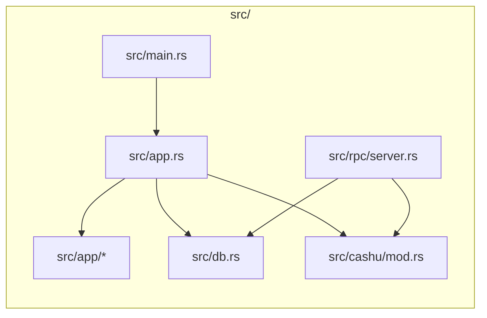
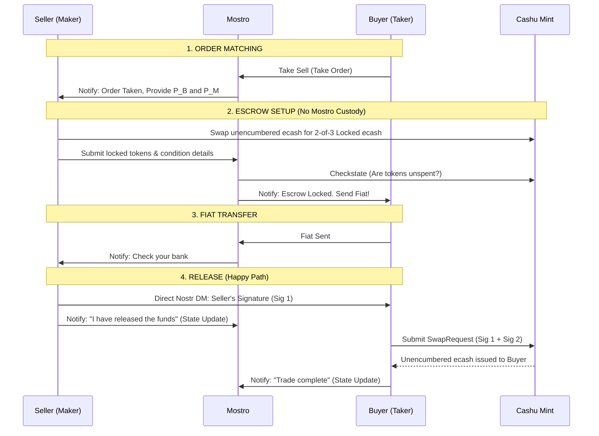

# Cashu 2-of-3 Multisig Escrow Architecture

This document describes the alternative escrow mechanism utilizing Cashu (NUT-11 P2PK) rather than Lightning Network hold invoices. In this model, Mostro acts strictly as a coordinator and arbitrator, and never takes custody of funds. 

## Context & Motivation

The Lightning hold-invoice escrow works well for users who run their own node and have reliable connectivity, but it does not serve everyone in the Mostro ecosystem. This Cashu-based model is **not a replacement** for the Lightning flow — it is an additional option aimed at communities and conditions where hold invoices are impractical. It deliberately trades self-custody and trustlessness for offline resilience and simplicity, which is an acceptable bargain in **trust-based communities**.

### Use Cases

1. **Offline resilience for users with unreliable infrastructure.** In places like Cuba, recurring electricity outages and intermittent connectivity make it impractical to keep a node — or even a phone — online for the full duration of a trade. The Lightning hold-invoice flow requires the payer, the payee, and Mostro's routing node to be online and able to route an HTLC at the same moment. The Cashu flow does not: funds are locked in an ecash token, and the release signature can be exchanged out-of-band over Nostr whenever each party happens to come online. A trade can progress across separate, non-overlapping connectivity windows.

2. **Non-technical users who don't want to run a node.** Operating a Lightning node means managing channels, inbound/outbound liquidity, rebalancing, and the custody risk of the funds those channels hold. Many users — especially newcomers — neither want nor are equipped to do this. The Cashu model lets them rely on an **external mint** instead. This means delegating custody and trust to the mint operator, which is a reasonable tradeoff for trust-based communities that already share a mint they trust.

3. **Reduced legal/custody surface for the operator.** This is the key structural improvement over Lightning. With a hold invoice, Mostro takes actual custody of the funds for the few seconds between accepting the inbound HTLC and settling the outbound payment — brief, but real custody. In the Cashu 2-of-3 model the operator **never takes possession of user funds at any point**: Mostro only ever holds 1 of the 3 keys and can never unilaterally move the ecash. This removes Mostro from the custody path entirely, which materially shrinks the legal and regulatory burden of operating a coordinator.

## Module Map (Proposed)



- Entry: `src/main.rs` initializes standard subsystems but bypasses `fedimint-tonic-lnd` initialization if operating in pure-Cashu mode.
- Cashu: `src/cashu/mod.rs` interfaces with the `cdk` crate to verify token conditions (NUT-10/NUT-11) and communicate with the Mint's `/v1/checkstate` endpoint.

## Core Flow: 2-of-3 Multisig

Instead of routing HTLCs through Mostro's node, the seller locks the funds in a Cashu token governed by a `2-of-3` signature requirement:
1. $P_B$ (Buyer Pubkey)
2. $P_S$ (Seller Pubkey)
3. $P_M$ (Mostro/Arbitrator Pubkey)



## Action Changes & Handlers

The introduction of Cashu Escrow modifies the responsibility of core action handlers.

| Action | Proposed Handler Mod | Responsibility |
| --- | --- | --- |
| `add-invoice` | `src/app/add_invoice.rs` | Instead of creating a hold invoice, validates the submitted Cashu token using `cdk`, verifies the 2-of-3 spending condition, and calls the Mint API to ensure funds exist. |
| `release` | `src/app/release.rs` | Instead of acting as the middleman for signatures, Mostro simply receives the state update notification from the Seller. The cryptographic signature is sent directly to the Buyer via a P2P Nostr Direct Message (NIP-59) using the trade's ephemeral keys. |
| `cancel` | `src/app/cancel.rs` | If a trade is canceled cooperatively, the Buyer provides their signature directly to the Seller (via NIP-59 DM) so the Seller can reclaim the locked ecash, bypassing Mostro's servers. |
| `admin-settle` | `src/app/admin_settle.rs` | (Dispute Resolution) Mostro generates its signature ($P_M$) and hands it to the Buyer, allowing the Buyer to construct a valid 2-of-3 SwapRequest. |
| `admin-cancel` | `src/app/admin_cancel.rs` | (Dispute Resolution) Mostro generates its signature ($P_M$) and hands it to the Seller, allowing the Seller to reclaim their funds. |

## CDK Implementation Details

### Generating Spending Conditions
Sellers construct the 2-of-3 spending condition using `cdk::nuts::nut10`. We recommend the `SIG_INPUTS` flag. This allows the seller to sign the authorization once and pass it to the buyer, allowing the buyer to specify their own target outputs independently.

```rust
use cdk::nuts::nut10::{Conditions, SpendingConditions, SigFlag};
use cdk::nuts::PublicKey;

// 1. Gather pubkeys
let p_s: PublicKey = /* Seller */;
let p_b: PublicKey = /* Buyer */;
let p_m: PublicKey = /* Mostro */;

// 2. Define 2-of-3 constraints
let conditions = Conditions::new(
    None,                           
    Some(vec![p_b, p_m]),           // Secondary keys
    None,                           
    Some(2),                        // Requires 2 signatures
    None,                           
    Some(SigFlag::SigInputs),       // SigInputs for flexible output assignment
).unwrap();

// 3. Generate Secret for blinding
let secret = SpendingConditions::new_p2pk(p_s, Some(conditions));
```

### Signature Flags: `SIG_INPUTS` vs `SIG_ALL`
*   **`SIG_INPUTS`:** The easiest UX. The Seller only signs the intent to release. The Buyer receives the signature via Nostr DM, crafts their own unblinded outputs, signs the request, and asks the Mint to swap.
*   **`SIG_ALL`:** The safest UX against malicious Mints. The Buyer must pre-construct their outputs, send the hash to the Seller, and the Seller signs the entire bundle. 
*   **Decision:** Mostro relies on `SIG_INPUTS` as the baseline. Because both parties must mutually agree on the Mint provider prior to the trade, we assume the Mint will not maliciously front-run transaction outputs. 

## Advantages over Lightning Hold Invoices

1. **Non-Custodial:** Mostro drops all legal and technical burdens of custody. A compromised Mostro server only leaks 1 of 3 keys, meaning attacker cannot steal active escrows.
2. **Offline Resilience:** If Mostro's daemon crashes or vanishes permanently, the Buyer and Seller can still cooperate out-of-band to settle the trade (Seller + Buyer = 2 keys).
3. **No Routing Failures:** Bypasses Lightning Network topology, channel liquidity constraints, and unpredictable routing fees.
4. **Zero Capital Lockup:** Mostro does not require inbound/outbound channel liquidity to facilitate trades.