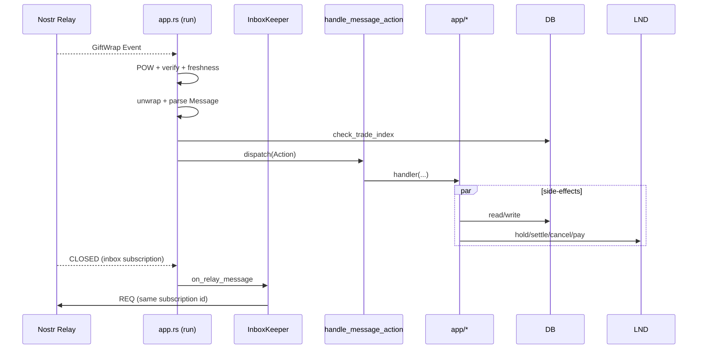
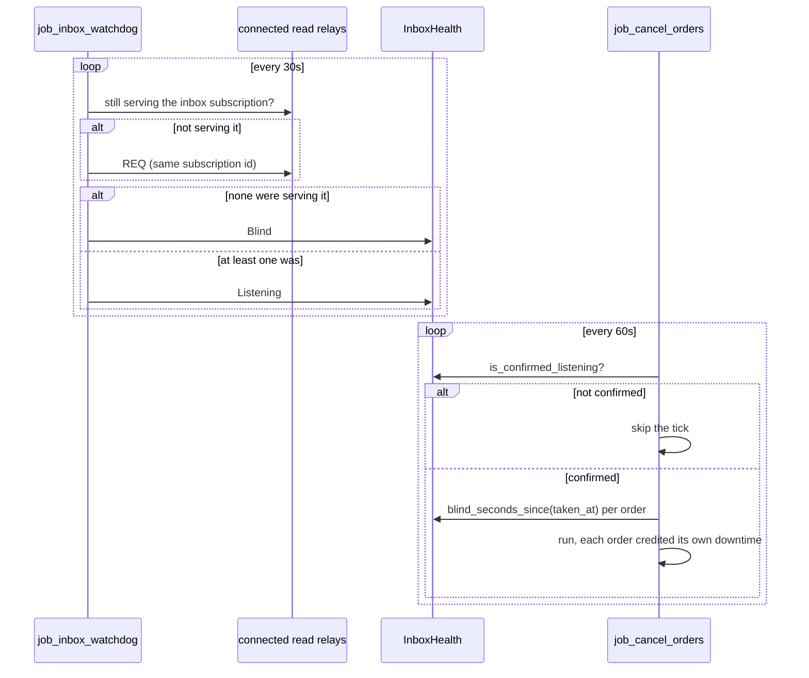

# Event Routing

How Nostr events become actions and side effects.

## Intake Pipeline
- Source: `src/app.rs:run`
- Steps: POW check → signature verify → recency guard → NIP-59 unwrap → parse `mostro_core::Message` → inner verify → `check_trade_index` → dispatch.

## The Inbox Subscription
- Source: `src/inbox.rs`
- Every trade message reaches Mostro over a single long-lived subscription, created at startup by `main` with a stable id (`InboxSubscription`) so that later frames can be attributed to it. Its filter is p-tagged to the node, restricted to the configured transport's event kind, and carries `limit(0)`: only live traffic is wanted.
- `run` consumes the whole notification stream, not just events. `ClientNotification::Message` carries the relay control plane and goes to `InboxKeeper`; `ClientNotification::Shutdown` ends the loop.

### Recovering a lost ear
A relay can end a subscription at any time by sending `CLOSED`. The nostr-sdk removes the subscription for almost every reason prefix, and a removed subscription is never re-REQ'd, not even after a reconnect — so without handling, one frame from one relay leaves the daemon running, connected, and unable to receive anything.

Two mechanisms keep the subscription alive:

- `InboxKeeper::on_relay_message` reacts to a `CLOSED` naming the inbox by re-sending the REQ to that relay, paced by a per-relay backoff (immediate first retry, doubling to a five-minute ceiling, cleared when the relay answers with `EOSE`).
- `check_inbox_health`, run every 30 seconds by `job_inbox_watchdog`, audits each connected read relay and re-subscribes any that is no longer serving the inbox. This covers the losses that produce no frame the loop can see: a notification channel that dropped messages under lag, a REQ that failed to go out, a relay added after startup.

Health is judged by the presence of the subscription, never by traffic volume: an instance with no trades in flight is legitimately silent.

A relay re-subscribed during an audit is not counted as listening until the following round. Sending a REQ says nothing about whether the relay will honour it, and counting the attempt would report a healthy inbox indefinitely against a relay that closes it on principle.

### NIP-42
The daemon and price clients are built with a `SignerAuthenticator` over the node's keys (`src/util.rs:connect_nostr`). Without it a relay that gates reads behind authentication answers the REQ with `CLOSED "auth-required: …"`, which the SDK treats as permanent. The AUTH event is bound to the relay's challenge and URL, so it cannot be replayed elsewhere.

### Messages lost while blind are not recovered
`accept_event` rejects anything whose `created_at` is older than ten seconds. A message sent while the inbox was down is therefore already too old to be accepted by the time the subscription returns, and re-subscribing with `since` instead of `limit(0)` would not change that. Whoever sent it has to send it again.

Because those messages are lost rather than delayed, order timeouts cannot be trusted while the inbox is down — a user who answered on time would look silent. `job_cancel_orders` therefore skips its tick entirely unless an audit has confirmed the daemon is listening (`InboxHealth::is_confirmed_listening`): no slash, no refund, no republish. Startup counts as unconfirmed, since the daemon subscribes before the watchdog's first pass.

Once the inbox recovers, each order is credited the downtime **it** waited through. `InboxHealth` keeps the wall-clock windows during which the node was deaf; `blind_seconds_since(taken_at)` intersects them with the order's own wait. An order already waiting when a relay went quiet is owed all of that outage; one taken after it ended is owed nothing. The query widens its window by `max_blind_seconds` so no eligible order is missed, and the exact per-order figure decides.

The credit has to be per order rather than one global allowance: a single figure either under-credits an order that waited through the whole outage or hands the same credit to one taken long afterwards.

## Dispatch
- Router: `src/app.rs:handle_message_action`
- Maps `Action` → module function under `src/app/*`.
- On `MostroError`, `manage_errors` pushes user-facing “can’t do” messages or logs warnings.

## Trade Index
- Function: `src/app.rs:check_trade_index`
- Ensures monotonic `trade_index` for trading actions; verifies signature binding; auto-creates user on first valid trade.

## Key Actions (entries)
- Take Buy: `src/app/take_buy.rs`
- Add Invoice: `src/app/add_invoice.rs`
- Release: `src/app/release.rs`
- Cancel: `src/app/cancel.rs`
- Dispute: `src/app/dispute.rs`

## Diagram

The watchdog runs on its own schedule, independently of the loop above:

