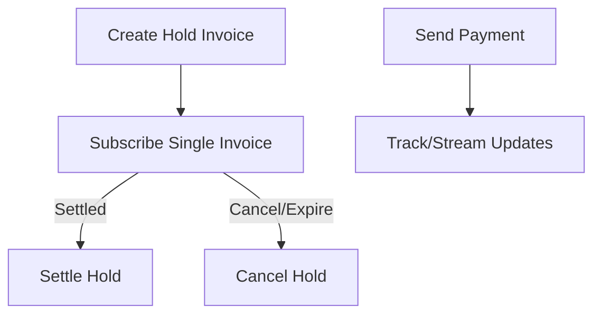

# Lightning Operations

Core interactions with LND via `fedimint_tonic_lnd`.

## Connector
- Source: `src/lightning/mod.rs`
- Type: `LndConnector { client: Client }`
- Construct: `LndConnector::new()` using host, cert, macaroon from settings.

## Hold Invoices
- Create: `create_hold_invoice(description, amount)` → `(AddHoldInvoiceResp, preimage, hash)`.
- Subscribe: `subscribe_invoice(r_hash, sender)` streams `InvoiceState` updates.
- Settle: `settle_hold_invoice(preimage)`.
- Cancel: `cancel_hold_invoice(hash)`.

## Outgoing Payments
- `send_payment(invoice, amount, sender)`
  - Validates invoice amount or supplies `amt`.
  - Caps max fee: 1% for amounts ≤1000 sats; `Settings::get_mostro().max_routing_fee` for larger amounts.
  - Streams router updates to caller.

## Node Status
- `get_node_info()`; mapped to `LnStatus` and stored in `config::LN_STATUS`.

## Invoice Validation

Source: `src/lightning/invoice.rs`

The invoice validation module provides comprehensive validation for Lightning invoices, Lightning Addresses, and LNURL-pay requests.

### Functions

#### decode_invoice
```rust
pub fn decode_invoice(payment_request: &str) -> Result<Bolt11Invoice, MostroError>
```
Decodes a BOLT11 invoice string into a structured invoice object.

**Parameters**:
- `payment_request`: BOLT11 invoice string

**Returns**: `Bolt11Invoice` or `MostroError::InvalidInvoice`

**Entry**: `src/lightning/invoice.rs:33`

#### is_valid_invoice
```rust
pub async fn is_valid_invoice(
    amount: i64,
    fee: i64,
    payment_request: &str,
) -> Result<String, MostroError>
```
Comprehensive validation supporting:
- BOLT11 Lightning invoices
- Lightning Addresses (user@domain.com)
- LNURL-pay requests

**Validation checks**:
1. Invoice format and decoding
2. Amount matching (with fee deduction): `expected_amount = amount - fee`
3. Minimum payment amount enforcement (`mostro_settings.min_payment_amount`)
4. Expiration validation (`invoice.is_expired()`)
5. Expiration window compliance: `expires_at > now + invoice_expiration_window`
6. Lightning Address resolution via LNURL
7. LNURL callback with amount parameter

**Entry**: `src/lightning/invoice.rs:181`

**Error cases**:
- `InvalidInvoice`: Decoding fails or format invalid
- `WrongAmountError`: Invoice amount doesn't match expected (after fee deduction)
- `MinAmountError`: Amount below minimum threshold
- `InvoiceExpiredError`: Invoice already expired
- `ExpirationWindowTooShort`: Expires before required window

## Payment Retry System

Source: `src/scheduler.rs:172` (job_retry_failed_payments)

Failed outgoing payments are automatically retried via the scheduler.

### Configuration

**Settings** (`src/config/types.rs:28-46`):
```rust
pub struct LightningSettings {
    // ... other fields ...
    pub payment_attempts: u32,        // Max retry attempts (default: 3)
    pub payment_retries_interval: u32, // Seconds between retries (default: 60)
}
```

### Retry Job

**Function**: `job_retry_failed_payments()`
- Queries database for failed payments with retry attempts remaining
- Respects `payment_attempts` limit
- Scheduled at `payment_retries_interval` frequency
- Automatically invokes `send_payment()` for each retry
- Updates payment status and attempt count in database

### Workflow
1. Payment fails initially → marked as failed in DB
2. Scheduler runs retry job every N seconds (payment_retries_interval)
3. Job finds failed payments with `attempts < payment_attempts`
4. Invokes send_payment() again
5. Increments attempt counter
6. Continues until success or max attempts reached

## Payment Error Handling

**Pre-flight Checks** (lines 183-201):
Before attempting payment, `send_payment()` uses `track_payment_v2` to detect duplicate attempts:

```rust
// Check if payment was previously attempted
match ln_client.router().track_payment_v2(track_req).await {
    Ok(_) => {
        error!("Aborting paying invoice with hash {hash} to buyer");
        return Err(MostroError::TrackError);
    }
    Err(_) => {
        // Payment not found, safe to proceed
    }
}
```

**Amount Validation** (lines 210-220):
```rust
if let Some(amt_msat) = invoice.amount_milli_satoshis() {
    let invoice_amount_sats = amt_msat / 1000;
    if invoice_amount_sats != amount as u64 * 1000 {
        error!("Aborting paying invoice with wrong amount to buyer");
        return Err(MostroError::WrongAmountError);
    }
}
```

**Zero-Amount Invoice Handling** (lines 222-228):
If invoice has no amount, the `amt` field is populated in SendPaymentRequest:
```rust
if invoice.amount_milli_satoshis().is_none() {
    req.amt = amount;
}
```

**Fee Limit Enforcement**:
```rust
let max_fee = match amount.cmp(&1000) {
    Ordering::Less | Ordering::Equal => amount as f64 * 0.01,  // 1%
    Ordering::Greater => amount as f64 * mostro_settings.max_routing_fee,
};
req.fee_limit_sat = max_fee as i64;
```

**Timeout**: 60 seconds (line 205)

## Node Information

### get_node_info
```rust
pub async fn get_node_info(&mut self) -> Result<GetInfoResponse, MostroError>
```

Retrieves LND node information including:
- Node version
- Public key
- Node alias
- Active chains (e.g., bitcoin mainnet/testnet)
- Network information
- Block height sync status

**Entry**: `src/lightning/mod.rs:260`

**Usage**: Called during startup to populate `config::LN_STATUS` (src/main.rs:86)

## Diagrams

