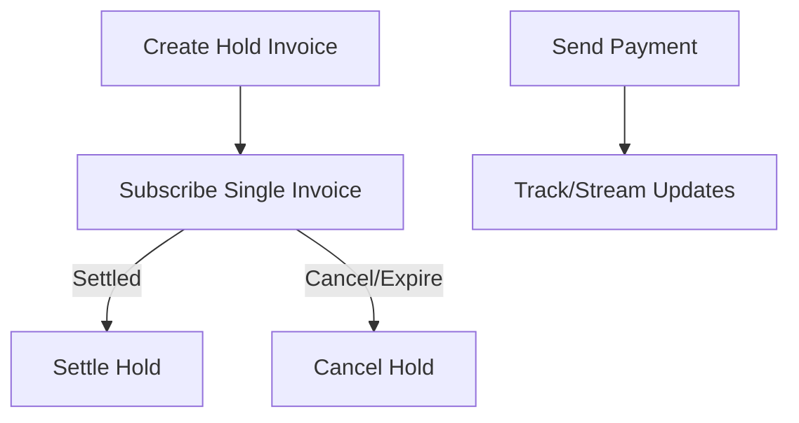

# Lightning Operations

Core interactions with LND via `fedimint_tonic_lnd`.

## Connector
- Source: `src/lightning/mod.rs`
- Type: `LndConnector { client: Client }`
- Construct: `LndConnector::new()` using host, cert, macaroon from settings.

## Hold Invoices
- Create: `create_hold_invoice(description, amount)` → `(AddHoldInvoiceResp, preimage, hash)`.
- Subscribe: `subscribe_invoice(r_hash, sender)` streams `InvoiceState` updates.
- Settle: `settle_hold_invoice(preimage)`.
- Cancel: `cancel_hold_invoice(hash)`.

## Outgoing Payments
- `send_payment(invoice, amount, sender)`
  - Validates invoice amount or supplies `amt`.
  - Caps max fee: 1% for amounts ≤1000 sats; `Settings::get_mostro().max_routing_fee` for larger amounts.
  - Streams router updates to caller.

## Node Status
- `get_node_info()`; mapped to `LnStatus` and stored in `config::LN_STATUS`.

## Invoice Validation

Source: `src/lightning/invoice.rs`

The invoice validation module provides comprehensive validation for Lightning invoices, Lightning Addresses, and LNURL-pay requests.

### Functions

#### decode_invoice
```rust
pub fn decode_invoice(payment_request: &str) -> Result<Bolt11Invoice, MostroError>
```
Decodes a BOLT11 invoice string into a structured invoice object.

**Parameters**:
- `payment_request`: BOLT11 invoice string

**Returns**: `Bolt11Invoice` or `MostroError::InvalidInvoice`

**Entry**: `src/lightning/invoice.rs:33`

#### is_valid_invoice
```rust
pub async fn is_valid_invoice(
    amount: i64,
    fee: i64,
    payment_request: &str,
) -> Result<String, MostroError>
```
Comprehensive validation supporting:
- BOLT11 Lightning invoices
- Lightning Addresses (user@domain.com)
- LNURL-pay requests

**Validation checks**:
1. Invoice format and decoding
2. Amount matching (with fee deduction): `expected_amount = amount - fee`
3. Minimum payment amount enforcement (`mostro_settings.min_payment_amount`)
4. Expiration validation (`invoice.is_expired()`)
5. Expiration window compliance: `expires_at > now + invoice_expiration_window`
6. Lightning Address resolution via LNURL
7. LNURL callback with amount parameter

**Entry**: `src/lightning/invoice.rs:181`

**Error cases**:
- `InvalidInvoice`: Decoding fails or format invalid
- `WrongAmountError`: Invoice amount doesn't match expected (after fee deduction)
- `MinAmountError`: Amount below minimum threshold
- `InvoiceExpiredError`: Invoice already expired
- `ExpirationWindowTooShort`: Expires before required window

## Payment Retry System

Source: `src/scheduler.rs:172` (job_retry_failed_payments)

Failed outgoing payments are automatically retried via the scheduler.

### Configuration

**Settings** (`src/config/types.rs:28-46`):
```rust
pub struct LightningSettings {
    // ... other fields ...
    pub payment_attempts: u32,        // Max retry attempts (default: 3)
    pub payment_retries_interval: u32, // Seconds between retries (default: 60)
}
```

### Retry Job

**Function**: `job_retry_failed_payments()`
- Queries database for failed payments with retry attempts remaining
- Respects `payment_attempts` limit
- Scheduled at `payment_retries_interval` frequency
- Automatically invokes `send_payment()` for each retry
- Updates payment status and attempt count in database

### Workflow
1. Payment fails initially → marked as failed in DB
2. Scheduler runs retry job every N seconds (payment_retries_interval)
3. Job finds failed payments with `attempts < payment_attempts`
4. Invokes send_payment() again
5. Increments attempt counter
6. Continues until success or max attempts reached

## Payment Error Handling

**Pre-flight Checks** (lines 183-201):
Before attempting payment, `send_payment()` uses `track_payment_v2` to detect duplicate attempts:

```rust
// Check if payment was previously attempted
match ln_client.router().track_payment_v2(track_req).await {
    Ok(_) => {
        error!("Aborting paying invoice with hash {hash} to buyer");
        return Err(MostroError::TrackError);
    }
    Err(_) => {
        // Payment not found, safe to proceed
    }
}
```

**Amount Validation** (lines 210-220):
```rust
if let Some(amt_msat) = invoice.amount_milli_satoshis() {
    let invoice_amount_sats = amt_msat / 1000;
    if invoice_amount_sats != amount as u64 * 1000 {
        error!("Aborting paying invoice with wrong amount to buyer");
        return Err(MostroError::WrongAmountError);
    }
}
```

**Zero-Amount Invoice Handling** (lines 222-228):
If invoice has no amount, the `amt` field is populated in SendPaymentRequest:
```rust
if invoice.amount_milli_satoshis().is_none() {
    req.amt = amount;
}
```

**Fee Limit Enforcement**:
```rust
let max_fee = match amount.cmp(&1000) {
    // For small amounts, use 1% but ensure minimum of 10 sats
    Ordering::Less | Ordering::Equal => (amount as f64 * 0.01).max(10.0),
    Ordering::Greater => amount as f64 * mostro_settings.max_routing_fee,
};
req.fee_limit_sat = max_fee as i64;
```

**Timeout**: 60 seconds (line 205)

## Node Information

### get_node_info
```rust
pub async fn get_node_info(&mut self) -> Result<GetInfoResponse, MostroError>
```

Retrieves LND node information including:
- Node version
- Public key
- Node alias
- Active chains (e.g., bitcoin mainnet/testnet)
- Network information
- Block height sync status

**Entry**: `src/lightning/mod.rs:260`

**Usage**: Called during startup to populate `config::LN_STATUS` (src/main.rs:86)

## Anti-Abuse Bond Operations

The optional anti-abuse bond (`[anti_abuse_bond]`, off by default) puts a
**second** hold invoice on a trade, owned by the maker and/or taker. It is
released on normal completion and on cancels before a waiting-state
timeout; it is slashed only on an explicit solver `BondResolution`
directive or a waiting-state timeout (when `slash_on_waiting_timeout =
true`). Full design: `docs/ANTI_ABUSE_BOND.md`. This section is the
operator runbook.

### Where the state lives

Every bond is one row in the `bonds` table (`src/app/bond/db.rs`,
`model.rs`). Inspect it directly:

```sql
SELECT id, order_id, role, state, amount_sats,
       parent_bond_id, child_order_id, slashed_share_sats,
       node_share_sats, slashed_reason,
       payout_attempts, invoice_request_attempts, slashed_at
  FROM bonds ORDER BY created_at;
```

`state` (string-backed, `src/app/bond/types.rs`) walks:

```text
requested → locked ─┬→ released                       (happy / cancel before timeout)
                    └→ pending-payout ─┬→ slashed      (counterparty paid their share)
                                       ├→ forfeited    (counterparty never claimed in window)
                                       └→ failed       (send_payment exhausted)
```

- **`pending-payout`** — a slash already fired. The bond HTLC was
  **settled** (claimed into Mostro's wallet) at slash time; the scheduler
  is now driving the counterparty payout. The split is frozen here:
  `node_share_sats` is the node's retained share, `amount_sats -
  node_share_sats` is owed to the winning counterparty.
- **`slashed`** — terminal success; the counterparty share was paid.
- **`forfeited`** — designed-in long-stop: the counterparty never sent a
  payout invoice within `payout_claim_window_days`. The node keeps
  `amount_sats` in full. **No operator action needed.**
- **`failed`** — `send_payment` exhausted `payout_max_retries` against a
  delivered invoice. **User-recoverable** while inside the claim window: a
  fresh `Action::AddBondInvoice` from the recipient flips the row back to
  `pending-payout`. Only past the window does it need operator attention
  (see below).
- `slashed_reason` is `lost-dispute` (solver directive) or `timeout`
  (waiting-state timeout). A cancel before the timeout is never a slash.

For range-order maker bonds the parent row stays `locked` while child
rows (`parent_bond_id` set, `child_order_id` = the taken slice) carry the
proportional per-slice slashes; the single settle happens at range close.

### Scheduler jobs

Run from `src/scheduler.rs` (see `run_jobs`):

- `job_process_bond_payouts` — drives every `pending-payout` row: requests
  a payout bolt11 from the winner (`Action::AddBondInvoice`, cadenced by
  `payout_invoice_window_seconds`), runs `send_payment`, retries up to
  `payout_max_retries`, and reconciles against LND on entry so a daemon
  restart never double-pays.
- `job_reconcile_stranded_maker_bonds` — settles and distributes a range
  maker bond at range close (per-slice counterparty shares + maker
  refund); the 5-minute sweep is the backstop if the inline close failed.

### Reading what happened in the logs

Bond transitions log through `tracing` (`bond payout: …` lines in
`src/app/bond/payout.rs`, plus slash/release lines in `flow.rs` /
`slash.rs`). To follow a solver decision, look for the `BondResolution`
on the inbound `admin-settle` / `admin-cancel` message — its wire shape is:

```json
{ "order": { "version": 1, "id": "<order-id>", "action": "admin-cancel",
  "payload": { "bond_resolution": { "slash_seller": true, "slash_buyer": false } } } }
```

`slash_seller` / `slash_buyer` are resolved to a maker- or taker-bond row
by the order kind (sell → maker is seller; buy → maker is buyer). A
`payload: null` (or absent) means **release both bonds** — no slash. A
slash directed at a side with no `locked` bond is rejected with
`CantDo(InvalidPayload)` and the trade resolution does not run.

### Resolving a `failed` bond manually

A `failed` row means the bond was slashed (sats are already in Mostro's
wallet), but Mostro could not route the counterparty's share and the
claim window has since elapsed, so the auto-recovery path no longer
re-arms it. There is no slash to undo and no funds at risk on the
counterparty's side — the value is held by the node. To make the
counterparty whole, pay them out-of-band (the amount owed is
`amount_sats - node_share_sats`) and keep the row as the audit record.
Before the window elapses, prefer the built-in path: have the
counterparty resend their payout invoice, which flips the row back to
`pending-payout` automatically.

### Public exposure

The node advertises its bond policy in the kind-38385 info event
(`src/nip33.rs::info_to_tags`) so clients can warn users before they
trade: `bond_enabled` (always emitted), and when enabled `bond_apply_to`,
`bond_amount_pct`, `bond_base_amount_sats`, `bond_slash_on_waiting_timeout`,
`bond_slash_node_share_pct`, and `bond_payout_claim_window_days`.

## Diagrams

```mermaid
flowchart TD
  A[Create Hold Invoice] --> B[Subscribe Single Invoice]
  B -->|Settled| C[Settle Hold]
  B -->|Cancel/Expire| D[Cancel Hold]
  E[Send Payment] --> F[Track/Stream Updates]
```
