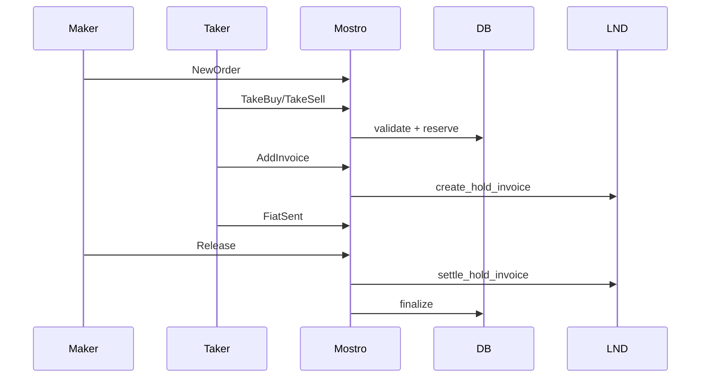

# Orders and Actions

Summary of order lifecycle and key handlers.

## Core Types
- Messages/Actions: `mostro_core::message::{Message, Action}`
- Orders: `mostro_core::order::Order` persisted via `sqlx_crud`.

## Handlers (entries)
- New Order: `src/app/order.rs`
- Take Buy: `src/app/take_buy.rs:11`
- Take Sell: `src/app/take_sell.rs`
- Add Invoice: `src/app/add_invoice.rs:21`
- Fiat Sent: `src/app/fiat_sent.rs`
- Release: `src/app/release.rs:94`
- Cancel: `src/app/cancel.rs`
- Dispute: `src/app/dispute.rs`
- Rate User: `src/app/rate_user.rs`
- Orders List: `src/app/orders.rs`
- Trade Pubkey: `src/app/trade_pubkey.rs`
- Restore Session: `src/app/restore_session.rs`

## Action → Handler Map

| Action | Handler File | Responsibility |
| --- | --- | --- |
| `new-order` | https://github.com/MostroP2P/mostro/blob/main/src/app/order.rs | Validate and create a new order; emit listing event |
| `take-buy` | https://github.com/MostroP2P/mostro/blob/main/src/app/take_buy.rs#L12 | Taker accepts sell; validate status, set amounts, reserve |
| `take-sell` | https://github.com/MostroP2P/mostro/blob/main/src/app/take_sell.rs | Taker accepts buy; mirror of take-buy for sell side |
| `add-invoice` | https://github.com/MostroP2P/mostro/blob/main/src/app/add_invoice.rs#L34 | Store buyer invoice or create hold invoice; notify parties |
| `fiat-sent` | https://github.com/MostroP2P/mostro/blob/main/src/app/fiat_sent.rs | Buyer signals fiat transfer; move to FiatSent |
| `release` | https://github.com/MostroP2P/mostro/blob/main/src/app/release.rs#L160 | Seller releases; settle hold invoice and finalize |
| `cancel` | https://github.com/MostroP2P/mostro/blob/main/src/app/cancel.rs#L319 | Cancel pending order; cancel hold if present |
| `dispute` | https://github.com/MostroP2P/mostro/blob/main/src/app/dispute.rs#L141 | Open dispute and notify admin/solver |
| `rate-user` | https://github.com/MostroP2P/mostro/blob/main/src/app/rate_user.rs | Record post-trade reputation update |
| `orders` | https://github.com/MostroP2P/mostro/blob/main/src/app/orders.rs | Return order lists/history to requester |
| `trade-pubkey` | https://github.com/MostroP2P/mostro/blob/main/src/app/trade_pubkey.rs | Exchange or update per-trade pubkeys |
| `restore-session` | https://github.com/MostroP2P/mostro/blob/main/src/app/restore_session.rs | Rehydrate client session and state |
| `admin-cancel` | https://github.com/MostroP2P/mostro/blob/main/src/app/admin_cancel.rs | Admin cancel; optionally cancel hold invoice |
| `admin-settle` | https://github.com/MostroP2P/mostro/blob/main/src/app/admin_settle.rs | Admin settlement; settle/cancel holds, finalize |
| `admin-add-solver` | https://github.com/MostroP2P/mostro/blob/main/src/app/admin_add_solver.rs | Register dispute solver key |
| `admin-take-dispute` | https://github.com/MostroP2P/mostro/blob/main/src/app/admin_take_dispute.rs | Assign or take ownership of dispute |
| `last-trade-index` | https://github.com/MostroP2P/mostro/blob/main/src/app/last_trade_index.rs | Retrieve user's last trade index from database |

## Typical Flow
1) Maker posts New Order (GiftWrap message).
2) Taker executes Take Buy/Sell; DB validates and reserves.
3) Buyer Add Invoice; Mostro creates hold invoice if needed.
4) Buyer Fiat Sent; seller later Release.
5) Mostro settles hold invoice, pays buyer (minus fees), and requests ratings.

## Error Handling
- `MostroError::MostroCantDo(CantDoReason)` → user notifications (invalid peer, status, amount, signature, trade index).
- `MostroError::MostroInternalErr(ServiceError)` → logged; may generate “can’t do” fallback.

## Diagram

