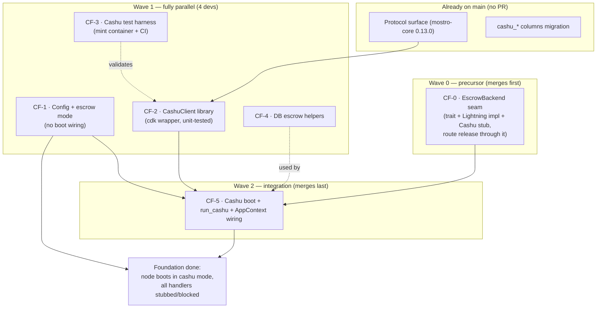

# Cashu Escrow — Fundamentals (Foundation Milestone)

**Status:** Draft for review · **Target:** `main` (`mostro-core 0.13.0`) ·
**Feature flag:** `[cashu].enabled`, defaults to `false`

This document is the engineering plan for the **foundation** of Cashu escrow in
`mostrod`. It does not implement any trade flow — its single goal is to put every
shared scaffold in place, on `main`, **without changing how the daemon behaves
today**, so that the four feature tracks (lock / release / cooperative-cancel /
dispute) can afterwards be built in parallel on disjoint files.

Read [`../CASHU_ESCROW_ARCHITECTURE.md`](../CASHU_ESCROW_ARCHITECTURE.md) first
for the crypto model and motivation. This document assumes it.

---

## 1. Goals and non-goals

### Goals
- Land all **shared, conflict-prone scaffolding** for Cashu on `main` in small
  PRs, each independently reviewable and shippable.
- After the milestone: a node configured with `[cashu] enabled = true` **boots**,
  connects to its mint, and runs — but every trade action is safely rejected
  with a clear "not implemented yet" error. No trade can be completed yet.
- Keep `mostrod` byte-for-byte behaviourally identical when Cashu is **off**.
- Maximise parallelism for the feature tracks that follow.

### Non-goals (explicitly out of scope here)
- Any actual Cashu trade flow: lock, release, cancel, dispute. Those are the
  feature tracks (docs 02–05).
- Any change to the Lightning hold-invoice flow beyond *additive* seams.
- `mostro-core` protocol changes — the 0.13.0 surface is treated as **frozen**
  (see §3). If a track later needs a new variant, that is a separate
  `mostro-core` release, not foundation work.
- Per-order mint negotiation, multi-mint allow-lists, Cashu-native bonds, Cashu
  fee collection — all future work.

---

## 2. Non-negotiable principles (merge gates)

Every PR in this milestone is reviewed against these. A PR that cannot satisfy
all four is mis-scoped and must be split.

1. **Off-by-default, behaviour-preserving.** With `[cashu]` absent or
   `enabled = false`, the daemon must behave exactly as it does on `main` today.
   This is verified by the existing test suite staying green *unmodified* (tests
   may be *added*, not *changed to accommodate new behaviour*).
2. **Atomic and shippable.** Each PR is self-contained and leaves `main`
   releasable. No PR depends on a *future* PR to compile or pass CI.
3. **Additive only.** New modules, new config keys, new DB helper functions, new
   trait methods. No existing public signature changes in a way that breaks the
   Lightning path. Schema changes are forbidden here — the columns already exist
   on `main` (see §3).
4. **Inert until wired.** New code paths added before the integration PR
   (`CF-5`) must be unreachable at runtime (dead-but-tested library code). The
   single PR that makes Cashu code reachable is `CF-5`, and even then only the
   *boot path* — all *handlers* still return "not implemented".

---

## 3. Baseline — what is ALREADY on `main` (do not re-implement)

Confirmed present on `origin/main` with `mostro-core 0.13.0`. **None of these
need a foundation PR.** Treat them as the frozen contract the tracks build on.

### Protocol surface (in `mostro-core 0.13.0`, frozen)

| Item | Location | Notes |
|------|----------|-------|
| `Action::AddCashuEscrow` | `message.rs` | seller → Mostro, carries `CashuLockProof` |
| `Action::CashuEscrowLocked` | `message.rs` | Mostro → parties, informational |
| `Action::CashuPmSignature` | `message.rs` | Mostro → winner, carries `CashuSignatures` |
| `Payload::CashuLockProof(CashuLockProof)` | `message.rs` | `{ token, mint_url, buyer_pubkey, seller_pubkey, mostro_pubkey }` (all hex/strings) |
| `Payload::CashuSignatures(Vec<CashuProofSignature>)` | `message.rs` | `CashuProofSignature { secret, signature }` |
| `CantDoReason::{InvalidCashuToken, CashuMintUnavailable, InvalidMintUrl, CashuEscrowNotLocked, CashuSignatureMissing}` | `error.rs` | |
| `Order.{cashu_mint_url, cashu_escrow_token, cashu_escrow_locked_at}` | `order.rs` | all `Option`, `SmallOrder` unaffected |
| `MessageKind::verify()` arms for `AddCashuEscrow` / `CashuPmSignature` | `message.rs` | payload-shape checks |

### Daemon scaffolding already merged to `main`

| Item | Location | Notes |
|------|----------|-------|
| Migration `cashu_escrow_fields` | `migrations/20260530120000_cashu_escrow_fields.sql` | adds the 3 `cashu_*` columns; **schema is frozen — no track adds a migration for escrow fields** |

### Escrow seam — NOT yet on `main` (owned by CF-0)

The narrow `EscrowBackend` seam is **not** in the tree yet: `rg 'trait
EscrowBackend' src` is empty, there is no `src/escrow.rs`, and `release_action`
still takes `&mut LndConnector` directly. It is therefore **not** a baseline
assumption — it is the first foundation PR, **CF-0**, a behaviour-preserving
refactor that must merge before CF-5 (which wires `Arc<dyn EscrowBackend>` into
`AppContext`):

| Item | Location | Notes |
|------|----------|-------|
| `EscrowBackend` trait | `src/escrow.rs` (new) | `create_hold_invoice` / `settle_hold_invoice` / `cancel_hold_invoice` |
| `impl EscrowBackend for LndConnector` | `src/escrow.rs` (new) | behaviour-preserving Lightning pass-through |
| `CashuBackend` stub | `src/escrow.rs` (new) | methods return a typed "not implemented" error (no `panic!`) |
| `release_action` routed through `&mut dyn EscrowBackend` | `src/app/release.rs` | replaces the direct `&mut LndConnector` parameter; Lightning behaviour unchanged |

> **Design consequence:** because the protocol and schema are already on `main`,
> the foundation is **much smaller** than the original F1–F6 plan. We do **not**
> re-open `mostro-core` and we do **not** add a migration. The one refactor we do
> need — establishing the `EscrowBackend` seam — is isolated into **CF-0** so no
> later track has to touch `release.rs` or invent an unplanned shared-file
> refactor mid-flight. The risk surface shrinks accordingly.

---

## 4. Locked design decisions (do not re-litigate per PR)

Carried from the architecture doc, restated as constraints:

1. **Global mode switch, not per-order.** A node runs in exactly one escrow mode:
   `lightning` (default) **or** `cashu`, fixed in `settings.toml`. In `cashu`
   mode the LND connector is **not initialised** at boot.
2. **Node-configured, fixed mint.** One `mint_url` per node; all Cashu trades use
   it. No per-order mint.
3. **Coordinator, not wallet.** The daemon validates tokens, holds `P_M`, and
   signs only during dispute resolution. All wallet operations live in clients.
4. **Trade keys for `P_B` / `P_S`.** The 2-of-3 condition embeds the per-order
   **trade** pubkeys, never identity/master keys. `P_M` is Mostro's arbitrator
   key.
5. **Bonds ⊕ Cashu are mutually exclusive.** `anti_abuse_bond.enabled &&
   cashu.enabled` is a hard config error at startup.
6. **`mostro-core 0.13.0` protocol is the frozen baseline** for the foundation
   + tracks effort (see §3) — frozen *except* for additive, versioned releases
   that a track explicitly justifies (the escape hatch §3's design-consequence
   note already allows). Exercised once so far: Track A requires
   `mostro-core ≥ 0.14.0` for `CashuLockProof.fee_token` (see 02 §4A).
7. **Establish a narrow `EscrowBackend` seam (CF-0); branch handlers on
   `escrow_mode`.** We do **not** redesign `EscrowBackend` into a high-level
   `lock`/`release`/`cancel`/`dispute` trait during foundation. The trait keeps
   the LN hold-invoice shape (`create`/`settle`/`cancel_hold_invoice`); Cashu
   behaviour is added by branching the relevant handlers on
   `Settings::escrow_mode()` / `is_cashu_enabled()` (the same pattern `release_action`
   adopts once CF-0 routes it through `&mut dyn EscrowBackend`).
   Rationale: the high-traffic handler files (`take_*`, `cancel`, `admin_*`,
   `release`) stay behaviourally untouched on the Lightning path, which is the
   whole point of keeping `mostrod` stable. A higher-level escrow trait is
   possible *future* refactor work, never a prerequisite for shipping Cashu.

---

## 5. Foundation milestone — overview

Six PRs. One precursor (CF-0) establishes the escrow seam and merges first; four
are independent and parallelisable; one is the integration PR that merges last.



**Reading the graph:** `CF-0` is the behaviour-preserving precursor that lands the
`EscrowBackend` seam (and routes `release` through it) before anything builds on
it. `CF-1`, `CF-2`, `CF-3`, `CF-4` have no dependencies on each other and can be
opened simultaneously once CF-0 is in. `CF-5` is the only sequential gate — it
needs `CF-0` (the seam it wires into `AppContext`), `CF-1` (to read the mode) and
`CF-2` (to connect the mint) merged first, and soft-uses `CF-4`'s helpers for
in-flight discovery.

---

## 6. PR specifications

Each PR below lists: **scope**, **files**, **what it must NOT do**,
**backwards-compat guarantee**, **tests**, **dependencies**, and **conflict
surface**.

### CF-0 · `EscrowBackend` seam (precursor, Wave 0)

**Scope.** Behaviour-preserving refactor only: introduce the narrow escrow
seam described in §3/§4.7 and route `release_action` through it. No new
runtime behaviour, no config, no Cashu logic.

**Files.**
- `src/escrow.rs` (new) — `trait EscrowBackend { create_hold_invoice /
  settle_hold_invoice / cancel_hold_invoice }`; `impl EscrowBackend for
  LndConnector` as a literal pass-through; `CashuBackend` stub whose methods
  return a typed "not implemented" error (never `panic!` / `unimplemented!`).
- `src/app/release.rs` — `release_action` takes `&mut dyn EscrowBackend`
  instead of `&mut LndConnector`; Lightning behaviour unchanged.

**Must NOT.** Touch boot (`main.rs`), `AppContext` (CF-5 wires the seam),
config, the scheduler, or any other handler. Implement any Cashu method body.

**Backwards-compat guarantee.** Lightning calls flow through the pass-through
impl unchanged; the existing release/dispute test suite passes unmodified.

**Tests.** Existing suite green unmodified; a unit test that every
`CashuBackend` method returns the typed error (no panic).

**Dependencies.** None. **Conflict surface.** new `src/escrow.rs`,
`src/app/release.rs`. **Parallel with.** Nothing — it is the Wave-0 precursor
and merges first.

---

### CF-1 · Config + escrow mode (no boot change)

**Scope.** Introduce Cashu configuration and the escrow-mode resolution, with
validation — but wire it to **nothing** at runtime yet (only config validation
reads it).

**Files.**
- `src/config/types.rs` — `struct CashuSettings { enabled: bool, mint_url: String,
  escrow_locktime_days: u32 }` (all `#[serde(default)]`; `escrow_locktime_days`
  defaults to **15** and must be `>= 1` — it is the seller-recovery locktime floor,
  see Track A §4B); `enum EscrowMode { Lightning, Cashu }`.
- `src/config/settings.rs` — `pub cashu: Option<CashuSettings>` on `Settings`
  (`#[serde(default)]`, mirroring `anti_abuse_bond`); `Settings::get_cashu()`,
  `Settings::is_cashu_enabled()`, `Settings::escrow_mode()`.
- `src/config/util.rs` — validation in `validate_mostro_settings`: (a) reject
  `cashu.enabled && anti_abuse_bond.enabled`; (b) when enabled, require non-empty
  `mint_url` that parses as `http`/`https`.
- `src/config/wizard.rs` + `settings.tpl.toml` — a commented `[cashu]` block and
  an optional interactive prompt.

**Must NOT.** Touch `main.rs` boot, the scheduler, `AppContext`, or any handler.
`escrow_mode()` may exist but nothing calls it on a hot path yet.

**Backwards-compat guarantee.** `[cashu]` absent ⇒ `get_cashu() == None` ⇒
`is_cashu_enabled() == false` ⇒ `escrow_mode() == Lightning`. A config that does
not mention Cashu validates and boots exactly as before.

**Tests.** Unit tests for serde defaults (absent block, disabled block, enabled
block), mutual-exclusion rejection, and `mint_url` scheme validation. (These
mirror the `anti_abuse_bond` config tests already in the tree.)

**Dependencies.** None. **Conflict surface.** `config/*`, `settings.tpl.toml` —
small, additive. **Parallel with.** CF-2, CF-3, CF-4.

---

### CF-2 · CashuClient library

**Scope.** A self-contained `cdk` wrapper in `src/cashu/mod.rs`. Pure library:
parse/validate tokens and talk to a mint. **Not wired into the daemon.**

**Files.**
- `Cargo.toml` — add `cdk` (+ `cdk-http-client` if needed), pinned.
- `src/cashu/mod.rs` — `pub struct CashuClient` and an `Error` enum
  (`impl std::error::Error`). Public API:
  - `async fn connect(mint_url: &str) -> Result<Self, Error>` — verifies the mint
    is reachable, supports the required NUTs (07 state, 11 P2PK, 12 DLEQ), **and
    that its active keysets are denominated in `sat`** (NUT-06 `unit`); any other
    unit is a hard connect error — token values are compared against sat amounts
    downstream, so a `usd`/`msat` keyset would make every amount check
    economically meaningless.
  - `async fn check_state(&self, ys) -> Result<CheckStateResponse, Error>` — NUT-07.
  - `fn verify_2of3_condition(token, p_b, p_s, p_m) -> Result<Token, Error>` —
    parses, asserts exactly 2 required sigs (`n_sigs = 2`) over the three expected
    pubkeys, **a `locktime` tag present**, and **`refund = [P_S]` with
    `n_sigs_refund = 1`** and no other refund key (the seller-recovery path, Track A
    §4B) (NUT-10/11). The locktime *value* (floor check) is verified by
    `verify_escrow_token`, which holds the config.
  - `async fn verify_token_dleq(&self, token) -> Result<(), Error>` — NUT-12.
  - `async fn verify_escrow_token(&self, token, p_b, p_s, p_m, expected_amount, min_locktime)` —
    composes the above into one acceptance check (condition + mint binding +
    per-proof **`sat` keyset unit** — a token may mix keysets, so the boot-time
    check alone does not cover it — +
    amount + DLEQ + unspent + **`token.locktime >= min_locktime`**, where the
    caller passes `min_locktime = now + cashu.escrow_locktime_days`; the seller may
    set a longer locktime for marketplace trades, never a shorter one — Track A §4B).
  - `fn cashu_pubkey_from_xonly_hex(hex) -> Result<PublicKey, Error>` — maps a
    Nostr x-only trade pubkey to a Cashu `PublicKey`.
- `src/main.rs` — register `pub mod cashu;` **only** (a `mod` declaration is not
  a behaviour change). No call sites.

**Must NOT.** Be called from any handler, `AppContext`, or the boot path. No
global state beyond what the unit tests need.

**Backwards-compat guarantee.** Adding a dependency and an unreferenced module
changes no runtime behaviour. The Lightning path never constructs a `CashuClient`.

**Tests.** Unit tests for `verify_2of3_condition` (accept a valid 2-of-3 carrying a
`locktime` + `refund = [P_S]`; reject wrong sig count, missing locktime, missing/
wrong/extra refund key, missing/extra pubkey) and
`cashu_pubkey_from_xonly_hex`. Mint-backed tests (`connect`, `check_state`,
`verify_token_dleq`) run against the CF-3 container and are `#[ignore]`d /
env-gated when the mint is absent, so they don't break offline CI.

**Dependencies.** `cdk` only. **Conflict surface.** New module + `Cargo.toml`
dep block + one `mod` line. **Parallel with.** CF-1, CF-3, CF-4.

---

### CF-3 · Cashu test harness

**Scope.** Make a real Cashu mint available to CI and local runs so CF-2 and the
later tracks have something to test against.

**Files.**
- `docker-compose.cashu.yml` — a throwaway test mint (e.g. `nutshell` FakeWallet
  backend). The mint key is a documented **non-sensitive fixture**.
- A **dedicated workflow** (its own file, e.g. `.github/workflows/cashu.yml`, not
  the default `ci.yml`) that starts the mint and runs the env-gated Cashu
  integration tests. **Trigger = scheduled + opt-in by label** (the same pattern
  the repo already adopted for mutation testing — see the
  `ci(mutation): run as scheduled audit + opt-in, not on every push` change):
  - **Scheduled:** a nightly `cron` run against `main` as a recurring safety net,
    so a regression is caught even if a PR author forgets the label.
  - **Opt-in:** runs on a PR only when it carries the **`cashu`** label, giving
    immediate pre-merge feedback to anyone working on Cashu.
  - It is **never** part of the default required PR checks, so non-Cashu PRs and
    the Lightning path never pay its cost or flakiness.
- `tests/cashu_mint.rs` + `tests/common/mod.rs` — integration test skeleton and
  shared helpers (spin-up wait, fund a wallet, build a 2-of-3 token) the tracks
  reuse. Gated behind an env var (e.g. `CASHU_TEST_MINT_URL`) so they `#[ignore]`
  / skip when no mint is present.

**Must NOT.** Add the mint to the default required CI checks, modify `ci.yml`'s
required jobs, or make any unit test depend on network access by default.

**Backwards-compat guarantee.** Pure test/infra; no daemon code.

**Tests.** A smoke test that the mint is reachable and returns mint info when the
container is up; a no-op/skip when the env var is unset.

**Dependencies.** None. **Conflict surface.** CI yaml + new test files.
**Parallel with.** CF-1, CF-2, CF-4.

---

### CF-4 · DB escrow helpers

**Scope.** Additive query helpers over the **already-migrated** `cashu_*`
columns. Used later by the lock track and by restore/monitoring; added now so the
schema-adjacent code is frozen and reviewed once.

**Files.**
- `src/db.rs`:
  - `async fn update_order_cashu_escrow(pool, order_id, mint_url, token,
    locked_at, expected_status, new_status) -> Result<bool, MostroError>` —
    **atomic compare-and-set**: persists the three columns *and* transitions the
    status in one `UPDATE … WHERE id = ? AND status = ? AND
    cashu_escrow_locked_at IS NULL`, returning whether a row matched. No
    lock-without-advance window; replay-safe.
  - `async fn find_locked_cashu_orders(pool) -> Result<Vec<Order>, MostroError>`
    — `WHERE cashu_escrow_locked_at IS NOT NULL`. Do **not** add a `status`
    predicate: `update_order_cashu_escrow` advances the status in the same write
    as the lock, so filtering on `Active` would skip legitimately locked rows
    that have already moved on. Only re-add a status predicate if a separate
    invariant guarantees locked rows never leave `Active`.

> **Forward note (Track A).** TA-1f later extends `update_order_cashu_escrow`
> with a `fee_token` parameter plus a fee-persistence migration
> (`cashu_fee_token`, `cashu_fee_redeemed_at` on `orders`; new
> `cashu_fee_proofs` table) so the seller-funded fee survives a crash between
> lock and redeem and can never be reused across orders — see 02 §4A. CF-4
> itself ships without it.

**Must NOT.** Add or alter any migration. Be called from a hot path yet.

**Backwards-compat guarantee.** New, unreferenced functions. The columns already
exist on `main`, so no schema change ships here.

**Tests.** Unit tests on an in-memory SQLite: CAS succeeds once and is idempotent
on replay; status-mismatch matches zero rows; `find_locked_cashu_orders` excludes
unlocked orders and **includes locked orders regardless of status** (e.g. a
locked order that already advanced to `FiatSent`) — the test asserts the
no-status-predicate design above instead of contradicting it.

**Dependencies.** None (schema already on `main`). **Conflict surface.** `db.rs`
(additive functions + their tests). **Parallel with.** CF-1, CF-2, CF-3.

---

### CF-5 · Cashu boot + `run_cashu` + AppContext wiring (integration)

**Scope.** The single integration PR. Make a `cashu`-mode node **boot and run**
with no LND, connect to its mint, and route events through a Cashu event loop in
which **every trade action returns `CantDo(InvalidAction)`** (nothing is
implemented yet). This is what proves the foundation works end to end while
keeping it inert for real trades.

**Files.**
- `src/app/context.rs` — `AppContext` carries the active escrow backend
  (`Arc<dyn EscrowBackend>` or equivalent) and an `Option<Arc<CashuClient>>`;
  accessors `escrow()` / `cashu_client()`. Lightning mode leaves the client
  `None`.
- `src/main.rs` — branch on `Settings::is_cashu_enabled()`:
  - **Lightning (default):** unchanged path — `LndConnector::new()`, LN status
    probe, held-invoice resubscribe, `run(ctx, &mut ln_client)`.
  - **Cashu:** skip `LndConnector::new()` and the LN status probe entirely;
    `CashuClient::connect(mint_url)` (fail fast with a clear error if the mint is
    unreachable); attach the client to `ctx`; `return run_cashu(ctx).await`.
- `src/app.rs` — `run_cashu(ctx)`: mirrors `run()`'s event/decrypt/verify/
  trade-index pipeline (reuse the same `unwrap_incoming` transport path as `run`)
  but dispatches every trade action to `CantDo(InvalidAction)` for now. Factor the
  shared event-decode prologue so `run` and `run_cashu` cannot drift
  (anti-duplication; see Risks).
- `src/scheduler.rs` — gate LN-only jobs (`find_held_invoices` resubscribe, bond
  jobs, payment retries) behind `!is_cashu_enabled()`; leave mode-agnostic jobs
  (order expiry, rate publishing) running.

**Must NOT.** Implement any handler body. Change the Lightning boot path in any
observable way. Start the mint connection in Lightning mode.

**Backwards-compat guarantee.** With Cashu disabled, `main.rs` takes the
identical existing branch and `run()` is called exactly as today; the scheduler
gates are no-ops (`is_cashu_enabled() == false`). Existing tests stay green
unmodified.

**Tests.** Unit/integration: boot resolves `EscrowMode::Cashu` and reaches
`run_cashu` without constructing an LND client (inject/mocked); a trade action in
Cashu mode yields `CantDo(InvalidAction)`; scheduler skips LN jobs in Cashu mode.
The "Lightning mode unchanged" guarantee is covered by the existing suite.

**Dependencies.** **CF-0** (the `EscrowBackend` seam wired into `AppContext`),
**CF-1** (mode + `is_cashu_enabled`) and **CF-2** (mint connect) are hard
prerequisites; **CF-4** is a soft prerequisite (used for
in-flight Cashu discovery / restore if included). **Conflict surface.** `main.rs`,
`app.rs`, `app/context.rs`, `scheduler.rs` — the high-traffic shared files. This
is why it merges **last and alone** in the milestone. **Parallel with.** Nothing
in this milestone — it is the join point.

#### CF-5 detail — the shared event-loop prologue (zero-drift refactor)

`run()` on `main` (`src/app.rs`) is one `loop { while let … recv() }` whose body
has two clearly separable parts:

1. **Prologue (transport + validation) — identical for both modes.** In order:
   `event.check_pow(pow)` → `event.kind == accepted_kind` filter → the
   protocol-v2 spam-gate pre-check (replay dedup + first-contact PoW, `is_v2`
   only) → `event.verify()` → `unwrap_incoming(&event, my_keys)` → 10-second
   replay window (`unwrapped.created_at`) → identity≠sender-without-signature
   bail → `check_trade_index(...)` → `inner_message.verify()` →
   `message.inner_action()`. Every failure is a `continue`.
2. **Dispatch + error tail — the only mode-specific part.** `run` calls
   `handle_message_action(action, msg, &unwrapped, my_keys, ln_client, &ctx)`;
   then the `downcast::<MostroError>()` → `manage_errors(...)` / `warning_msg(...)`
   tail. `run_cashu` needs the *same* tail but a *different* dispatch (no
   `ln_client`).

**The rule:** the prologue must exist in exactly one place so `run` and
`run_cashu` cannot drift. Extract it; do not copy-paste the loop body.

Proposed extraction (signatures only — bodies are a literal cut of today's
prologue with each `continue` becoming `return None`):

```rust
/// Decode + fully validate one relay event into a dispatchable triple, or
/// `None` if it must be skipped (PoW, wrong kind, spam-gate, decrypt failure,
/// stale, bad signature, failed trade-index, failed inner verify). Shared
/// VERBATIM by `run` (Lightning) and `run_cashu` (Cashu).
async fn accept_event(
    ctx: &AppContext,
    event: &Event,
    my_keys: &Keys,
    pow: u8,
    pow_first_contact: u8,
    accepted_kind: Kind,
    is_v2: bool,
) -> Option<(Action, Message, UnwrappedMessage)>;

/// Shared post-dispatch error handling (identical in both loops today).
async fn finalize_dispatch(
    result: anyhow::Result<()>,
    message: Message,
    unwrapped: UnwrappedMessage,
    action: &Action,
);
```

Both loops then reduce to the same skeleton, differing in **one line**:

```rust
// run() — Lightning
while let Ok(RelayPoolNotification::Event { event, .. }) = notifications.recv().await {
    let Some((action, message, unwrapped)) =
        accept_event(&ctx, &event, my_keys, pow, pow_first_contact, accepted_kind, is_v2).await
    else { continue };
    let result = handle_message_action(&action, message.clone(), &unwrapped, my_keys, ln_client, &ctx).await;
    finalize_dispatch(result, message, unwrapped, &action).await;
}

// run_cashu() — Cashu (no ln_client)
while let Ok(RelayPoolNotification::Event { event, .. }) = notifications.recv().await {
    let Some((action, message, unwrapped)) =
        accept_event(&ctx, &event, my_keys, pow, pow_first_contact, accepted_kind, is_v2).await
    else { continue };
    let result = dispatch_cashu(&action, message.clone(), &unwrapped, my_keys, &ctx).await;
    finalize_dispatch(result, message, unwrapped, &action).await;
}
```

**`dispatch_cashu` in this PR — closed decision.** The routing rule is a strict
allow-list, drawn at *"escrow-independent actions that neither create nor advance
an order"*:

- **Allowed** (route through the existing `handle_message_action_no_ln(...)`;
  read-only / session, never touch escrow, LND, or order lifecycle):
  **`Orders`**, **`LastTradeIndex`**, **`RestoreSession`**, **`TradePubkey`**.
  A Cashu-foundation node can therefore still serve the order book, restore
  sessions, and sync trade indexes — all zero-risk for funds.
- **Blocked** → `Err(MostroCantDo(CantDoReason::InvalidAction))` — everything that
  creates, advances, or settles an order, because there is no escrow behind it
  yet: `NewOrder`, `TakeBuy`, `TakeSell`, `AddInvoice`, `FiatSent`, `Release`,
  `Cancel`, `Dispute`, `RateUser`, `AddCashuEscrow`, `AdminCancel`,
  `AdminSettle`, `AddBondInvoice`, and any admin/dispute action. The feature
  tracks replace these arms one at a time, in their own files.

Rationale: allowing, say, `NewOrder` would populate the order book with orders
that can never be taken to completion (no escrow), producing orphan/half-state
orders. The allow-list is deliberately the *narrowest* set that keeps the node
observable without ever moving an order's lifecycle. `RateUser` is blocked
because nothing can reach a rateable terminal state during foundation.

**Action-ownership matrix (merge gate for the tracks).** Every blocked action
must have an owner that eventually unblocks it, or an explicit
*permanently-blocked* decision. A track PR replaces the `InvalidAction` arm
**only** for the actions it owns below. The rule: **no action may be left
without a row** — an ownerless action means the feature ships incomplete (a
cashu node where, e.g., `NewOrder` is still rejected after all four tracks can
never trade at all; the first Cashu attempt hit exactly this bug in code).

| Action | Unblocked by | Final routing |
|--------|-------------|---------------|
| `NewOrder` | **TA-2** (Track A — bundled with the take flow, so orders become creatable and takeable in the same PR; scoped in 02 §6 TA-2) | `handle_message_action_no_ln` — creating a pending order touches no escrow |
| `TakeBuy`, `TakeSell` | **TA-2** (Track A) | cashu branch → `show_cashu_escrow_request` |
| `AddCashuEscrow` | **TA-1** (Track A) | `add_cashu_escrow_action` |
| `FiatSent` | **Track B** | cashu branch (state advance, no LND; carries the §4B locktime guard — see 02 §4B) |
| `Release` | **Track B** | cashu release handler |
| `RateUser` | **Track B** | `no_ln` once terminal states are reachable |
| `Cancel` | **Track C** | cashu cancel handler |
| `Dispute`, `AdminCancel`, `AdminSettle`, `AdminTakeDispute` | **Track D** | cashu dispute handlers |
| `AdminAddSolver` | **Track D** (dispute setup needs solvers) | `handle_message_action_no_ln` — solver management touches no escrow/LND |
| `AddInvoice` | **never** — the buyer-invoice step does not exist in cashu mode (02 §2) | permanently `InvalidAction` (documented decision) |
| `AddBondInvoice` | **never** — bonds ⊕ cashu are mutually exclusive (§4.5) | permanently `InvalidAction` |

**Backwards-compatibility proof obligation.** Extracting `accept_event` /
`finalize_dispatch` is a pure refactor of `run`. The merge gate is: the existing
`app.rs` test module (`check_trade_index_tests`, `handle_message_action_tests`,
`message_validation_tests`, `event_processing_tests`) passes **unmodified**, and
a new test asserts `run`'s skeleton calls `accept_event` then
`handle_message_action` in order (e.g. by routing a known-good event through a
test double). Because the Lightning loop keeps calling the *same*
`handle_message_action` with the *same* `ln_client`, no Lightning behaviour can
change.

**AppContext shape (this PR).** Add `escrow: Arc<dyn EscrowBackend>` (or an enum
wrapper) and `cashu_client: Option<Arc<CashuClient>>`, with `escrow()` /
`cashu_client()` accessors. Lightning constructs `LndConnector`-backed escrow and
`cashu_client = None`; Cashu constructs the `CashuBackend` (still stubbed) and
`cashu_client = Some(connected)`. The narrow `EscrowBackend` trait (established by
CF-0, see §4.7) is consumed here unchanged — handlers reach Cashu behaviour by
branching on `Settings::escrow_mode()`, not through new trait methods.

---

## 7. Issues table — sequential vs parallel

> These become the GitHub issues for the milestone. IDs are stable references for
> cross-linking PRs. "Wave" indicates merge ordering; everything in a wave can be
> worked and merged in any order relative to its wave-mates.

| ID | Title | Wave | Depends on | Can run in parallel with | Conflict-prone files | Risk |
|----|-------|------|-----------|--------------------------|----------------------|------|
| **CF-0** | `EscrowBackend` seam (trait + `LndConnector` impl + `CashuBackend` stub; route `release_action` through `&mut dyn EscrowBackend`) | 0 | — | — (precursor, merges first) | new `src/escrow.rs`, `src/app/release.rs` | Low (behaviour-preserving) |
| **CF-1** | Config + escrow mode (`CashuSettings`, `EscrowMode`, validation, wizard/template) | 1 | — | CF-2, CF-3, CF-4 | `config/*`, `settings.tpl.toml` | Low |
| **CF-2** | `CashuClient` library (`cdk` wrapper, token/condition/DLEQ verification) | 1 | — (`cdk` only) | CF-1, CF-3, CF-4 | new `src/cashu/mod.rs`, `Cargo.toml` | Medium (crypto) |
| **CF-3** | Cashu test harness (mint container + opt-in CI + integration skeleton) | 1 | — | CF-1, CF-2, CF-4 | `.github/workflows/ci.yml`, new test files | Low |
| **CF-4** | DB escrow helpers (`update_order_cashu_escrow` CAS, `find_locked_cashu_orders`) | 1 | — (schema on `main`) | CF-1, CF-2, CF-3 | `src/db.rs` (additive) | Low |
| **CF-5** | Cashu boot + `run_cashu` + `AppContext` wiring + scheduler gating | 2 | **CF-0, CF-1, CF-2** (hard), CF-4 (soft) | — (integration join) | `main.rs`, `app.rs`, `app/context.rs`, `scheduler.rs` | Medium-High |

### Critical path
`CF-0` → (`CF-1` + `CF-2`) → `CF-5`. Everything else (`CF-3`, `CF-4`) hangs off
the side and never blocks the critical path. With four developers, CF-0 lands
first (small, behaviour-preserving), then Wave 1 collapses to the duration of the
slowest of `CF-1`/`CF-2`, then `CF-5`.

### Suggested assignment (4 devs)
- Dev A → **CF-0** (escrow seam, merges first), then **CF-1** (config), then pairs on **CF-5**.
- Dev B → **CF-2** (mint client) — the longest pole; start first.
- Dev C → **CF-3** (harness), then unblocks CF-2's mint-backed tests.
- Dev D → **CF-4** (db helpers), then reviews **CF-5**.

---

## 8. Milestone Definition of Done

The foundation is complete when **all** hold:

1. `CF-0`…`CF-5` are merged to `main`, each as its own PR.
2. A node with `[cashu] enabled = true` and a reachable `mint_url` **boots**,
   logs that it is in Cashu mode, connects to the mint, and runs `run_cashu`
   **without an LND node present**.
3. In Cashu mode, every trade action returns a clear `CantDo(InvalidAction)`
   (or the appropriate `CantDoReason`) — no panics, no half-states.
4. With Cashu disabled, `mostrod` is behaviourally identical to pre-milestone
   `main`; the pre-existing test suite passes unmodified.
5. `cargo fmt --check`, `cargo clippy --all-targets -- -D warnings`, and
   `cargo test` are green; the mint-backed integration tests pass against the
   CF-3 harness.
6. Bonds-vs-Cashu mutual exclusion is enforced and tested.

At that point the four feature tracks (docs 02–05) can start in parallel.

---

## 9. Risks and mitigations

| Risk | Mitigation |
|------|------------|
| `CF-5` touches the hottest files (`main.rs`, `app.rs`) and could destabilise the LN path | Merge it last and alone; keep the Lightning branch byte-identical; cover with the existing suite; require a focused review |
| `run` / `run_cashu` event-loop duplication drifts over time | In `CF-5`, factor the shared decode/verify/trade-index prologue into one helper both call; do not copy-paste the loop body |
| `mostro-core 0.13.0` Cashu surface turns out insufficient for a track | Out of scope for foundation; if discovered, raise a `mostro-core` change as a separate, clearly-versioned release before the affected track |
| Mint-backed tests make CI flaky/slow | CF-3 keeps them opt-in/scheduled and env-gated; default PR CI never depends on a live mint |
| Operator enables Cashu **and** bonds | Hard config-validation error at startup (CF-1), with a test |

---

## 10. Interface contracts to freeze on day one

So Wave-1 PRs can proceed before each other merges, agree these signatures up
front (they are the seams; bodies can follow):

- **`CashuClient`** public methods (CF-2) — exact signatures in §6.
- **`Settings::{get_cashu, is_cashu_enabled, escrow_mode}`** (CF-1).
- **`db::{update_order_cashu_escrow, find_locked_cashu_orders}`** (CF-4).
- **`AppContext::{escrow, cashu_client}`** accessors (CF-5) — so tracks can mock
  the backend.

Once these four signatures are written down (even as stubs returning
`unimplemented!()` / `None`), each PR can be coded and unit-tested in isolation.

---

## 11. Out of scope → next documents

The trade flows are specified separately and depend only on this milestone:

- **02 · Track A — Lock / escrow setup** (`AddCashuEscrow`, `verify_escrow_token`,
  CAS lock, notify buyer). Depends on CF-1, CF-2, CF-4, CF-5.
- **03 · Track B — Release happy path** (seller→buyer NIP-59 signature; daemon
  only advances state). Depends on CF-5.
- **04 · Track C — Cooperative cancel** (buyer→seller signature P2P). Depends on
  CF-5.
- **05 · Track D — Dispute resolution** (`admin_settle`/`admin_cancel` deliver the
  `P_M` signature via `CashuPmSignature`). Depends on CF-2, CF-5.

Each will get its own document mirroring this structure (scope → per-PR specs →
issues table → DoD) once fundamentals is approved.
