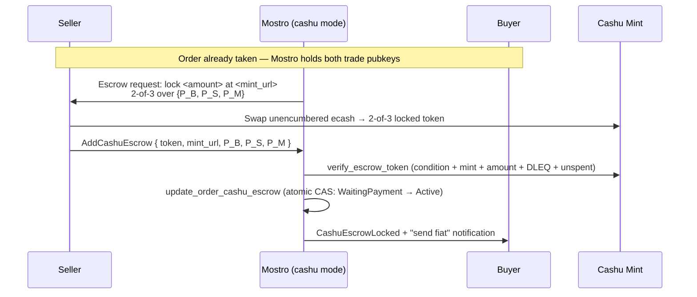

# Cashu Escrow — Track A: Lock / Escrow Setup

**Status:** Draft for review · **Target:** `main` (`mostro-core 0.13.0`) ·
**Depends on:** Fundamentals **CF-1, CF-2, CF-4, CF-5** (see
[`01-fundamentals.md`](./01-fundamentals.md)) · **Feature flag:** `[cashu].enabled`

Track A is the **first functional Cashu flow**: the seller locks the trade amount
in a Cashu 2-of-3 multisig token, Mostro validates and records it, and the order
advances so the buyer can send fiat. It is "box 2" of the sequence diagram in
[`../CASHU_ESCROW_ARCHITECTURE.md`](../CASHU_ESCROW_ARCHITECTURE.md). It touches
the most fundamentals pieces of any track, so writing it also **validates that
the foundation is correctly dimensioned** — see §11.

This document assumes Fundamentals is implemented and merged. It only adds
behaviour *inside the Cashu branch*; the Lightning path is never changed.

---

## 1. Goal and scope

### Goal
Make a `cashu`-mode node able to **lock escrow** for a taken order:
1. When an order is taken, ask the **seller** to lock funds in a 2-of-3 token
   (instead of paying a Lightning hold invoice).
2. Accept the seller's `AddCashuEscrow` submission, **fully validate** the token
   against the mint and the order's trade keys, **atomically** persist it and
   advance the order, and **notify the buyer** to send fiat.

### In scope
- The `add_cashu_escrow_action` handler (validation + atomic lock + notify).
- The Cashu branch of `take_sell` / `take_buy` that emits the escrow request.
- Restore/monitor of in-flight locked escrows after a restart.

### Out of scope (other tracks / future)
- **Release** (seller hands the buyer the redeem signature) → Track B.
- **Cooperative cancel** → Track C. **Dispute resolution** (`P_M` signs) → Track D.
- **Fee collection in Cashu mode.** What amount the token must carry relative to
  the Mostro fee is an open architectural question (see arch doc "Open
  Questions"). Track A validates the token amount against a single
  `expected_amount` and treats fee policy as a knob decided elsewhere; it does
  **not** invent a fee mechanism. See §11.

---

## 2. Where Track A sits — flow and state transitions

**State transition (the only one Track A performs):**
`WaitingPayment` → `Active`, gated by the CF-4 compare-and-set so the token is
persisted and the status advanced in a single `UPDATE` (no lock-without-advance
window, replay-safe). The `expected_status`/`new_status` pair passed to the CAS
must match whatever the take flow sets when waiting for the seller to fund — the
Cashu analogue of "seller paid the hold invoice → Active".

> **Why the seller, not the buyer, submits the lock:** in a Cashu trade the buyer
> redeems the locked token themselves later (with two signatures), so — unlike the
> Lightning flow — the buyer never provides a payout invoice. The `add-invoice`
> (buyer-invoice) step is simply **absent** in Cashu mode. Track A wires the
> seller-funds path; it does not touch `add_invoice.rs`.

---

## 3. What Track A consumes from Fundamentals

This is the dependency contract. If any row is missing or shaped differently when
Track A starts, fundamentals was under-specified (that is the point of writing
this now — see §11).

| Needs | From | Exact item |
|-------|------|------------|
| Mode + mint config | CF-1 | `Settings::is_cashu_enabled()`, `Settings::escrow_mode()`, `get_cashu().mint_url` |
| Token validation | CF-2 | `CashuClient::verify_escrow_token(token, p_b, p_s, p_m, expected_amount)`, `verify_2of3_condition`, `check_state`, `verify_token_dleq`, `cashu_pubkey_from_xonly_hex` |
| Atomic lock | CF-4 | `db::update_order_cashu_escrow(pool, order_id, mint_url, token, locked_at, expected_status, new_status) -> Result<bool>` |
| In-flight discovery | CF-4 | `db::find_locked_cashu_orders(pool)` |
| Client handle | CF-5 | `AppContext::cashu_client() -> Option<&Arc<CashuClient>>` |
| Dispatch seam | CF-5 | `AddCashuEscrow` routed to `add_cashu_escrow_action` (a CF-5 stub Track A fills in) — see §11 |
| Mint connectivity | CF-5 | mint connected at boot in cashu mode |

Protocol (already in `mostro-core 0.13.0`, frozen):
- `Action::AddCashuEscrow` carrying `Payload::CashuLockProof(CashuLockProof)`,
  where `CashuLockProof = { token, mint_url, buyer_pubkey, seller_pubkey,
  mostro_pubkey }` (all hex/strings).
- `Action::CashuEscrowLocked` (informational, buyer notification).
- `CantDoReason::{InvalidCashuToken, CashuMintUnavailable, InvalidMintUrl,
  CashuEscrowNotLocked}`.
- `Order.{cashu_mint_url, cashu_escrow_token, cashu_escrow_locked_at}`.

No new `mostro-core` variant is required by Track A.

---

## 4. The lock handler — `add_cashu_escrow_action`

New file `src/app/add_cashu_escrow.rs`. The handler is the Cashu analogue of the
"seller funds the escrow" step. Validation ordering matters: **validate fully
before mutating any state**, then commit atomically — the same discipline applied
to `release_action` (compute/verify first, persist second, notify last).

**Algorithm:**

1. **Resolve order & request id.** `get_order(&msg, pool)`; reject if not found.
2. **Authorise the sender.** The submitter MUST be the order's **seller trade
   key**: `order.get_seller_pubkey()? == event.sender`, else
   `CantDo(InvalidPeer)`. (Same identity check shape as `release_action`.)
3. **Check status.** The order must be in the "waiting for seller to fund" status
   (`WaitingPayment`); otherwise `CantDo(NotAllowedByStatus)`.
4. **Extract the proof.** `Payload::CashuLockProof(proof)`; absent ⇒
   `CantDo(InvalidCashuToken)`. (`MessageKind::verify()` already guarantees the
   payload shape, but the handler re-checks defensively.)
5. **Bind the mint.** `proof.mint_url` MUST equal the node's configured
   `get_cashu().mint_url` (normalised); else `CantDo(InvalidMintUrl)`. The node
   only escrows on its own mint.
6. **Bind the pubkeys to THIS order.** Convert each hex pubkey with
   `cashu_pubkey_from_xonly_hex`:
   - `proof.buyer_pubkey` MUST equal the order's **buyer trade pubkey**
     (`order.get_buyer_pubkey()?`).
   - `proof.seller_pubkey` MUST equal the order's **seller trade pubkey**
     (`event.sender`).
   - `proof.mostro_pubkey` MUST equal Mostro's arbitrator key (`my_keys`).
   Any mismatch ⇒ `CantDo(InvalidCashuToken)`. This is the security core:
   the 2-of-3 must lock to the keys Mostro already holds for this order, never
   attacker-chosen keys.
7. **Validate the token against the mint.**
   `ctx.cashu_client()` → `verify_escrow_token(&proof.token, p_b, p_s, p_m,
   expected_amount)`. This composes: 2-of-3 condition (exactly 2 sigs, no
   locktime, no refund keys, the three expected pubkeys present), mint binding,
   amount, NUT-12 DLEQ (proofs really issued by the mint), and NUT-07 unspent
   check. Map failures: malformed/condition → `CantDo(InvalidCashuToken)`;
   mint unreachable → `CantDo(CashuMintUnavailable)`. `expected_amount` is the
   order amount per the fee policy in §11.
8. **Atomically lock + advance.**
   `db::update_order_cashu_escrow(pool, order.id, &proof.mint_url, &proof.token,
   now, /*expected*/ WaitingPayment, /*new*/ Active)`. If it returns `false`
   (status changed concurrently, or escrow already locked — replay), log and
   return `Ok(())` without notifying (idempotent; same pattern as the
   `rows_affected() == 0` guard in `release_action`).
9. **Publish the updated order event** (kind 38383) via `update_order_event`, as
   the LN funding path does, so the order's public state stays consistent.
10. **Notify the buyer.** Enqueue `Action::CashuEscrowLocked` to the buyer plus
    the existing "send fiat" notification, so the buyer learns the escrow is live
    and the fiat phase can begin.

All notifications happen **after** the successful CAS — never before — so a
validation or persistence failure leaves the order exactly as it was and the
seller can retry.

---

## 5. `take_sell` / `take_buy` — the Cashu branch

`take_sell_action` / `take_buy_action` keep one handler each; they branch on
`Settings::escrow_mode()` near the point where the Lightning path creates the
seller hold invoice:

- **Lightning (unchanged):** create the hold invoice, ask the seller to pay it.
- **Cashu:** instead emit an **escrow request** to the seller carrying everything
  needed to build the 2-of-3: the amount to lock, the node `mint_url`, the
  buyer trade pubkey `P_B`, and Mostro's arbitrator pubkey `P_M`. (This is the
  `show_cashu_escrow_request(...)` helper.) The order is left in `WaitingPayment`,
  exactly where the CAS in step 8 expects it.

The buyer-invoice request that the Lightning flow issues is **skipped** in Cashu
mode (the buyer redeems ecash directly later).

These two files are **owned by Track A** — no other track edits them, so there is
no cross-track conflict here.

---

## 6. PR breakdown (atomic, backwards-compatible)

Track A is small enough for two core PRs plus one optional hardening PR. Each is
off-by-default and leaves `main` shippable.

### TA-1 · `add_cashu_escrow_action` handler
Fill in the CF-5 stub for `AddCashuEscrow` in its **own** file
`src/app/add_cashu_escrow.rs`: the full validation algorithm (§4), the CF-4
atomic CAS, the order-event publish, and the buyer notification. Unit-tested
against the CF-3 mint (valid lock → `Active` + buyer notified; each rejection
path; replay → idempotent no-op).
*Depends on CF-2, CF-3, CF-4, CF-5 (CF-3 supplies the mint harness TA-1 is
unit-tested against). Conflict surface: new file only.*

### TA-2 · `take_*` escrow request
Add the Cashu branch to `take_sell_action` / `take_buy_action` and the
`show_cashu_escrow_request` helper, so a taken order asks the seller to lock
instead of to pay a hold invoice. Completes the lock flow end-to-end with TA-1.
*Depends on CF-1, CF-5 (and TA-1 for a full e2e test). Conflict surface:
`take_sell.rs`, `take_buy.rs`, `util.rs` — Track-A-owned.*

### TA-3 · Restore / monitor in-flight locks (optional, recommended)
On startup in cashu mode, use `db::find_locked_cashu_orders` to re-hydrate
in-flight escrows (and optionally re-`check_state` them), mirroring the
`find_held_invoices` resubscribe the Lightning path does. Keeps locked escrows
visible across restarts.
*Depends on CF-4, CF-5. Conflict surface: `main.rs`/restore module — small,
additive, cashu-gated.*

---

## 7. Issues table — sequential vs parallel

| ID | Title | Depends on | Parallel with | Conflict surface | Risk |
|----|-------|-----------|---------------|------------------|------|
| **TA-1** | `add_cashu_escrow_action` handler (validate + atomic lock + notify) | CF-2, CF-3, CF-4, CF-5 | TA-2 (until e2e) | new `src/app/add_cashu_escrow.rs` | Medium (crypto + state) |
| **TA-2** | `take_sell`/`take_buy` Cashu escrow request | CF-1, CF-5 | TA-1 | `take_*.rs`, `util.rs` | Low-Medium |
| **TA-3** | Restore/monitor in-flight locked escrows | CF-4, CF-5 | TA-1, TA-2 | `main.rs`/restore (additive) | Low |

**Sequencing:** TA-1 and TA-2 can be developed in parallel (different files) and
merged in either order; the **end-to-end** lock test needs both, so whichever
merges second carries the e2e test. TA-3 is independent and can land any time
after CF-4 + CF-5. Relative to other tracks, **all of Track A is parallel with
Tracks B/C/D** — it only edits its own files plus the pre-wired CF-5 stub.

---

## 8. Definition of Done

1. A `cashu`-mode node, after an order is taken, asks the seller to lock a 2-of-3
   escrow and accepts a valid `AddCashuEscrow`, advancing `WaitingPayment →
   Active` and notifying the buyer to send fiat — verified end-to-end against the
   CF-3 mint.
2. Every rejection path returns the correct `CantDoReason` and leaves the order
   unchanged (wrong sender, wrong status, wrong mint, pubkey mismatch, malformed
   token, mint unavailable, double-spent, replay).
3. The lock is atomic and idempotent (concurrent/replayed submission matches zero
   rows and is a safe no-op).
4. With Cashu disabled, behaviour is identical to `main`; existing tests pass
   unmodified.
5. `cargo fmt --check`, `clippy -D warnings`, `cargo test`, and the mint-backed
   integration tests are green.

---

## 9. Principles inherited from Fundamentals

All four merge gates from [`01-fundamentals.md`](./01-fundamentals.md) §2 apply
unchanged: off-by-default & behaviour-preserving, atomic & shippable, additive
only (no schema change — the columns exist), and inert-until-enabled. Track A adds
behaviour **only** inside the cashu branch; the Lightning lock/funding path is
untouched.

---

## 11. Gaps found while writing this track (feedback into Fundamentals)

Writing Track A surfaced the following — fold these into the fundamentals spec
**before** freezing it:

### G-1 · `dispatch_cashu` must route to per-action handlers, not an in-`app.rs` match
**Problem.** Fundamentals CF-5 describes `dispatch_cashu` as a `match` (in
`app.rs`) that returns `InvalidAction` for blocked actions. If every track later
edits its arm of that match, `app.rs` becomes a **cross-track merge-conflict
hotspot** — breaking the "tracks edit disjoint files" guarantee.

**Fix (update CF-5).** Apply the "stub every integration point in foundation"
principle, but keep CF-5 inside its **own** files. In CF-5:
- `run_cashu`'s `dispatch_cashu` maps **every** trade action to
  `CantDo(InvalidAction)` by default — a single central **dispatch stub** in
  CF-5-owned `app.rs`, which is what keeps cashu mode inert. This default is the
  frozen seam; tracks do not edit it.
- create `src/app/add_cashu_escrow.rs` with a stub `add_cashu_escrow_action`
  returning `InvalidAction` — the one new integration point that has no existing
  owner.

CF-5 does **not** add `is_cashu_enabled()` guards to the existing trade handler
files (`take_*`, `release`, `cancel`, `admin_*`). Those files are **track-owned**
(e.g. `take_*` is Track-A-owned per §7), so guarding them from CF-5 would
reintroduce the very cross-track overlap this fix avoids. Instead, each track adds
its **own** handler's cashu branch and wires that handler into `dispatch_cashu`
when it implements it — replacing the default `InvalidAction` for exactly the
actions it owns. The §6 allow-list (`Orders`, `LastTradeIndex`, `RestoreSession`,
`TradePubkey` → `no_ln`) is unaffected — only the *mechanism* for the
blocked/escrow actions changes.

### G-2 · `expected_amount` / fee policy is undefined
**Problem.** `verify_escrow_token` needs an `expected_amount`, but whether the
locked token includes the Mostro fee (and who bears it) is undecided — the arch
doc lists Cashu fee collection as open.

**Fix.** Not a fundamentals blocker, but Track A must be handed an explicit rule.
Recommended interim: the token locks the **order amount** (no fee folded in), and
Cashu-mode fee collection is deferred to a dedicated design — documented as a
known limitation so Track A's amount check is unambiguous.

### G-3 · Confirm the take-flow status the CAS expects
**Problem.** The CF-4 CAS takes `expected_status`/`new_status`. Track A assumes
`WaitingPayment → Active`. CF-5/Track A must confirm the take flow actually leaves
a Cashu order in `WaitingPayment` (and not `WaitingBuyerInvoice`, which is skipped
in Cashu mode).

**Fix.** Pin the exact status the Cashu take flow sets in TA-2, and pass the
matching pair to the CAS. No new fundamentals surface needed — just an agreed
constant.

**No gaps found in:** the protocol surface (`mostro-core 0.13.0` carries
`AddCashuEscrow`/`CashuLockProof`/`CashuEscrowLocked` and the needed
`CantDoReason`s), the DB schema (columns exist on `main`), the CAS helper shape,
or the `CashuClient` API — all are sufficient for Track A as specified.
