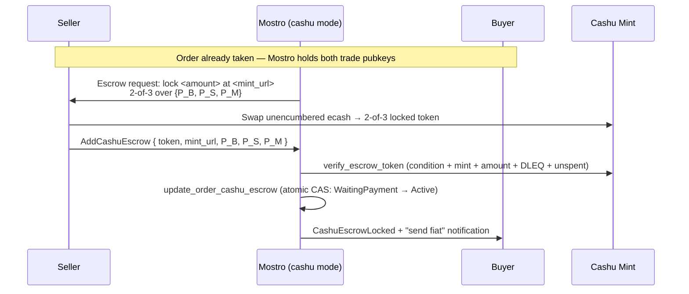

# Cashu Escrow — Track A: Lock / Escrow Setup

**Status:** Draft for review · **Target:** `main` (**requires `mostro-core ≥ 0.14.0`**) ·
**Depends on:** Fundamentals **CF-1, CF-2, CF-4, CF-5** (see
[`01-fundamentals.md`](./01-fundamentals.md)) · **Feature flag:** `[cashu].enabled`

Track A is the **first functional Cashu flow**: the seller locks the trade amount
in a Cashu 2-of-3 multisig token, Mostro validates and records it, and the order
advances so the buyer can send fiat. It is "box 2" of the sequence diagram in
[`../CASHU_ESCROW_ARCHITECTURE.md`](../CASHU_ESCROW_ARCHITECTURE.md). It touches
the most fundamentals pieces of any track, so writing it also **validates that
the foundation is correctly dimensioned** — see §11.

This document assumes Fundamentals is implemented and merged. It only adds
behaviour *inside the Cashu branch*; the Lightning path is never changed.

---

## 1. Goal and scope

### Goal
Make a `cashu`-mode node able to **lock escrow** for a taken order:
1. When an order is taken, ask the **seller** to lock funds in a 2-of-3 token
   (instead of paying a Lightning hold invoice).
2. Accept the seller's `AddCashuEscrow` submission, **fully validate** the token
   against the mint and the order's trade keys, **atomically** persist it and
   advance the order, and **notify the buyer** to send fiat.

### In scope
- The `add_cashu_escrow_action` handler (validation + atomic lock + notify).
- The Cashu branch of `take_sell` / `take_buy` that emits the escrow request.
- **Fee collection — funder-pays-at-lock (Option 2).** The seller locks the
  **full** Mostro fee as a second, separate token in the same `AddCashuEscrow`
  step; the daemon validates and redeems it. This is the only fee model Track A
  implements (see §4A).
- Restore/monitor of in-flight locked escrows after a restart.

### Out of scope (other tracks / future)
- **Release** (seller hands the buyer the redeem signature) → Track B.
- **Cooperative cancel** → Track C. **Dispute resolution** (`P_M` signs) → Track D.
- **Alternative fee models.** Splitting the fee back onto the buyer (a separate
  buyer-paid token gated at `FiatSent`), per-order fee negotiation, or any
  fee-on-the-fiat-side scheme are **not** implemented here. Track A commits to
  Option 2 (funder pays the whole fee at lock); other models are future work.
  The *refund-on-non-success* mechanics for the fee token are specified here as
  an obligation but executed by Tracks C/D (see §4A).

---

## 2. Where Track A sits — flow and state transitions



**State transition (the only one Track A performs):**
`WaitingPayment` → `Active`, gated by the CF-4 compare-and-set so the token is
persisted and the status advanced in a single `UPDATE` (no lock-without-advance
window, replay-safe). The `expected_status`/`new_status` pair passed to the CAS
must match whatever the take flow sets when waiting for the seller to fund — the
Cashu analogue of "seller paid the hold invoice → Active".

> **Why the seller, not the buyer, submits the lock:** in a Cashu trade the buyer
> redeems the locked token themselves later (with two signatures), so — unlike the
> Lightning flow — the buyer never provides a payout invoice. The `add-invoice`
> (buyer-invoice) step is simply **absent** in Cashu mode. Track A wires the
> seller-funds path; it does not touch `add_invoice.rs`.

---

## 3. What Track A consumes from Fundamentals

This is the dependency contract. If any row is missing or shaped differently when
Track A starts, fundamentals was under-specified (that is the point of writing
this now — see §11).

| Needs | From | Exact item |
|-------|------|------------|
| Mode + mint config | CF-1 | `Settings::is_cashu_enabled()`, `Settings::escrow_mode()`, `get_cashu().mint_url` |
| Token validation | CF-2 | `CashuClient::verify_escrow_token(token, p_b, p_s, p_m, expected_amount, min_locktime)` (2-of-3 **plus** the `locktime`/`refund=[P_S]` seller-recovery path, §4B), `verify_2of3_condition`, `check_state`, `verify_token_dleq`, `cashu_pubkey_from_xonly_hex` |
| Locktime floor | CF-1 | `get_cashu().escrow_locktime_days` (default 15) → `min_locktime = now + days` (§4B) |
| Fee-token validation | CF-2 | `CashuClient::verify_fee_token(token, p_m, expected_fee)` (new, §4A) |
| Fee realisation | CF-2 | `CashuClient::sign_with_pm(proofs)` + a mint swap — the fee-only redeem capability (§4A) |
| Fee amount | existing | `util::get_fee(amount)` → `order.fee` (per-party half); fee token value = `2 * order.fee` |
| Atomic lock | CF-4 | `db::update_order_cashu_escrow(pool, order_id, mint_url, token, locked_at, expected_status, new_status) -> Result<bool>` — TA-1f extends it with `fee_token` (§4A) |
| In-flight discovery | CF-4 | `db::find_locked_cashu_orders(pool)` |
| Client handle | CF-5 | `AppContext::cashu_client() -> Option<&Arc<CashuClient>>` |
| Dispatch seam | CF-5 | `AddCashuEscrow` routed to `add_cashu_escrow_action` (a CF-5 stub Track A fills in) — see §11 |
| Mint connectivity | CF-5 | mint connected at boot in cashu mode |

Protocol (in `mostro-core ≥ 0.14.0`):
- `Action::AddCashuEscrow` carrying `Payload::CashuLockProof(CashuLockProof)`,
  where `CashuLockProof = { token, mint_url, buyer_pubkey, seller_pubkey,
  mostro_pubkey, fee_token }` — `fee_token: Option<String>` (the seller-funded
  fee token, §4A) was added in **0.14.0**; the rest since 0.13.0.
- `Action::CashuEscrowLocked` (informational, buyer notification).
- `CantDoReason::{InvalidCashuToken, CashuMintUnavailable, InvalidMintUrl,
  CashuEscrowNotLocked}`.
- `Order.{cashu_mint_url, cashu_escrow_token, cashu_escrow_locked_at}`.

**Track A requires `mostro-core ≥ 0.14.0`.** The one protocol item it needs
beyond the 0.13.0 surface — the additive `fee_token: Option<String>` field on
`CashuLockProof`, carrying the seller-funded fee token (Option 2, §4A) — was
**released in 0.14.0**. It is backwards-compatible (`Option`, defaults `None`).
Nothing else in Track A needs a protocol change.

---

## 4. The lock handler — `add_cashu_escrow_action`

New file `src/app/add_cashu_escrow.rs`. The handler is the Cashu analogue of the
"seller funds the escrow" step. Validation ordering matters: **validate fully
before mutating any state**, then commit atomically — the same discipline applied
to `release_action` (compute/verify first, persist second, notify last).

**Algorithm:**

1. **Resolve order & request id.** `get_order(&msg, pool)`; reject if not found.
2. **Authorise the sender.** The submitter MUST be the order's **seller trade
   key**: `order.get_seller_pubkey()? == event.sender`, else
   `CantDo(InvalidPeer)`. (Same identity check shape as `release_action`.)
3. **Check status.** The order must be in the "waiting for seller to fund" status
   (`WaitingPayment`); otherwise `CantDo(NotAllowedByStatus)`.
4. **Extract the proof.** `Payload::CashuLockProof(proof)`; absent ⇒
   `CantDo(InvalidCashuToken)`. (`MessageKind::verify()` already guarantees the
   payload shape, but the handler re-checks defensively.)
5. **Bind the mint.** `proof.mint_url` MUST equal the node's configured
   `get_cashu().mint_url` (normalised); else `CantDo(InvalidMintUrl)`. The node
   only escrows on its own mint.
6. **Bind the pubkeys to THIS order.** Convert each hex pubkey with
   `cashu_pubkey_from_xonly_hex`:
   - `proof.buyer_pubkey` MUST equal the order's **buyer trade pubkey**
     (`order.get_buyer_pubkey()?`).
   - `proof.seller_pubkey` MUST equal the order's **seller trade pubkey**
     (`event.sender`).
   - `proof.mostro_pubkey` MUST equal Mostro's arbitrator key (`my_keys`).
   Any mismatch ⇒ `CantDo(InvalidCashuToken)`. This is the security core:
   the 2-of-3 must lock to the keys Mostro already holds for this order, never
   attacker-chosen keys.
7. **Validate the token against the mint.**
   `ctx.cashu_client()` → `verify_escrow_token(&proof.token, p_b, p_s, p_m,
   expected_amount, min_locktime)`. This composes: 2-of-3 condition (exactly 2 sigs
   over the three expected pubkeys) **with the seller-recovery locktime** (`locktime`
   present, `refund = [P_S]`, `n_sigs_refund = 1`, and
   `locktime >= now + cashu.escrow_locktime_days` — §4B), mint binding,
   amount, NUT-12 DLEQ (proofs really issued by the mint), and NUT-07 unspent
   check. Map failures: malformed/condition → `CantDo(InvalidCashuToken)`;
   mint unreachable → `CantDo(CashuMintUnavailable)`. `expected_amount` is the
   order amount per the fee policy in §11.
8. **Atomically lock + advance.**
   `db::update_order_cashu_escrow(pool, order.id, &proof.mint_url, &proof.token,
   now, /*expected*/ WaitingPayment, /*new*/ Active)`. If it returns `false`
   (status changed concurrently, or escrow already locked — replay), log and
   return `Ok(())` without notifying (idempotent; same pattern as the
   `rows_affected() == 0` guard in `release_action`).
9. **Publish the updated order event** (kind 38383) via `update_order_event`, as
   the LN funding path does, so the order's public state stays consistent.
10. **Notify the buyer.** Enqueue `Action::CashuEscrowLocked` to the buyer plus
    the existing "send fiat" notification, so the buyer learns the escrow is live
    and the fiat phase can begin.

All notifications happen **after** the successful CAS — never before — so a
validation or persistence failure leaves the order exactly as it was and the
seller can retry.

> **Fee handling slots between steps 7 and 8** — the second token (the Mostro
> fee) is validated alongside the escrow token (after step 7) and realised
> around the CAS (step 8). See §4A.

---

## 4A. Fee collection — funder-pays-at-lock (Option 2)

### Why a dedicated mechanism is unavoidable

In the Lightning flow Mostro collects its fee **because it is in the money
path**: it receives a hold invoice for `amount + seller_fee` and pays the buyer
`amount - buyer_fee`, keeping the difference. The Cashu model deliberately
removes Mostro from the money path — the 2-of-3 token is redeemed **in full** by
the buyer (with `SIG_INPUTS` the redeemer chooses its own outputs), and on the
happy path Mostro is neither a signer nor a relay of the release. Therefore:

> **Mostro cannot skim a fee output from the escrow token.** A non-signer cannot
> force an output in a NUT-11 spend; `SIG_ALL` does not help because the two
> happy-path signers are buyer + seller, not Mostro. The fee must be a
> **separate payment**, gated by a protocol step Mostro controls.

Option 2 takes the simplest such path: the **funder (the seller) pays the entire
Mostro fee, as a second token, at the moment it locks the escrow.** There is
exactly one collection point (`AddCashuEscrow`) and one gate, and it never
depends on the buyer's later cooperation.

### Amounts (exact)

Mostro's per-order fee helper is unchanged: `util::get_fee(amount)` returns
`round(mostro.fee * amount / 2)` — i.e. **one party's half**, persisted as
`order.fee`. The total Mostro fee is therefore `2 * order.fee`.

| Token | Locked to | Value | Who funds | On success |
|-------|-----------|-------|-----------|------------|
| **Escrow** | 2-of-3 `{P_B, P_S, P_M}` | `order.amount` | seller | buyer redeems (Track B) |
| **Fee** | P2PK 1-of-1 `P_M` | `2 * order.fee` | seller | Mostro redeems |

- The **escrow** token value stays `order.amount` exactly — the §4 step-7 check
  is unchanged. The buyer redeems the full amount; **no buyer fee is deducted**,
  because nothing can deduct from a token the buyer redeems freely.
- The **fee** token carries the **whole** Mostro fee (`2 * order.fee`, both
  halves), because the buyer pays none. Using `2 * order.fee` (rather than
  recomputing `round(mostro.fee * amount)`) keeps the number bit-identical to the
  value already stored on the order and used everywhere else.
- Seller's total outlay = `order.amount + 2 * order.fee`.

> **Economic consequence (must be documented for operators).** Relative to
> Lightning, where the seller pays `amount + order.fee` and the buyer effectively
> pays `order.fee`, Option 2 shifts the buyer's half onto the seller: the seller
> pays **both** halves (`amount + 2*order.fee`) and the buyer pays nothing. The
> *total* Mostro revenue (`2 * order.fee`) and the **dev-fee accounting are
> unchanged** — `util::get_dev_fee` still operates on the total Mostro fee, carved
> from Mostro's earnings exactly as today. Only the buyer/seller split moves.

A node MAY instead charge only the seller's half (`order.fee`) and accept half
revenue in Cashu mode; that is a one-constant change to the expected fee-token
value and is left as an operator-policy note, not a separate code path. The
spec'd default is the **full** fee, to match "the same fee set in
`settings.toml`".

### Protocol addition — the exact `mostro-core` change set

`Payload::CashuLockProof` was `{ token, mint_url, buyer_pubkey, seller_pubkey,
mostro_pubkey }` (five `String` fields) through `mostro-core 0.13.x` — no slot
for a second token. **`mostro-core 0.14.0` added the one field Option 2 needs**
(`src/message.rs`); this is the *complete* change that landed, nothing else in
the crate changed. Track A consumes it and requires `mostro-core ≥ 0.14.0`.

**1 · The struct field** (`CashuLockProof` in `src/message.rs`). Add a single optional field,
with serde attributes that make it both backward- and forward-compatible on the
wire:

```rust
#[derive(Debug, Deserialize, Serialize, Clone, PartialEq, Eq)]
pub struct CashuLockProof {
    pub token: String,
    pub mint_url: String,
    pub buyer_pubkey: String,
    pub seller_pubkey: String,
    pub mostro_pubkey: String,
    /// NUT-11 P2PK token locked 1-of-1 to `P_M`, carrying the Mostro fee
    /// (`2 * order.fee`). `None` when the node charges no fee. See Track A §4A.
    #[serde(default, skip_serializing_if = "Option::is_none")]
    pub fee_token: Option<String>,
}
```

- `#[serde(default)]` → a message from an **old client** (no `fee_token` key)
  deserializes to `None` instead of failing (forward-compat).
- `skip_serializing_if = "Option::is_none"` → an old-style proof serialises
  **byte-identically** to today (the key is omitted, not emitted as `null`), so
  existing wire fixtures and signatures over the JSON are unaffected.

**2 · The constructor** (`CashuLockProof::new` in `src/message.rs`). Keep the existing 5-arg `new()`
exactly as-is (it sets `fee_token: None`), and add an **immutable builder** so
the field is opt-in and no existing caller breaks:

```rust
impl CashuLockProof {
    pub fn new(/* …unchanged 5 args… */) -> Self {
        Self { token, mint_url, buyer_pubkey, seller_pubkey, mostro_pubkey,
               fee_token: None }
    }

    /// Attach the seller-funded fee token (Option 2). Returns a new value.
    pub fn with_fee_token(mut self, fee_token: String) -> Self {
        self.fee_token = Some(fee_token);
        self
    }
}
```

`from_json` / `as_json` need no change (serde-derived).

**3 · `MessageKind::verify()` — NO change** (the `AddCashuEscrow` arm in `src/message.rs`). The
`AddCashuEscrow` arm checks only `id.is_some()` and that the payload is
`CashuLockProof(_)`. It stays exactly as-is, on purpose: `verify()` is a
**protocol-shape** check with no access to `Settings`, so it **cannot** know
whether this node charges a fee. Presence/amount of `fee_token` is therefore a
**daemon-side, config-dependent** check (in `add_cashu_escrow_action`, §4A), not
a protocol invariant. When `mostro.fee > 0` the handler rejects a `None` or
mis-valued `fee_token` with `CantDo(CashuSignatureMissing)` /
`InvalidCashuToken`; when `mostro.fee == 0` a `None` is valid.

**4 · Tests** (the Cashu test module in `src/message.rs`). Extend
`sample_lock_proof()`/round-trip coverage with two cases: (a) a proof built via
`with_fee_token(..)` round-trips through `as_json`/`from_json` preserving
`Some`; (b) a legacy JSON string **without** the `fee_token` key deserialises to
`fee_token: None` (the forward-compat guarantee). The existing `verify()` tests
stay green unmodified — verify behaviour is unchanged.

**5 · Release + daemon pin.** Adding a public struct field is breaking for
struct-literal construction, so the field **shipped in `mostro-core 0.14.0`** (a
pre-1.0 breaking-allowed minor); `new()` and `verify()` stayed source-compatible.
**Track A requires `mostro-core ≥ 0.14.0`**, pinned in the daemon's `Cargo.toml`.
This was the only deviation from the "0.13.0 frozen" rule the foundation set —
exactly the case the fundamentals doc allows: *"if a track later needs a new
variant, that is a separate `mostro-core` release."*

> **No other `mostro-core` edits.** `Action`, the other `Payload` variants,
> `CantDoReason` (the needed reasons already exist), `Order` fields, and every
> other `verify()` arm are untouched. The fee feature is one optional field plus
> one builder.

### CashuClient addition (CF-2 surface)

One new verification method, mirroring `verify_escrow_token` but for the
single-key fee token:

```rust
/// Validate a P2PK fee token: locked to exactly P_M (1-of-1, no extra pubkeys),
/// value == expected_fee, bound to the configured mint, DLEQ valid (NUT-12),
/// unspent (NUT-07). Returns the parsed Token on success.
async fn verify_fee_token(
    &self,
    token: &str,
    p_m: PublicKey,
    expected_fee: u64,
) -> Result<Token, Error>;
```

It reuses the same primitives `verify_escrow_token` composes; the only
differences are **exactly one** required pubkey (`P_M`) and the expected amount.

### Realising the fee — a narrow, fee-only wallet capability

Collecting the fee means Mostro must **redeem** the fee token (sign with `P_M`
via the F4 `sign_with_pm`, then swap at the mint for fresh ecash). This is the
one place the daemon stops being purely a *coordinator* and performs a *wallet*
op — but **strictly on its own revenue, never on user escrow funds**. The
non-custodial guarantee is untouched: the `order.amount` stays in the 2-of-3 the
daemon can never move alone; only the separately-funded fee (already Mostro's
money once paid) is redeemed.

### Handler algorithm — what §4 gains

Insert into `add_cashu_escrow_action`:

- **After step 7 (escrow validated), validate the fee token.** Extract
  `proof.fee_token`; if `mostro.fee > 0` and it is absent ⇒
  `CantDo(CashuSignatureMissing)`. Else
  `cashu_client.verify_fee_token(&fee_token, p_m, 2 * order.fee as u64)`.
  Map failures the same way as the escrow token (malformed/condition/amount ⇒
  `InvalidCashuToken`; mint unreachable ⇒ `CashuMintUnavailable`). **Both tokens
  must be valid before any state changes** — same validate-fully-then-commit
  discipline as §4.
- **Step 8 (CAS) also persists the fee token.** TA-1f ships a migration adding
  `cashu_fee_token` + `cashu_fee_redeemed_at` to `orders` and extends the CF-4
  CAS with a `fee_token` parameter, so the fee token is written **in the same
  atomic UPDATE** that advances the status. Rationale (crash-safety): the fee
  is redeemed *after* the CAS; if the token lived only in memory, a crash
  between CAS and redeem would leave a correctly-`Active` order whose fee is
  unrecoverable **and undetectable** — and the replay guard below would
  correctly refuse a second submission, closing the recovery path forever.
  Persisting it in the CAS makes the redeem retryable from the DB.
- **Cross-order reuse guard (same transaction).** Nothing in the fee token
  binds it to *this* order — it is P2PK to the node-wide `P_M`, unlike the
  escrow token whose 2-of-3 embeds per-order trade keys — so
  `verify_fee_token`'s unspent check only stops *sequential* reuse. Two
  concurrent `AddCashuEscrow` for two same-fee orders could both validate the
  same token before the first redeem (TOCTOU), leaving one order `Active` with
  an uncollectable fee. TA-1f therefore records each fee-proof
  `Y = hash_to_curve(secret)` (the same identifier NUT-07 uses) in a
  `cashu_fee_proofs (y PRIMARY KEY, order_id, created_at)` table, inserted in
  the same transaction as the CAS; a UNIQUE violation ⇒
  `CantDo(InvalidCashuToken)`. (A cryptographic alternative — requiring an
  `order_id` tag inside the P2PK secret — is cleaner but needs client-side
  coordination; documented as future hardening, not TA-1f.)
- **After a successful CAS, redeem the fee token** (`sign_with_pm` + swap). Order
  matters: advance state first, collect fee second, because the fee was already
  proven valid-and-unspent during validation and the redeem is retryable from
  the persisted token. On success stamp `cashu_fee_redeemed_at`; on failure a
  cashu-mode scheduler job retries pending redeems
  (`cashu_fee_token IS NOT NULL AND cashu_fee_redeemed_at IS NULL`) — the
  analogue of the LN payment-retry job. A failed redeem never rolls back the
  trade.
- **Idempotency / replay.** A replayed `AddCashuEscrow` finds the CAS matching
  zero rows (already `Active`) → no-op, no second redeem. The same fee token
  submitted for a *different* order hits the `cashu_fee_proofs` uniqueness
  guard → rejected cleanly. Never double-charge, never double-accept.

### Refund obligation (executed by Tracks C/D)

Because the fee is realised at **lock**, not at success, the daemon **owes the
seller a refund** on every path that does not complete the trade (cooperative
cancel after lock, dispute resolved for the seller, expiry of a locked-but-never-
paid escrow). The refund = Mostro mints/sends a fresh token of `2 * order.fee` to
the seller's **trade** pubkey. Track A only **states** this obligation; the
actual refund call lives in the cancel/dispute/expiry handlers (Tracks C/D and
Integration), so it is enumerated here as a cross-track contract, not built in
TA-1.

### Refinement (optional) — self-service refund via NUT-11 locktime

To avoid Mostro having to *proactively* refund (and the "Mostro forgot the token
across a restart" failure mode), the fee token can instead be locked **P2PK to
`P_M` with `locktime` = order expiry and `refund` pubkey = `P_S`** (NUT-11
natively supports locktime + refund keys; the escrow token itself now carries a
seller-recovery locktime too, see §4B). Then:

- **Before locktime:** only `P_M` can spend ⇒ on success Mostro redeems promptly.
- **After locktime:** if Mostro never redeemed (trade abandoned/cancelled), the
  seller (`P_S`) reclaims the fee **unilaterally** — no daemon action needed.

Since TA-1f already persists the fee token for crash-safety (§4A), this
refinement no longer costs a migration — only a slightly richer
`verify_fee_token` (accept locktime + `P_S` refund) in exchange for
self-service refunds and "fee only on success" semantics. It is a clean
follow-up, not a TA-1 blocker; TA-1f ships the simpler 1-of-1 form.

### What Option 2 does *not* solve

A seller and buyer who collude out-of-band could agree the seller funds a
*smaller* escrow and settles the rest off-protocol, starving Mostro of the fee —
but only by the seller under-funding, which the buyer would have to accept (they
receive less). The realistic evasion is the **seller** simply not taking orders
on a fee-charging node. This is acceptable for the trust-based communities the
Cashu mode targets, and is the honest price of removing Mostro from the money
path. It is **strictly better** than the buyer-side fee (Option 1), where an
honest-looking buyer can skip its fee at `FiatSent` after the seller is already
committed.

---

## 4B. Seller-recovery locktime on the escrow token

### Decision

The 2-of-3 escrow token carries a **`locktime` + `refund = [P_S]`** so the seller
can reclaim the funds **alone** after the locktime **if Mostro disappears *and* the
buyer refuses to cooperate**. Without it a plain 2-of-3 has no escape hatch: if the
arbitrator key `P_M` is gone and the buyer won't sign, the funds are locked
forever. The horizon is configurable: **`cashu.escrow_locktime_days`, default 15**
(CF-1).

### Construction (NUT-11)

The seller builds the P2PK secret with:
- `data = P_S`, `pubkeys = [P_B, P_M]`, `n_sigs = 2` — the 2-of-3, unchanged.
- `locktime = now + cashu.escrow_locktime_days`, `refund = [P_S]`,
  `n_sigs_refund = 1`.

NUT-11 then exposes two **independent** pathways:
- **Before locktime:** the normal 2-of-3 (any 2 of `P_S`/`P_B`/`P_M`). Happy path
  (Track B) and dispute (Track D) are unaffected.
- **After locktime:** the *refund* pathway — `P_S` alone (1 sig) reclaims. This is
  the seller's recovery.

> `refund = [P_S]` is **mandatory**, not cosmetic: NUT-11 says a token with a
> `locktime` but **no** `refund` tag becomes spendable by **anyone** without a
> signature once it expires. A missing/empty refund tag must be rejected.

### What `verify_escrow_token` enforces (the security floor)

The locktime is double-edged: once it passes, the seller can reclaim the sats **even
if the buyer already sent fiat**. A malicious seller who set a *short* locktime
could stall past it and keep both the sats and the fiat. So the daemon never accepts
an arbitrary locktime — it enforces:
1. `locktime` present and `>= now + cashu.escrow_locktime_days` (the floor). The
   seller MAY set it **longer** (slow marketplace trades), never shorter.
2. `refund == [P_S]` exactly (the order's seller trade key) and `n_sigs_refund == 1`
   — never an attacker-chosen key.

The floor must comfortably exceed the worst-case settlement + dispute window; 15
days is generous for that while still letting a node that wants a marketplace extend
it per trade.

### Buyer obligation

The buyer must **redeem before the locktime** (with the seller's release signature —
Track B — or `P_M`'s dispute signature — Track D). The locktime is in the token, so
the client surfaces it and warns the buyer as it approaches. Once the buyer redeems,
the token is spent and the locktime is moot.

### Consequence for the marketplace motivation

This makes the escrow **time-bounded** rather than indefinite — a deliberate
trade-off for recoverability. The 15-day default (extendable per trade by the
seller) keeps the long-lived/marketplace use case viable while guaranteeing the
seller is never *permanently* locked out when Mostro and the buyer both go silent.

### Daemon-side remaining-locktime guards (cross-track obligation)

The buyer-side warning is **not** a sufficient defence on its own, because the
seller controls the fiat-side timing. Concrete attack: the seller stalls the
pre-payment phase ("bank problems", re-negotiation) until little locktime
remains, lets the buyer send fiat on day 13 of 15, goes silent, and reclaims
via the refund path on day 15 — keeping both the fiat and the sats without
failing a single protocol check. A dispute opened on day 14 doesn't save the
buyer: human resolution (Track D) can easily take longer than the remaining
window, and a `P_M` signature delivered after the seller reclaims is
worthless.

The daemon therefore enforces the remaining window at the points it controls —
the same philosophy as the LN flow's server-side hold-invoice expiry handling
(never trust the client to watch the clock):

1. **`FiatSent` guard (Track B).** Reject `FiatSent` with a clear `CantDo`
   when `locktime - now < escrow_settlement_margin_days` (a new
   `#[serde(default)]` key on `CashuSettings`, default **3**, added by Track B
   alongside its `FiatSent` branch — not needed during foundation). This cuts
   the attack at the root: fiat can never be sent inside the danger window.
2. **Dispute-open alert (Track D).** A dispute opened with less remaining
   locktime than the resolution SLA flags the solver with priority (and is
   logged): late `P_M` signatures are useless.
3. **Monitor (TA-3).** The locked-escrow monitor warns the buyer proactively
   as the locktime approaches on an unresolved order.

---

## 5. `take_sell` / `take_buy` — the Cashu branch

`take_sell_action` / `take_buy_action` keep one handler each; they branch on
`Settings::escrow_mode()` near the point where the Lightning path creates the
seller hold invoice:

- **Lightning (unchanged):** create the hold invoice, ask the seller to pay it.
- **Cashu:** instead emit an **escrow request** to the seller carrying everything
  needed to build the 2-of-3: the escrow amount to lock (`order.amount`), the
  **fee amount** to lock separately (`2 * order.fee`, Option 2 §4A), the node
  `mint_url`, the buyer trade pubkey `P_B`, Mostro's arbitrator pubkey `P_M`, and
  the **locktime horizon** (`cashu.escrow_locktime_days`, §4B) so the seller sets
  `locktime = now + days` with `refund = [P_S]`.
  (This is the `show_cashu_escrow_request(...)` helper.) The order is left in
  `WaitingPayment`, exactly where the CAS in step 8 expects it. The seller's
  client then builds **two** tokens — the 2-of-3 escrow and the 1-of-1 `P_M` fee
  token — and submits both in `AddCashuEscrow`.

The buyer-invoice request that the Lightning flow issues is **skipped** in Cashu
mode (the buyer redeems ecash directly later).

These two files are **owned by Track A** — no other track edits them, so there is
no cross-track conflict here.

---

## 6. PR breakdown (atomic, backwards-compatible)

Track A is small enough for two core PRs plus one optional hardening PR. Each is
off-by-default and leaves `main` shippable.

### TA-1 · `add_cashu_escrow_action` handler
Fill in the CF-5 stub for `AddCashuEscrow` in its **own** file
`src/app/add_cashu_escrow.rs`: the full validation algorithm (§4), the CF-4
atomic CAS, the order-event publish, and the buyer notification. Unit-tested
against the CF-3 mint (valid lock → `Active` + buyer notified; each rejection
path; replay → idempotent no-op).
*Depends on CF-2, CF-3, CF-4, CF-5 (CF-3 supplies the mint harness TA-1 is
unit-tested against). Conflict surface: new file only.*

### TA-1f · Fee token (Option 2)
The fee half of TA-1, separable for review. Four pieces:
1. **`mostro-core` ≥ 0.14.0 (released):** the `fee_token: Option<String>` field
   on `CashuLockProof` is already available; the daemon pins `≥ 0.14.0`.
2. **CF-2 surface:** `CashuClient::verify_fee_token(token, p_m, expected_fee)`
   and the fee-only redeem (`sign_with_pm` + swap), unit-tested against the CF-3
   mint.
3. **Persistence + anti-reuse (§4A):** the fee migration (`cashu_fee_token`,
   `cashu_fee_redeemed_at` on `orders`; new `cashu_fee_proofs` table), the
   `fee_token` extension of the CF-4 CAS, and the cashu-mode scheduler job that
   retries pending redeems. This is the crash-safety + TOCTOU half; it is
   **not** optional.
4. **Handler:** validate the fee token after the escrow token, persist it in
   the CAS, then redeem it (§4A). Tests: valid fee → `Active` + fee redeemed +
   `cashu_fee_redeemed_at` stamped; missing/mis-valued fee_token when
   `mostro.fee > 0` → rejected, order unchanged; replay → no double-charge;
   the same fee token on a second order → rejected (Y-uniqueness); simulated
   crash between CAS and redeem → the scheduler retry collects the fee.
*Depends on `mostro-core ≥ 0.14.0` + CF-2 + TA-1. Conflict surface: `add_cashu_escrow.rs`
(same new file as TA-1) + `cashu/mod.rs` (additive method) + `migrations/` +
`db.rs` + `scheduler.rs` (additive, cashu-gated). Can be folded into
TA-1 or landed right after it.*

### TA-2 · `take_*` escrow request
Add the Cashu branch to `take_sell_action` / `take_buy_action` and the
`show_cashu_escrow_request` helper, so a taken order asks the seller to lock
instead of to pay a hold invoice. Completes the lock flow end-to-end with TA-1.
*Depends on CF-1, CF-5 (and TA-1 for a full e2e test). Conflict surface:
`take_sell.rs`, `take_buy.rs`, `util.rs` — Track-A-owned.*

### TA-3 · Restore / monitor in-flight locks (optional, recommended)
On startup in cashu mode, use `db::find_locked_cashu_orders` to re-hydrate
in-flight escrows (and optionally re-`check_state` them), mirroring the
`find_held_invoices` resubscribe the Lightning path does. Keeps locked escrows
visible across restarts.
*Depends on CF-4, CF-5. Conflict surface: `main.rs`/restore module — small,
additive, cashu-gated.*

---

## 7. Issues table — sequential vs parallel

| ID | Title | Depends on | Parallel with | Conflict surface | Risk |
|----|-------|-----------|---------------|------------------|------|
| **TA-1** | `add_cashu_escrow_action` handler (validate + atomic lock + notify) | CF-2, CF-3, CF-4, CF-5 | TA-2 (until e2e) | new `src/app/add_cashu_escrow.rs` | Medium (crypto + state) |
| **TA-1f** | Fee token Option 2 (`verify_fee_token` + persistence/anti-reuse + redeem; uses `CashuLockProof.fee_token`) | `mostro-core` ≥ 0.14.0, CF-2, TA-1 | TA-2 | `add_cashu_escrow.rs`, `cashu/mod.rs`, `migrations/`, `db.rs`, `scheduler.rs` | Medium (crypto + revenue) |
| **TA-2** | `take_sell`/`take_buy` Cashu escrow request | CF-1, CF-5 | TA-1 | `take_*.rs`, `util.rs` | Low-Medium |
| **TA-3** | Restore/monitor in-flight locked escrows | CF-4, CF-5 | TA-1, TA-2 | `main.rs`/restore (additive) | Low |

**Sequencing:** TA-1 and TA-2 can be developed in parallel (different files) and
merged in either order; the **end-to-end** lock test needs both, so whichever
merges second carries the e2e test. TA-3 is independent and can land any time
after CF-4 + CF-5. Relative to other tracks, **all of Track A is parallel with
Tracks B/C/D** — it only edits its own files plus the pre-wired CF-5 stub.

---

## 8. Definition of Done

1. A `cashu`-mode node, after an order is taken, asks the seller to lock a 2-of-3
   escrow and accepts a valid `AddCashuEscrow`, advancing `WaitingPayment →
   Active` and notifying the buyer to send fiat — verified end-to-end against the
   CF-3 mint.
2. Every rejection path returns the correct `CantDoReason` and leaves the order
   unchanged (wrong sender, wrong status, wrong mint, pubkey mismatch, malformed
   token, mint unavailable, double-spent, replay, **missing/mis-valued
   fee_token when `mostro.fee > 0`**).
3. The lock is atomic and idempotent (concurrent/replayed submission matches zero
   rows and is a safe no-op; **the fee token is never redeemed twice**).
3b. The seller-funded fee token of `2 * order.fee` is validated against the mint
   and redeemed on success; Mostro's total revenue equals the Lightning-mode
   `2 * order.fee`, and dev-fee accounting is unchanged (Option 2, §4A). The
   refund-on-non-success obligation is documented for Tracks C/D.
3c. The fee token is persisted in the same atomic write as the lock, so a
   redeem interrupted by a crash is collected by the scheduler retry; and the
   same fee token is never accepted for two orders (`cashu_fee_proofs`
   uniqueness) — both verified by tests (§6 TA-1f).
4. With Cashu disabled, behaviour is identical to `main`; existing tests pass
   unmodified.
5. `cargo fmt --check`, `clippy -D warnings`, `cargo test`, and the mint-backed
   integration tests are green.

---

## 9. Principles inherited from Fundamentals

All four merge gates from [`01-fundamentals.md`](./01-fundamentals.md) §2 apply
unchanged: off-by-default & behaviour-preserving, atomic & shippable, additive
only, and inert-until-enabled. One reviewed exception to "no schema change":
TA-1f ships the fee-persistence migration (§4A) — additive columns plus one new
table, both unreachable while Cashu is off. Track A otherwise adds behaviour
**only** inside the cashu branch; the Lightning lock/funding path is
untouched.

---

## 10. Cross-track obligations (contract summary)

Obligations Track A *defines* but other PRs *execute* — each owning track's
Definition of Done must reference its row:

| Obligation | Defined in | Executed by |
|------------|-----------|-------------|
| Fee refund on every non-success path (`2 * order.fee` to the seller's trade pubkey) | §4A | Tracks C/D + integration |
| `FiatSent` rejected when remaining locktime < `escrow_settlement_margin_days` | §4B | Track B |
| Dispute-near-locktime solver alert | §4B | Track D |
| Locked-escrow monitor + buyer locktime warnings | §4B | TA-3 |
| `dispatch_cashu` action→owner matrix (no ownerless actions) | 01 §6 (CF-5) | every track |

---

## 11. Gaps found while writing this track (feedback into Fundamentals)

Writing Track A surfaced the following — fold these into the fundamentals spec
**before** freezing it:

### G-1 · `dispatch_cashu` must route to per-action handlers, not an in-`app.rs` match
**Problem.** Fundamentals CF-5 describes `dispatch_cashu` as a `match` (in
`app.rs`) that returns `InvalidAction` for blocked actions. If every track later
edits its arm of that match, `app.rs` becomes a **cross-track merge-conflict
hotspot** — breaking the "tracks edit disjoint files" guarantee.

**Fix (update CF-5).** Apply the "stub every integration point in foundation"
principle, but keep CF-5 inside its **own** files. In CF-5:
- `run_cashu`'s `dispatch_cashu` maps **every** trade action to
  `CantDo(InvalidAction)` by default — a single central **dispatch stub** in
  CF-5-owned `app.rs`, which is what keeps cashu mode inert. This default is the
  frozen seam; tracks do not edit it.
- create `src/app/add_cashu_escrow.rs` with a stub `add_cashu_escrow_action`
  returning `InvalidAction` — the one new integration point that has no existing
  owner.

CF-5 does **not** add `is_cashu_enabled()` guards to the existing trade handler
files (`take_*`, `release`, `cancel`, `admin_*`). Those files are **track-owned**
(e.g. `take_*` is Track-A-owned per §7), so guarding them from CF-5 would
reintroduce the very cross-track overlap this fix avoids. Instead, each track adds
its **own** handler's cashu branch and wires that handler into `dispatch_cashu`
when it implements it — replacing the default `InvalidAction` for exactly the
actions it owns. The §6 allow-list (`Orders`, `LastTradeIndex`, `RestoreSession`,
`TradePubkey` → `no_ln`) is unaffected — only the *mechanism* for the
blocked/escrow actions changes. The complete **action→owner matrix** now lives
in fundamentals §6 (CF-5): no blocked action may be left without an owner or an
explicit permanently-blocked decision — otherwise the tracks can complete and
still leave cashu mode unable to trade (e.g. an ownerless `NewOrder`).

### G-2 · `expected_amount` / fee policy — RESOLVED (Option 2)
**Problem.** `verify_escrow_token` needs an `expected_amount`, but whether the
locked token includes the Mostro fee (and who bears it) was undecided — the arch
doc listed Cashu fee collection as open.

**Decision (this revision).** **Option 2 — funder pays at lock** (§4A). The
escrow token locks `order.amount` exactly (no fee folded in — folding fails
because the buyer redeems the token freely with `SIG_INPUTS`). The **whole**
Mostro fee (`2 * order.fee`, both halves) is funded by the seller as a
**separate** P2PK-1-of-1-`P_M` token in the same `AddCashuEscrow`, validated by a
new `verify_fee_token`, and redeemed by the daemon on success. This keeps total
revenue and dev-fee accounting identical to Lightning; the only shift is that the
seller bears the buyer's half too.

**Cost.** One additive `mostro-core` field (`CashuLockProof.fee_token:
Option<String>`, **released in 0.14.0**; Track A requires `≥ 0.14.0`), the
TA-1f fee-persistence migration (crash-safety + cross-order anti-reuse, §4A),
and a narrow fee-only redeem capability in the
daemon (its own revenue only; user escrow funds stay non-custodial). Refund of
the fee on non-success paths is an obligation handed to Tracks C/D (§10). The
self-service-refund refinement (NUT-11 locktime + `P_S` refund — no longer
costing a migration, since TA-1f persists the token, §4A) is documented as
optional future hardening.

### G-3 · Confirm the take-flow status the CAS expects
**Problem.** The CF-4 CAS takes `expected_status`/`new_status`. Track A assumes
`WaitingPayment → Active`. CF-5/Track A must confirm the take flow actually leaves
a Cashu order in `WaitingPayment` (and not `WaitingBuyerInvoice`, which is skipped
in Cashu mode).

**Fix.** Pin the exact status the Cashu take flow sets in TA-2, and pass the
matching pair to the CAS. No new fundamentals surface needed — just an agreed
constant.

**Sufficient as of `mostro-core 0.14.0`:** the protocol surface
(`AddCashuEscrow`/`CashuLockProof`/`CashuEscrowLocked` and the needed
`CantDoReason`s, plus the `CashuLockProof.fee_token` field added in 0.14.0), the
DB schema (escrow columns exist on `main`), and the CAS helper shape are all in
place. The only daemon-side additions Track A makes are the
`CashuClient::verify_fee_token` method and the fee-redeem capability (§4A, G-2).
Track A requires `mostro-core ≥ 0.14.0`; the escrow-token validation path, DB
CAS, and notification flow need no protocol change.
