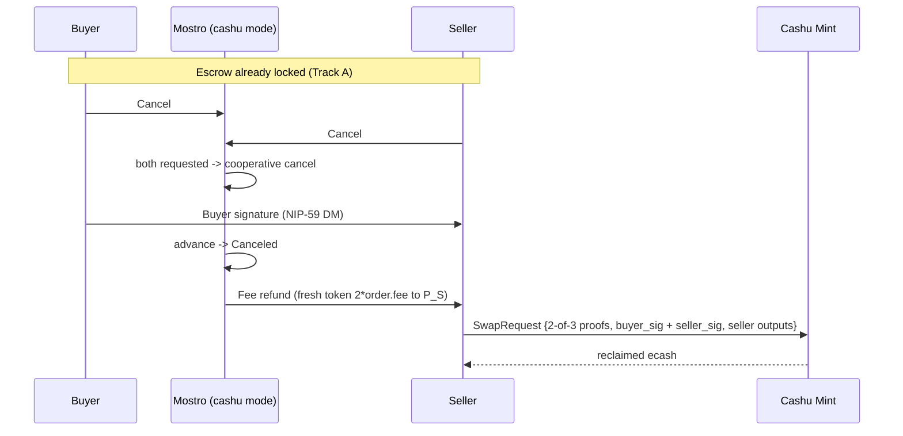

# Cashu Escrow — Track C: Cooperative Cancel

**Status:** Draft for review · **Target:** `main` (**requires `mostro-core ≥ 0.14.0`**) ·
**Depends on:** Fundamentals **CF-1, CF-2, CF-5** + **Track A** (the escrow must be
locked before it can be cancelled) · **Feature flag:** `[cashu].enabled`

Track C is the **cooperative unwind**: both parties agree to abandon a locked
trade, the buyer hands the seller the signature needed to reclaim the escrow, and
Mostro records the cancellation and **refunds the seller the fee** it collected at
lock. No dispute, no arbitrator signature.

This document assumes Fundamentals and Track A are merged. It only adds behaviour
*inside the Cashu branch*; the Lightning path is never changed.

---

## 1. Goal and scope

### Goal
Let a locked Cashu trade be cancelled by mutual consent without Mostro moving the
escrow:
1. Either party requests `Cancel`; when **both** have requested it (the existing
   cooperative-cancel handshake), the trade is cancelled.
2. The **buyer** delivers its **Cashu signature** directly to the **seller** (P2P
   NIP-59 DM) so the seller can build a 2-of-3 `SwapRequest`
   (`buyer_sig + seller_sig`) and **reclaim** the locked ecash itself.
3. Mostro advances the order to `Canceled` and — because the fee was collected at
   lock (Track A §4A) — **refunds the seller** the whole Mostro fee
   (`2 * order.fee`).

### In scope
- The Cashu branch of `cancel_action` (cooperative handshake → `Canceled`).
- The **fee-refund obligation** (Track A §4A): mint/send a fresh token of
  `2 * order.fee` to the seller's **trade** pubkey on a cancelled-after-lock
  order. (This is the first track to execute the refund obligation.)
- Unblocking `Cancel` in `dispatch_cashu`.

### Out of scope (other tracks)
- **Unilateral / dispute-driven** cancellation → Track D (`admin_cancel`).
- **Release** happy path → Track B.
- The **live fee redeem** mechanics (Track A TA-1f follow-up); the refund shares
  the same "Mostro sends ecash" capability and should land with it.

---

## 2. Where Track C sits — flow and state transitions

**State transition Track C performs:** the existing cooperative-cancel handshake
drives the order to `Canceled`. No hold invoice is cancelled — the seller
reclaims the token itself with the buyer's signature.

> **Why the buyer signs for the seller here.** On the happy path the *seller*
> signs so the *buyer* redeems; on a cancel the roles invert — the funds return to
> the seller, so the *buyer* provides the second signature that lets the *seller*
> reclaim. Same 2-of-3 token, opposite redeemer.

---

## 3. What Track C consumes from Fundamentals + Track A

| Needs | From | Exact item |
|-------|------|------------|
| Mode gate | CF-1 | `Settings::is_cashu_enabled()`, `escrow_mode()` |
| Locked escrow row | Track A | `Order.{cashu_escrow_token, cashu_escrow_locked_at}` populated |
| Fee to refund | Track A §4A | `order.fee` → refund value `2 * order.fee`; `cashu_fee_token`/`cashu_fee_redeemed_at` state |
| Seller trade pubkey | existing | `order.get_seller_pubkey()` (refund recipient) |
| Mostro-sends-ecash | CF-2 (TA-1f follow-up) | mint/send a fresh token to `P_S` |
| Dispatch seam | CF-5 | `Cancel` arm in `dispatch_cashu` |

Protocol (already on `main`, `mostro-core ≥ 0.14.0`): the existing
cooperative-cancel messages (`Action::Cancel` and its
`CooperativeCancel*`/`Canceled` acknowledgements). The buyer's Cashu signature
travels in the existing P2P cancel message shape; **no new protocol variant is
required**.

---

## 4. The fee refund (Track A §4A obligation — Track C executes it)

Because the fee is realised at **lock**, not at success, the daemon **owes the
seller a refund** on every non-success path. A cooperative cancel is one such
path.

- Refund value = **`2 * order.fee`** (the whole Mostro fee), sent as a fresh
  token to the seller's **trade** pubkey.
- Idempotency: gate the refund on the fee state so a replayed/duplicate cancel
  never double-refunds — e.g. only refund when `cashu_fee_token IS NOT NULL` and
  the order has not already been refunded (stamp a `cashu_fee_refunded_at`, or
  reuse `cashu_fee_redeemed_at` semantics: a redeemed fee is refunded by minting
  fresh ecash back, a not-yet-redeemed fee is simply not collected). The exact
  bookkeeping is a TC decision, but it **must** be single-shot.
- If the fee was **never charged** (`mostro.fee == 0`), there is nothing to
  refund — the branch is a no-op.

> **Interaction with the self-service-refund refinement (Track A §4A).** If a
> future revision locks the fee token with `locktime` + `refund = [P_S]`, the
> seller can reclaim the fee unilaterally after locktime and Track C's proactive
> refund becomes a fast-path optimisation rather than the sole recovery route.
> Track C ships the proactive refund against the simple 1-of-1 fee token TA-1f
> defines.

---

## 5. Handler — the Cashu branch of `cancel_action`

Keep the existing cooperative-cancel handshake (both parties must request
`Cancel`). In Cashu mode, at the point the Lightning path would cancel the hold
invoice:
- **Do not** touch LND (there is no hold invoice).
- Advance the order to `Canceled`, publish the order event.
- Acknowledge/relay the buyer's Cashu signature to the seller so the seller can
  reclaim.
- Execute the **fee refund** (§4) once, if a fee was collected.

`dispatch_cashu` replaces the `InvalidAction` arm for `Cancel` (routing through
the cashu-aware `cancel` handler). A *unilateral* cancel of a locked escrow (no
peer consent) is **not** a Track C concern — that path is a dispute (Track D).

---

## 6. PR breakdown (atomic, backwards-compatible)

### TC-1 · `cancel_action` Cashu branch + fee refund
Add the Cashu branch to `cancel_action` (cooperative handshake → `Canceled`, no
LND), the single-shot fee refund to `P_S`, and unblock `Cancel` in
`dispatch_cashu`. Unit-tested against the CF-3 mint (both-parties cancel →
`Canceled` + seller can reclaim + fee refunded once; single-party cancel does not
finalise; replay does not double-refund).
*Depends on CF-5, Track A (and TA-1f for the fee state + the Mostro-sends-ecash
capability). Conflict surface: `cancel.rs`, possibly `db.rs` (refund bookkeeping,
additive) + `migrations/` if a `cashu_fee_refunded_at` column is chosen,
`app.rs` (one dispatch arm).*

---

## 7. Issues table — sequential vs parallel

| ID | Title | Depends on | Parallel with | Conflict surface | Risk |
|----|-------|-----------|---------------|------------------|------|
| **TC-1** | `cancel_action` Cashu branch + fee refund + unblock `Cancel` | CF-5, Track A, TA-1f | Tracks B/D | `cancel.rs`, `app.rs`, (opt.) `migrations/` | Medium (funds return + refund) |

Track C is parallel with Tracks B/D; the only shared touch point is the
`dispatch_cashu` `Cancel` arm.

---

## 8. Definition of Done

1. A locked Cashu order, cancelled cooperatively by both parties, reaches
   `Canceled`, the seller can reclaim the escrow with the buyer's signature, and
   the seller is refunded `2 * order.fee` — verified end-to-end against the CF-3
   mint.
2. A single-party `Cancel` does **not** finalise the cancellation (the handshake
   still requires both).
3. The fee refund is **single-shot**: a replayed/duplicate cancel never
   double-refunds; a fee-free order refunds nothing.
4. With Cashu disabled, behaviour is identical to `main`; existing tests pass
   unmodified. `fmt`/`clippy -D warnings`/`test` green.

---

## 9. Cross-track obligations satisfied / raised

| Obligation | Defined in | Track C does |
|------------|-----------|--------------|
| Fee refund on non-success (coop cancel after lock), `2 * order.fee` to `P_S` | Track A §4A / §10 | **Executed** (TC-1) |
| Single-shot refund bookkeeping | Track A §4A | **Executed** (idempotent refund) |
| Mostro-sends-ecash capability | Track A §4A (TA-1f) | **Shared** with the fee redeem; lands together |
