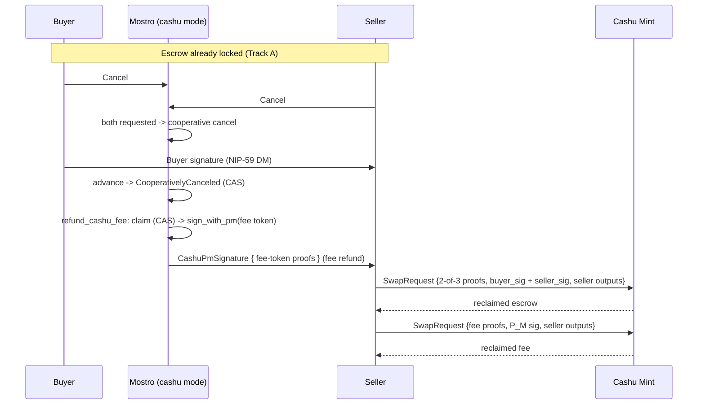

# Cashu Escrow — Track C: Cooperative Cancel

**Status:** Draft for review · **Target:** `main` (**requires `mostro-core ≥ 0.14.0`**) ·
**Depends on:** Fundamentals **CF-1, CF-2, CF-5** + **Track A** (the escrow must be
locked before it can be cancelled) · **Feature flag:** `[cashu].enabled`

Track C is the **cooperative unwind**: both parties agree to abandon a locked
trade, the buyer hands the seller the signature needed to reclaim the escrow, and
Mostro records the cancellation and **refunds the seller the fee** it collected at
lock. No dispute, no arbitrator signature on the *escrow*.

This document assumes Fundamentals and Track A are merged. It only adds behaviour
*inside the Cashu branch*; the Lightning path is never changed.

---

## 1. Goal and scope

### Goal
Let a locked Cashu trade be cancelled by mutual consent without Mostro moving the
escrow:
1. Either party requests `Cancel`; when **both** have requested it (the existing
   cooperative-cancel handshake), the trade is cancelled.
2. The **buyer** delivers its **Cashu signature** directly to the **seller** (P2P
   NIP-59 DM) so the seller can build a 2-of-3 `SwapRequest`
   (`buyer_sig + seller_sig`) and **reclaim** the locked ecash itself.
3. Mostro advances the order to **`CooperativelyCanceled`** — the same internal
   terminal status the Lightning handshake persists today
   (`cancel_cooperative_execution_step_2`, `src/app/cancel.rs`), which NIP-33
   already publishes as `canceled` — and, because the fee was collected at lock
   (Track A §4A), **refunds the seller** the whole Mostro fee (`2 * order.fee`)
   through the single-shot contract in §4.

### In scope
- The Cashu branch of `cancel_action` (cooperative handshake →
  `CooperativelyCanceled`).
- The **fee-refund obligation** (Track A §4A), executed through one shared,
  crash-safe helper (§4) that Track D reuses. This is the first track to execute
  the refund obligation.
- The **unfunded-take timeout** (§5a, TC-2): recovery for a take whose escrow is
  never locked.
- Unblocking `Cancel` in `dispatch_cashu`.

### Out of scope (other tracks)
- **Unilateral / dispute-driven** cancellation of a **locked** escrow → Track D
  (`admin_cancel`). A take that was **never locked** has no escrow to arbitrate,
  so it belongs to neither Track D nor the cooperative handshake above — its
  recovery is the TC-2 timeout job (§5a, raised by the TA-2 review).
- **Release** happy path → Track B.
- The **ecash revenue store** (Track A TA-1f follow-up) — needed only for the
  *already-redeemed* fee path (§4); Track C ships the *unredeemed* path, which
  needs no store.

---

## 2. Where Track C sits — flow and state transitions


```mermaid
sequenceDiagram
    participant B as Buyer
    participant M as Mostro (cashu mode)
    participant S as Seller
    participant Mint as Cashu Mint

    Note over B,S: Escrow already locked (Track A)
    B->>M: Cancel
    S->>M: Cancel
    M->>M: both requested -> cooperative cancel
    B->>S: Buyer signature (NIP-59 DM)
    M->>M: advance -> CooperativelyCanceled (CAS)
    M->>M: refund_cashu_fee: claim (CAS) -> sign_with_pm(fee token)
    M->>S: CashuPmSignature { fee-token proofs } (fee refund)
    S->>Mint: SwapRequest {2-of-3 proofs, buyer_sig + seller_sig, seller outputs}
    Mint-->>S: reclaimed escrow
    S->>Mint: SwapRequest {fee proofs, P_M sig, seller outputs}
    Mint-->>S: reclaimed fee
```

**State transition Track C performs:** the existing cooperative-cancel handshake
drives the order to `CooperativelyCanceled` (internal), published as `canceled`
by the existing NIP-33 mapping (`src/nip33.rs`). `Status::Canceled` is reserved,
as today, for the non-cooperative paths (maker cancel of a pending order, the
timeout job) and `CanceledByAdmin` for Track D — code that distinguishes a
completed handshake from an ordinary cancellation (`admin_settle`,
`admin_cancel`, the bond slash tables) keeps working unchanged. No hold invoice
is cancelled — the seller reclaims the token itself with the buyer's signature.

> **Why the buyer signs for the seller here.** On the happy path the *seller*
> signs so the *buyer* redeems; on a cancel the roles invert — the funds return to
> the seller, so the *buyer* provides the second signature that lets the *seller*
> reclaim. Same 2-of-3 token, opposite redeemer.

---

## 3. What Track C consumes from Fundamentals + Track A

| Needs | From | Exact item |
|-------|------|------------|
| Mode gate | CF-1 | `Settings::is_cashu_enabled()`, `escrow_mode()` |
| Locked escrow row | Track A | `Order.{cashu_escrow_token, cashu_escrow_locked_at}` populated |
| Fee to refund | Track A §4A (TA-1f) | `order.fee` → refund value `2 * order.fee`; `cashu_fee_token` / `cashu_fee_redeemed_at` state; the `cashu_fee_proofs` table |
| `P_M` signing | TA-1f (CF-2 surface; Track D TD-1 is the same primitive) | `sign_with_pm(token) -> Vec<CashuProofSignature>` — used here on the **fee** token only |
| Seller trade pubkey | existing | `order.get_seller_pubkey()` (refund recipient) |
| Mostro-sends-ecash (redeemed-fee path only) | TA-1f follow-up (ecash revenue store) | mint/send a fresh token to `P_S` |
| Claim-status CAS | TA-2 | `claim_order_status` (`src/db.rs`) — TC-2 extends it |
| Dispatch seam | CF-5 | `Cancel` arm in `dispatch_cashu` |

Protocol (already on `main`, `mostro-core ≥ 0.14.0`): the existing
cooperative-cancel messages (`Action::Cancel`,
`CooperativeCancelInitiatedByYou/ByPeer`, `CooperativeCancelAccepted`). The
buyer's Cashu signature travels in the existing P2P cancel message shape. The
fee refund is delivered with `Action::CashuPmSignature` +
`Payload::CashuSignatures` — the frozen surface Track D uses — carrying `P_M`
signatures over the **fee-token** proofs; **no new protocol variant is
required**. The `mostro-core` doc-comment on `CashuPmSignature` ("emitted only
during dispute resolution") is widened to "whenever Mostro hands a party its
`P_M` signatures over proofs that party holds" — a documentation-only change,
no wire change.

---

## 4. The fee refund — one crash-safe, single-shot contract (Track A §4A)

Because the fee is realised at **lock**, not at success, the daemon **owes the
seller a refund** on every non-success path. A cooperative cancel is one such
path; a seller-wins dispute (Track D) is another. Both call the **same helper**,
`refund_cashu_fee(order)`, with the contract below. Nothing else in the daemon
may refund a fee.

### 4.1 Why "not collected" is not a refund
The TA-1f fee token is P2PK **1-of-1 to `P_M`**. Before Mostro redeems it the
seller's ecash is not "still the seller's" — it is locked to Mostro's key and the
seller **cannot spend it**. So an unredeemed fee is *exactly as owed* as a
redeemed one; the difference is only in *how* it is returned.

### 4.2 The two refund paths

| Fee state at refund time | How the seller gets it back | Needs |
|--------------------------|-----------------------------|-------|
| **Unredeemed** (`cashu_fee_redeemed_at IS NULL`) — the only state TA-1f produces until the revenue store lands | Mostro runs `sign_with_pm(fee_token)` and delivers the per-proof `P_M` signatures to `P_S` via `CashuPmSignature`; the seller already holds the fee proofs and swaps them at the mint itself. Value returned = the full fee token = `2 * order.fee`. | TA-1f only (token persisted, `sign_with_pm`). **No ecash store, no minting.** |
| **Redeemed** (`cashu_fee_redeemed_at IS NOT NULL`) | Mostro mints/sends a fresh token of `2 * order.fee` to `P_S` from its ecash revenue store. | The **ecash revenue store** follow-up Track A TA-1f scopes (Mostro persisting swapped fee proofs). Not scheduled yet — see §7. |

The refund helper dispatches on `cashu_fee_redeemed_at`; the handler does not
care which path ran. If the fee was **never charged** (`mostro.fee == 0`,
`cashu_fee_token IS NULL`), the helper is a no-op.

> **Interaction with the self-service-refund refinement (Track A §4A).** If a
> future revision locks the fee token with `locktime` + `refund = [P_S]`, the
> seller can reclaim the fee unilaterally after locktime and the unredeemed path
> becomes a fast-path optimisation rather than the sole recovery route. Track C
> ships against the simple 1-of-1 fee token TA-1f defines.

### 4.3 Crash-safety and idempotency — the contract
1. **Atomic claim.** The helper first claims the refund with one conditional
   `UPDATE`: `SET cashu_fee_refund_claimed_at = now WHERE id = ? AND
   cashu_fee_token IS NOT NULL AND cashu_fee_refund_claimed_at IS NULL`.
   `rows_affected == 0` ⇒ already claimed (replayed cancel, concurrent terminal
   transition, or a previous crash mid-refund) ⇒ return without side effects.
   This is the **single-shot** guarantee; it does not depend on the caller's
   status check.
2. **The claim also fences the fee-redeem job.** TA-1f's pending-redeem retry
   selects `cashu_fee_token IS NOT NULL AND cashu_fee_redeemed_at IS NULL`; TC-1
   adds `AND cashu_fee_refund_claimed_at IS NULL`, and the redeem's own stamp
   becomes a CAS on the same predicate. A fee is therefore either redeemed or
   refunded, never both, and Mostro never races the seller at the mint for the
   same proofs.
3. **Side effect is replayable from persisted state.** Unredeemed path: `P_M`
   signatures are deterministic over the persisted `cashu_fee_token`, so
   re-signing and re-sending is harmless (the seller swaps once; a second
   `CashuPmSignature` for already-spent proofs is noise). Redeemed path: the
   minted refund token MUST be persisted *before* it is sent, so a crash after
   minting never loses ecash — the revenue-store follow-up owns that column.
4. **Durable delivery.** After the claim: sign/mint → `enqueue_order_msg` →
   stamp `cashu_fee_refunded_at`. A cashu-mode scheduler job re-runs the side
   effect for rows with `cashu_fee_refund_claimed_at IS NOT NULL AND
   cashu_fee_refunded_at IS NULL` (crash between claim and stamp). Because of
   (3) the retry is safe.
5. **Terminal-state races.** The helper is invoked from exactly one place per
   terminal transition (`cancel_cooperative_execution_step_2` here;
   `admin_cancel_action` in Track D), and only **after** that transition's own
   status CAS succeeded — the Cashu branch of step 2 persists
   `CooperativelyCanceled` with `UPDATE … WHERE id = ? AND status IN (Active,
   FiatSent)` rather than the unconditional full-row write, so a cooperative
   cancel and an `AdminCancel` landing together produce exactly one terminal
   status and one refund. The claim in (1) is the backstop if both still reach
   the helper.
6. **Bookkeeping columns** (TC-1 migration, additive):
   `cashu_fee_refund_claimed_at`, `cashu_fee_refunded_at` on `orders`. Reusing
   `cashu_fee_redeemed_at` for refund state is **not** allowed — the two paths
   in §4.2 need to tell "redeemed" from "refunded".

---

## 5. Handler — the Cashu branch of `cancel_action`

Keep the existing cooperative-cancel handshake (both parties must request
`Cancel`; the initiator guard in step 2 is unchanged). In Cashu mode, at the
point the Lightning path would cancel the hold invoice:
- **Do not** touch LND (there is no hold invoice).
- Advance the order to `CooperativelyCanceled` with the conditional status
  `UPDATE` of §4.3(5), then publish the order event (NIP-33 maps it to
  `canceled`) and send `CooperativeCancelAccepted` to both parties, as today.
- Acknowledge/relay the buyer's Cashu signature to the seller so the seller can
  reclaim the escrow (Mostro never stores that signature — the §2 callout in
  Track B applies symmetrically: `P_B` sig + `P_M` would be a 2-of-3).
- Call `refund_cashu_fee(order)` (§4) — once, if a fee was collected.

`dispatch_cashu` replaces the `InvalidAction` arm for `Cancel` (routing through
the cashu-aware `cancel` handler). A *unilateral* cancel of a locked escrow (no
peer consent) is **not** a Track C concern — that path is a dispute (Track D).
A cancel of a **pending** (never-taken) order keeps today's maker-cancel path
and `Status::Canceled`.

---

## 5a. The unfunded-take timeout (gap raised by the TA-2 review)

Track A TA-2 (`show_cashu_escrow_request` in `src/util.rs`, merged in #830)
claims the `Pending → WaitingPayment` transition atomically
(`claim_order_status`) and only then publishes the order event and persists the
row. Two abandonment cases leave an order sitting in `WaitingPayment` **with no
escrow locked**:

1. **The seller never submits `AddCashuEscrow`** (gone, or their client never
   retries a rejected lock). Nothing is locked and no fiat has moved — but the
   order is taken off the book from the maker's perspective, indefinitely.
2. **A partial failure after the claim** (the Nostr publish or the full-row
   persist fails). The claim has already committed, so the order is
   `WaitingPayment` with the taker's data unpersisted and no party notified.

On a Lightning node the equivalent state self-heals: `job_cancel_orders`
(`src/scheduler.rs`) re-selects stale `WaitingPayment` rows every tick
(`find_order_by_seconds` against `taken_at`), cancels the hold invoice, and
republishes or cancels the order. **That job is Lightning-only** (skipped when
`Settings::is_cashu_enabled()`), and until Track C lands, `Cancel` itself is
rejected with `InvalidAction` in `dispatch_cashu` — so today neither recovery
path exists in Cashu mode.

No funds are ever at risk here (nothing was locked), so this is a
liveness/book-keeping hole, not a safety hole — but it must be closed before
Cashu mode is production-usable.

### 5a.1 What is durable after the claim — the recovery record
`claim_order_status` commits **only** `status = WaitingPayment` (one-column
`UPDATE … WHERE status = Pending AND cashu_escrow_locked_at IS NULL`). Every
other take-side field — `taken_at` (`set_timestamp_now()` in `take_buy`/
`take_sell`), the taker's trade pubkey (`buyer_pubkey`/`seller_pubkey`), its
`master_*_pubkey` and `trade_index_*` — lives only in the in-memory copy until
the full-row `update` that runs **after** `update_order_event`. Between the two,
the row is `WaitingPayment` with `taken_at = 0` and the maker's columns exactly
as they were at creation.

TC-2 therefore:
- **Extends the claim** to stamp `taken_at = now` in the same `UPDATE`
  (`claim_order_status` gains a `taken_at` parameter; one-line, additive). The
  durable recovery record is then **`{status = WaitingPayment, taken_at}` plus
  the maker-side columns that pre-date the take**. Nothing about the taker is
  guaranteed durable, and TC-2 never relies on it.
- **Selects on that record only:** `status = WaitingPayment AND
  cashu_escrow_locked_at IS NULL AND taken_at > 0 AND taken_at <= now -
  expiration_seconds`. Rows with `taken_at = 0` cannot exist once the claim
  stamps it; for rows claimed by a pre-TC-2 daemon (upgrade window) the job logs
  them once and treats `created_at` as the age.
- **Notification fallback:** the maker is always reachable (its trade pubkey is
  on the row from creation) and is notified on republish/cancel exactly as the
  Lightning job does. The taker is notified **only if** its trade pubkey was
  persisted (`buyer_pubkey`/`seller_pubkey` both non-null); if the full-row
  write never landed there is nobody to notify — the taker's client sees the
  order back in the book / gone, and its own `WaitingSellerToPay` timeout
  handles the UX. No reconciliation against Nostr is attempted.

### 5a.2 The transition is a CAS, serialised with `AddCashuEscrow`
The Lightning job mutates with `update_order_to_initial_state` — an
**unconditional** `UPDATE … WHERE id = ?`. TC-2 must not reuse it: a seller's
`AddCashuEscrow` that succeeds between the job's `SELECT` and its write would
have its lock (`cashu_escrow_token`, `cashu_escrow_locked_at`, `Active`)
overwritten by a republish or cancel. Instead TC-2 mutates with one conditional
statement that re-checks the full predicate at the mutation point:

```sql
UPDATE orders
SET status = ?new, taken_at = 0, buyer_pubkey = ?maker_or_null,
    seller_pubkey = ?maker_or_null, /* + the LN job's amount/fee resets */
WHERE id = ? AND status = 'waiting-payment'
  AND cashu_escrow_locked_at IS NULL
  AND taken_at <= ?deadline
```

`rows_affected == 0` ⇒ something else won the row (a late lock, or a concurrent
tick) ⇒ **no event is published and nobody is notified**. The TA-1 lock CAS
(`update_order_cashu_escrow`) requires `status = WaitingPayment AND
cashu_escrow_locked_at IS NULL`; the two predicates are mutually exclusive on
the same row, so SQLite's single-writer semantics guarantee **exactly one**
wins. A seller locking *after* the timeout won is rejected cleanly by the TA-1
handler's `WaitingPayment` status check and keeps their token; a seller locking
*before* keeps the order `Active` and the job does nothing. A **locked** escrow
is never touched by this job (locked escrows are Track C/D territory).

**TC-2 closes the gap:** a cashu-gated scheduler job that selects on the
§5a.1 record and, via the §5a.2 CAS, republishes the order as `Pending` when the
taker stalled (mirroring the Lightning `(WaitingPayment, Buy)` republish arm)
or cancels it (`Status::Canceled`) when the maker stalled — without touching LND.

---

## 6. PR breakdown (atomic, backwards-compatible)

### TC-1 · `cancel_action` Cashu branch + `refund_cashu_fee`
Add the Cashu branch to `cancel_action` (cooperative handshake →
`CooperativelyCanceled` via conditional status CAS, no LND), the
`refund_cashu_fee` helper with the §4.3 contract (claim CAS, unredeemed path via
`sign_with_pm` + `CashuPmSignature`, redeem-job fence, retry job), its
migration (`cashu_fee_refund_claimed_at`, `cashu_fee_refunded_at`), and unblock
`Cancel` in `dispatch_cashu`. Unit-tested against the CF-3 mint: both-parties
cancel → `CooperativelyCanceled` + seller reclaims the escrow + seller swaps
the fee token with the delivered `P_M` signatures; single-party cancel does not
finalise; replayed cancel does not re-claim; a refund claimed after a simulated
crash is re-delivered by the retry job; a claimed refund is skipped by the
fee-redeem job; a concurrent `AdminCancel`-style terminal write produces one
terminal status and one refund.
*Depends on CF-5, Track A **including TA-1f** (fee token persisted +
`sign_with_pm`). Conflict surface: `cancel.rs`, `db.rs` (additive),
`migrations/`, `scheduler.rs` (additive, cashu-gated), `app.rs` (one dispatch
arm).*

### TC-2 · Unfunded-take timeout job (cashu-mode `job_cancel_orders` analogue)
A cashu-gated scheduler job that recovers orders stuck in `WaitingPayment` with
no locked escrow (§5a): stamp `taken_at` inside `claim_order_status`, select on
the durable record (§5a.1), mutate with the conditional CAS (§5a.2),
republish as `Pending` when the taker (buy-order seller) stalled, cancel when
the maker (sell-order seller) stalled, notify the maker always and the taker
when reachable — never touching LND. Unit-tested: a stale unfunded take is
republished/cancelled; a late-arriving `AddCashuEscrow` is rejected by the TA-1
status check; a **concurrent** late lock (lock CAS and timeout CAS racing on
the same row) leaves exactly one winner and the loser publishes nothing; a row
with no taker pubkey notifies the maker only; a *locked* escrow is never
touched.
*Depends on CF-1, CF-5, TA-2. Conflict surface: `db.rs`
(`claim_order_status`, additive param) + `util.rs` (one call site) +
`scheduler.rs` (additive, cashu-gated) + tests.*

---

## 7. Issues table — sequential vs parallel

| ID | Title | Depends on | Parallel with | Conflict surface | Risk |
|----|-------|-----------|---------------|------------------|------|
| **TC-1** | `cancel_action` Cashu branch + `refund_cashu_fee` + unblock `Cancel` | CF-5, Track A, **TA-1f** | Track B; Track D TD-1/TD-2 | `cancel.rs`, `db.rs`, `migrations/`, `scheduler.rs`, `app.rs` | Medium (funds return + refund) |
| **TC-2** | Unfunded-take timeout job (§5a) | CF-1, CF-5, TA-2 | TC-1, Tracks B/D | `db.rs`, `util.rs`, `scheduler.rs` (additive, cashu-gated) | Low |

**Ordering.**
- Track C has **no dependency on Track B** (nothing here needs the release
  watcher) and Track B has none on C.
- **Track D depends on TC-1:** TD-3's seller-wins refund calls
  `refund_cashu_fee` and relies on its migration; TD-3 lands after TC-1 (or
  carries the helper itself if it lands first — in which case TC-1 consumes it).
  TD-1/TD-2 are independent of Track C.
- **TC-1 depends on TA-1f**, which supplies the persisted fee token and
  `sign_with_pm`. The **unredeemed** refund path (§4.2) is fully implementable
  with TA-1f alone; the **redeemed** path needs the ecash revenue store, which
  TA-1f scopes as a follow-up with **no PR, issue, or track yet**. TC-1 ships
  the unredeemed path only; the redeemed branch is unreachable while TA-1f
  defers live redeem, and TC-1 makes that explicit (an `error`-level log and a
  claim left open for the store's retry job, never a silent no-op) — the moment
  the store lands, the redeemed path is its first consumer. This is recorded in
  the DoD so the gap is not a surprise for whoever picks up C.
- TC-2 is independent of the cancel handshake and can land before or after
  TC-1 — until one of them does, a take whose seller never locks leaves the
  order stranded in `WaitingPayment` (§5a).

---

## 8. Definition of Done

1. A locked Cashu order, cancelled cooperatively by both parties, reaches
   `CooperativelyCanceled` (published as `canceled`), the seller can reclaim the
   escrow with the buyer's signature, and the seller receives `P_M` signatures
   over the fee-token proofs and can swap them for `2 * order.fee` — verified
   end-to-end against the CF-3 mint.
2. A single-party `Cancel` does **not** finalise the cancellation (the handshake
   still requires both).
3. The fee refund is **single-shot and crash-safe** (§4.3): a replayed/duplicate
   cancel never re-claims; a crash between claim and delivery is recovered by
   the retry job; a claimed refund is never redeemed by the fee-redeem job; a
   fee-free order refunds nothing.
4. The redeemed-fee path is **explicitly scoped out** of TC-1 pending the ecash
   revenue store, and the code makes that state unreachable (TA-1f defers live
   redeem) rather than silently "not refunding".
5. A take whose escrow was never locked does not strand the order: the TC-2
   timeout republishes or cancels it through the §5a.2 CAS, a concurrent or late
   lock leaves exactly one winner, the maker is always notified, and a locked
   escrow is never touched by the job.
6. With Cashu disabled, behaviour is identical to `main`; existing tests pass
   unmodified. `fmt`/`clippy -D warnings`/`test` green.

---

## 9. Cross-track obligations satisfied / raised

| Obligation | Defined in | Track C does |
|------------|-----------|--------------|
| Fee refund on non-success (coop cancel after lock), `2 * order.fee` to `P_S` | Track A §4A / §10 | **Executed** (TC-1, unredeemed path via `P_M` signatures) |
| Single-shot, crash-safe refund bookkeeping shared by every refund caller | Track A §4A | **Executed** (`refund_cashu_fee`, §4.3) — **Track D must call it** (TD-3) |
| Refund of an *already-redeemed* fee (needs Mostro-held ecash) | Track A §4A (TA-1f follow-up: ecash revenue store) | **Scoped out, named** (§7) — first consumer of the store when it lands |
| Fee-redeem retry job must skip refund-claimed rows | **Raised here** (§4.3(2)) | **Executed** (TC-1 amends the TA-1f job predicate) |
| `claim_order_status` stamps `taken_at` in the claim | **Raised here** (§5a.1) | **Executed** (TC-2) |
| Unfunded-take timeout — no `job_cancel_orders` analogue in Cashu mode, so a never-locked take strands the order in `WaitingPayment` | TA-2 review (MostroP2P/mostro#830) | **Raised → TC-2** (§5a) |
